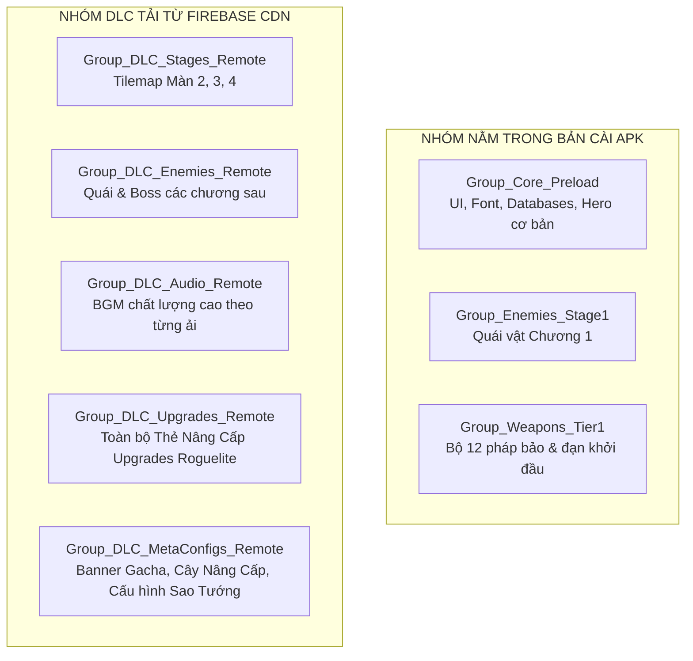

# Hướng Dẫn Tích Hợp Firebase Storage CDN Cho Unity Addressables (Dễ Nhất - Kéo Thả Trực Quan)

Tài liệu này hướng dẫn cách sử dụng **Firebase Storage** làm **CDN / DLC** cho Unity Addressables theo phương pháp **100% Giao Diện Web Trực Quan — Không Cần Cài Đặt Node.js, Không Cần Dòng Lệnh**.

---

## 1. Ưu Điểm Của Phương Pháp Kéo & Thả Firebase Storage

* **0 Cài Đặt**: Không cần cài Node.js, không cần gõ lệnh Terminal/PowerShell.
* **0 Xung Đột Code**: Không cần import thêm SDK Firebase vào Unity, tránh lỗi Gradle khi build Android APK.
* **Trực Quan**: Thấy rõ từng file `.bundle` dung lượng bao nhiêu MB trực tiếp trên trình duyệt.
* **Miễn Phí**: Google tặng sẵn 5 GB lưu trữ và 1 GB tải về mỗi ngày (đầy đủ cho nhu cầu phát triển & thử nghiệm).

---

## 2. Quy Trình 3 Bước Thực Hiện

### BƯỚC 1: Tạo Thư Mục Trên Firebase Console (1 Lần Duy Nhất)

1. Mở trình duyệt và truy cập: [Firebase Console](https://console.firebase.google.com/).
2. Chọn Project của bạn (hoặc bấm **Add project** để tạo mới).
3. Ở thanh menu bên trái, chọn **Build > Storage** -> Bấm **Get started**.
4. Chọn chế độ bảo mật:
   - Trong tab **Rules** của Storage, cho phép đọc công khai (để game Android tải được file):
     ```javascript
     rules_version = '2';
     service firebase.storage {
       match /b/{bucket}/o {
         match /{allPaths=**} {
           allow read: if true; // Cho phép game tải file không cần đăng nhập
           allow write: if false;
         }
       }
     }
     ```
   - Bấm **Publish** để lưu luật bảo mật.
5. Quay lại tab **Files**, bấm **Create folder** và đặt tên là: **`Android`**.

---

### BƯỚC 2: Cấu Hình Unity Addressables Profile

1. Trong Unity Editor, mở: `Window > Asset Management > Addressables > Profiles`.
2. Chọn Profile (hoặc tạo mới Profile đặt tên `Firebase_Web`):
   - **`Remote.BuildPath`**: Giữ nguyên mặc định là `ServerData/[BuildTarget]`
   - **`Remote.LoadPath`**: Dán đường link URL của thư mục Firebase Storage vào:
     ```text
     https://firebasestorage.googleapis.com/v0/b/<tên-project-của-bạn>.appspot.com/o/Android%2F{0}?alt=media
     ```
     *(Thay `<tên-project-của-bạn>` bằng ID dự án trên Firebase của bạn)*

---

### BƯỚC 3: Xuất File Bundle & Kéo Thả Lên Web

Mỗi khi bạn muốn cập nhật bản đồ mới, quái vật mới, thẻ nâng cấp hoặc sự kiện Gacha:

1. **Build trong Unity**:
   - Mở `Window > Asset Management > Addressables > Groups`.
   - Bấm nút **Build > New Build > Default Build Script**.
   - Unity sẽ nén và xuất các file vào thư mục: `Projectzombie/ServerData/Android/`.
2. **Kéo Thả Lên Web**:
   - Mở thư mục `ServerData/Android/` trên máy tính (sẽ có các file `.bundle`, `catalog.json`, `catalog.hash`).
   - Mở trình duyệt vào thư mục `Android` trên **Firebase Storage**.
   - **Kéo thả toàn bộ các file đó vào trình duyệt**.
3. **Hoàn Tất!** 
   - Mọi máy điện thoại Android khi mở game sẽ tự động đọc `catalog.hash` mới nhất và tải các gói nội dung mới về máy.

---

## 3. Kiến Trúc Hoàn Thiện 8 Nhóm Addressables (Local vs Remote CDN)

Toàn bộ tài nguyên của game được tổ chức thành **8 Nhóm Chiến Lược** để tối ưu hóa dung lượng APK (~50-80MB) và hỗ trợ vận hành LiveOps từ xa:



### Bảng Đặc Tả Chi Tiết 8 Nhóm:

| STT | Tên Nhóm (Group Name) | Vị Trí (Path) | Bundle Mode | Compression | Danh Mục Tài Nguyên Cụ Thể |
|:---:|---|---|---|---|---|
| **1** | **`Group_Core_Preload`** | **`Local`** (Trong APK) | `Pack Together` | LZ4 | UI Sảnh Chính, Font NotoSerif TMP, `WorldStageDatabaseSO`, `CharacterDatabaseSO`, Âm thanh UI, Tướng mặc định Đạo Sĩ. |
| **2** | **`Group_Enemies_Stage1`** | **`Local`** (Trong APK) | `Pack Together` | LZ4 | Quái vật Màn 1 (`Zombie_Basic`, Thủy quái cơ bản, Chuột ma) để người chơi mới mở game chơi được ngay mà không cần internet. |
| **3** | **`Group_Weapons_Tier1`** | **`Local`** (Trong APK) | `Pack Together` | LZ4 | Toàn bộ 12 Pháp Bảo Đông Sơn & Đạn khởi đầu (`Weapon_Pot`, `Weapon_Slipper`, `Weapon_Pipe`, `Weapon_W001_NoThan` $\rightarrow$ `Weapon_W012`). |
| **4** | **`Group_DLC_Stages_Remote`** | **`Remote`** (CDN Firebase) | **`Pack Separately`** | LZ4 | Các Prefab Tilemap Màn 2, 3, 4 (`Map_AncientCitadel`, `Map_CinnabarSwamp`, `Map_UnderworldGate`). Tải riêng từng ải khi người chơi chọn màn. |
| **5** | **`Group_DLC_Enemies_Remote`**| **`Remote`** (CDN Firebase) | `Pack Together` | LZ4 | Quái vật cấp cao Màn 2-3-4, Quỷ tướng tinh anh, Đại Boss các chương sau. |
| **6** | **`Group_DLC_Audio_Remote`**  | **`Remote`** (CDN Firebase) | **`Pack Separately`** | LZ4 | Nhạc nền BGM âm thanh nổi từng Ải (`BGM_AncientCitadel.mp3`, `BGM_CinnabarSwamp.mp3`). Giữ file APK nhẹ nhất có thể. |
| **7** | **`Group_DLC_Upgrades_Remote`**| **`Remote`** (CDN Firebase) | `Pack Together` | LZ4 | **Toàn bộ ScriptableObject Thẻ Nâng Cấp (`UpgradeData`)** với nhãn `UpgradeData` (Passives, Evolutions, Relic Fusions). Cân bằng meta/chỉ số trực tiếp từ CDN. |
| **8** | **`Group_DLC_MetaConfigs_Remote`**| **`Remote`** (CDN Firebase) | `Pack Together` | LZ4 | **Cấu hình LiveOps & Kinh Tế**: `banner_standard` (Gacha), `PermanentUpgradeTree` (Cây Miếu Cổ), `CharacterStarProgressionConfig` (Tiến trình Tướng). |

---

## 4. Công Cụ Thiết Lập Tự Động (One-Click Setup)

Bạn không cần tạo thủ công từng nhóm trong Editor:
- Trên thanh menu Unity, bấm: **`Tools > ProjectZombie > Addressables > Setup Standard CDN & Local Groups`**.
- Hệ thống sẽ tự động tạo đủ 8 nhóm, thiết lập đường dẫn Local/Remote, gán Bundle Mode và tự động đưa các Database, Prefab Vũ khí, Quái, Thẻ Nâng Cấp và Cấu hình Meta vào đúng nhóm.

---

---

## 6. Công Cụ Đối Chiếu & Kiểm Toán Dữ Liệu CDN (Audit & Comparator Tool)

Hệ thống cung cấp một Editor Tool trực quan để so sánh chi tiết trạng thái từng tài nguyên giữa bộ nhớ máy (Android/PC Cache) và máy chủ Firebase CDN:

* **Đường dẫn mở**: `Tools > ProjectZombie > Addressables > CDN Content Comparator & Audit Tool`
* **Tính năng chính**:
  1. **Audit Toàn Bộ Asset**: Tự động kết nối và liệt kê rõ từng Asset thuộc nhóm `[Trong APK]`, `[Đã Đồng Bộ / Mới Nhất]` (0 B Cached) hoặc `[Cần Cập Nhật / Chưa Tải]` kèm số MB cần tải.
  2. **Kiểm Tra Catalog Updates**: So sánh trực tiếp file `catalog.hash` giữa Local và CDN.
  3. **Tải Trước / Xóa Cache Từng Key**: Thử nghiệm tải lẻ một bản đồ hoặc quái vật cụ thể ngay trong Editor.
  4. **Xóa Toàn Bộ Local Cache**: Giả lập tức thì một máy Android mới tải game chưa có dữ liệu DLC.

---

## 7. Luồng Khởi Động Tự Động Bản Vá (Cold Start Auto-Patch)

Trò chơi đã được tích hợp component `GameStartupFlowController` trong `CoreBootstrapper`:
* Khi mở game trên Android $\rightarrow$ Game tự động kết nối Firebase CDN để kiểm tra `catalog.hash`.
* Nếu phát hiện có nội dung cập nhật mới $\rightarrow$ Màn hình Loading (`LoadingScreenPresenter`) sẽ hiển thị tiến trình tải mượt mà trước khi mở Sảnh chính (Main Hub).
* Nếu người chơi ở chế độ Offline (không có internet) $\rightarrow$ Tự động chuyển thẳng vào Sảnh chính sau 4 giây timeout để chơi các nội dung Offline có sẵn trong APK.
