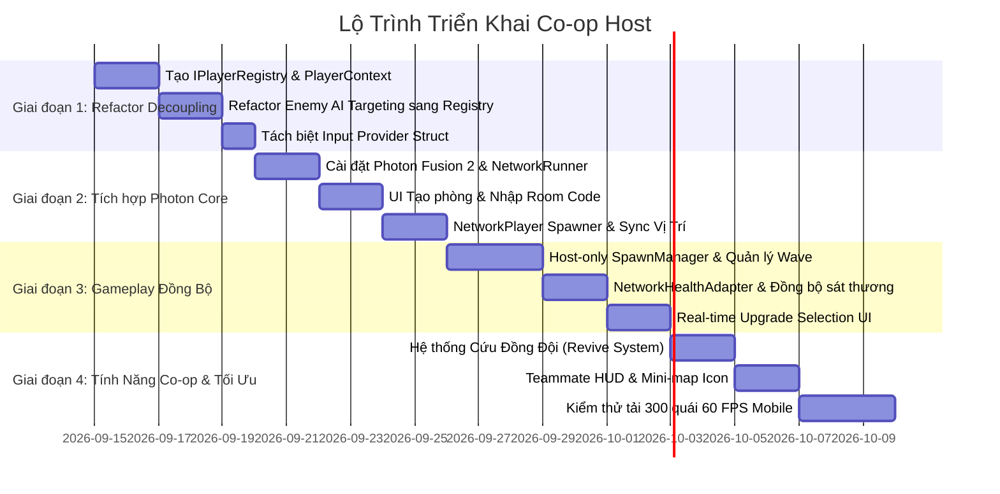

# Kế Hoạch Kiến Trúc & Triển Khai Tính Năng Co-op Host (Photon Fusion)
## Dự Án: Projectzombie (Top-down Survival Roguelite - Unity 2022)

Tài liệu này tổng hợp phân tích kiến trúc hiện tại, đề xuất mô hình tích hợp **Photon Fusion (Host Mode)**, các bước chuẩn hóa Clean Code, và danh mục các quyết định thiết kế (Game Design & Technical Decisions) cần thảo luận và thống nhất trước khi triển khai.

---

## 1. Mục Tiêu & Tổng Quan Hệ Thống

* **Chế độ chơi:** Co-op 2–4 người chơi (Host - Client P2P/Relay).
* **Mô hình mạng mục tiêu:** **Host-Authoritative (Photon Fusion 2 Host Mode)**.
  * Máy Host đóng vai trò là Máy Chủ (Server) kiêm Người Chơi 1 (Host Player).
  * Máy Client gửi Input lên Host và nhận đồng bộ trạng thái (State Replication).
* **Tiêu chuẩn chất lượng:**
  * **Clean Code & Decoupling:** Tách biệt hoàn toàn Game Logic (Domain) khỏi Network Layer (Photon API).
  * **Quy chuẩn 60 FPS Mobile & 0 GC Allocations:** Đảm bảo không sinh rác bộ nhớ trong vòng lặp mạng và chiến đấu với số lượng 100–300 quái vật trên màn hình.

---

## 2. Phân Tích Hiện Trạng & Điểm Nghẽn Kiến Trúc (Single-Player Coupling)

| Hệ Thống Hiện Tại | Mã Nguồn Liên Quan | Hiện Trạng (Single-Player) | Yêu Cầu Thay Đổi Cho Co-op |
| :--- | :--- | :--- | :--- |
| **Player Registry** | `PlayerProvider.cs` | Static Class chỉ lưu duy nhất 1 `PlayerTransform` và 1 `PlayerHealth`. | Chuyển thành `IPlayerRegistry` quản lý danh sách nhiều `PlayerContext`. |
| **Enemy AI & Targeting** | `Enemy.cs`, `CombatMovementStrategy.cs`, `MeleeMovementStrategy.cs` | Quái tự động lock vào `PlayerProvider.PlayerTransform`. | Hệ thống chọn mục tiêu linh hoạt (`GetNearestPlayer`, Aggro/Threat Table). |
| **Wave Spawner** | `SpawnManager.cs`, `CameraAwareSpawnLocator.cs` | Sinh quái dựa trên tọa độ của 1 người chơi và 1 camera. | Host quản lý Spawner, phân bổ quái xung quanh tất cả người chơi còn sống. |
| **Level Up & TimeScale** | `GameplayBootstrapper.cs`, `UpgradeUIPresenter.cs` | Dừng hoàn toàn game (`Time.timeScale = 0`) khi người chơi chọn thẻ. | Không dừng game; chuyển sang cơ chế chọn thẻ thời gian thực (Real-time HUD) hoặc Slow-mo Vote. |
| **Vũ Khí & Đạn Dược** | `WeaponManager.cs`, `ProjectileSystem.cs`, `GlobalVFXPoolManager.cs` | Khởi tạo đạn và hiệu ứng cục bộ không qua mạng. | Client-side Prediction cho đạn visual; Host xác thực va chạm và trừ máu. |
| **Hệ Thống Máu & Sát Thương** | `HealthSystem.cs`, `CharacterCombat.cs` | Trừ máu trực tiếp ở local không có quyền kiểm soát (Authority). | Host-Authoritative: Chỉ Host có quyền thay đổi `Networked` CurrentHealth. |
| **UI MVP & Context** | `GameplayUIBinder.cs`, `RunHUDPresenter.cs` | Bind UI toàn cục với thực thể Player đầu tiên tìm thấy. | Tách biệt Local Player HUD (`HasInputAuthority`) và Teammate HUD Widget. |

---

## 3. Kiến Trúc Mục Tiêu: Mô Hình Port & Adapter (Hexagonal Architecture)

Để giữ code sạch và không bị "ô nhiễm" bởi Photon SDK, kiến trúc sẽ chia thành 2 tầng rõ rệt:

```
┌──────────────────────────────────────────────────────────────────┐
│                   CORE DOMAIN LAYER (C# Thuần)                  │
│                                                                  │
│   ├── IPlayerRegistry (Quản lý đa người chơi)                   │
│   ├── HealthSystem (Tính toán máu, khiên, giáp)                  │
│   ├── EnemyStateMachine & CombatMovementStrategy (AI Quái)      │
│   ├── WeaponManager & RelicEvolution (Hệ thống trang bị)        │
│   └── RunStatsTracker (Thống kê trận đấu)                        │
└─────────────────────────────────▲────────────────────────────────┘
                                  │ (Interfaces & Events)
┌─────────────────────────────────▼────────────────────────────────┐
│               PHOTON NETWORK ADAPTER LAYER (Fusion 2)            │
│                                                                  │
│   ├── NetworkRunnerManager (Khởi tạo phòng, kết nối Relay)      │
│   ├── NetworkPlayerAdapter (Sync Position, Input, State)        │
│   ├── NetworkHealthAdapter (Sync [Networked] Health)            │
│   ├── NetworkEnemySync (Đồng bộ quái nén cho Client)            │
│   └── NetworkInputBridge (Thu thập & gửi NetworkInputData)       │
└──────────────────────────────────────────────────────────────────┘
```

---

## 4. Các Thay Đổi Kiến Trúc Kỹ Thuật Chi Tiết

### 4.1. Nâng Cấp Quản Lý Player: `IPlayerRegistry`
Thay thế `PlayerProvider` static bằng interface có thể inject:
```csharp
public interface IPlayerRegistry
{
    IReadOnlyList<PlayerContext> ActivePlayers { get; }
    PlayerContext LocalPlayer { get; }
    PlayerContext GetNearestPlayer(Vector2 position);
    PlayerContext GetPlayerByRef(PlayerRef playerRef);
    void RegisterPlayer(PlayerContext player);
    void UnregisterPlayer(PlayerContext player);
    event Action<PlayerContext> OnPlayerJoined;
    event Action<PlayerContext> OnPlayerLeft;
}
```

### 4.2. Tách Biệt Input Struct (Blittable, 0-GC)
```csharp
public struct NetworkInputData : INetworkInput
{
    public Vector2 MoveDirection;
    public Vector2 AimDirection;
    public NetworkButtons Buttons; // Button Attack, Dash, Ultimate
}
```

### 4.3. Host-Only Enemy AI & Spawner Execution
* **Trên Host (`Runner.IsServer`):** Chạy toàn bộ FSM, Raycast né vật cản, tính sát thương.
* **Trên Client (`Runner.IsClient`):** Tắt `EnemyStateMachine`, tắt `Collider2D` vật lý, chỉ giữ `SpriteRenderer`, `Animator` và `NetworkTransform` để nội suy chuyển động mượt mà.

### 4.4. Tối Ưu Băng Thông Đạn Dược (Client Prediction + Server Hit)
* Tuyệt đối **không gán `NetworkObject` lên từng viên đạn** (tránh nghẽn băng thông với hàng trăm đạn trên màn hình).
* **Mô phỏng đạn:** Client tự spawn đạn visual qua `GlobalVFXPoolManager`.
* **Sát thương:** Khi đạn chạm quái phía Host hoặc báo cáo chạm có xác thực từ Client, Host sẽ trừ máu quái qua `NetworkHealthAdapter`.

---

## 5. Danh Mục Các Vấn Đề Cần Thảo Luận & Thống Nhất

Dưới đây là các chủ đề game design và kỹ thuật cần chốt phương án:

### ❓ Chủ Đề 1: Cơ Chế Thăng Cấp (Level Up & Upgrade Selection)
* **Phương án A (Real-time HUD Card Selection - Khuyên dùng):** Khi lên cấp, UI chọn 3 thẻ hiện ở một góc/thanh bên màn hình. Game **không dừng lại**; người chơi vừa di chuyển né quái vừa chạm chọn thẻ.
* **Phương án B (Shared Level Up & Slow-mo Vote):** Cả phòng chia sẻ chung 1 thanh EXP. Khi đủ EXP, game giảm tốc độ (Slow-motion 0.2x) trong 5 giây để mọi người cùng chọn thẻ.
* **Phương án C (Pause Timeout):** Game tạm dừng tối đa 10 giây; ai chọn xong sẽ chờ người còn lại.

---

### ❓ Chủ Đề 2: Cơ Chế Phân Bổ Kinh Nghiệm & Vật Phẩm (EXP & Drops)
* **Phương án A (Shared EXP Pool):** Bất kỳ ai nhặt viên ngọc kinh nghiệm (ExpGem) hoặc Tiền thì cả phòng đều được cộng dồn điểm chung.
* **Phương án B (Individual EXP & Magnet):** Mỗi người tự nhặt ExpGem rơi ra cho riêng mình (hoặc nhân bản ExpGem trên từng máy).

---

### ❓ Chủ Đề 3: Cơ Chế Tử Trận & Hồi Sinh (Down & Revive System)
* **Phương án A (Linh Hồn & Bia Mộ):** Khi hết máu, nhân vật biến thành Linh hồn / Ngã gục tại chỗ (vẫn quan sát được). Đồng đội đứng trong phạm vi vòng tròn hồi sinh trong 3 giây để cứu viện.
* **Phương án B (Respawn Wave):** Chết sẽ chờ đến khi đợt quái (Wave Phase) hiện tại kết thúc hoặc Boss bị tiêu diệt mới tự động hồi sinh với 50% máu.

---

### ❓ Chủ Đề 4: Luồng Tạo Phòng & Ghép Trận (Matchmaking & Lobby)
* **Phương án A (Room Code 6 ký tự):** Host bấm "Tạo Phòng" -> sinh ra mã 6 chữ số (ví dụ: `889922`) -> Client nhập mã để tham gia qua Photon Relay.
* **Phương án B (Local Wi-Fi LAN Discovery):** Tự động quét và tìm thấy phòng đang mở trong cùng mạng Wi-Fi không cần nhập mã.

---

### ❓ Chủ Đề 5: Tính Năng Tương Tác Kỹ Năng Đồng Đội (Co-op Synergy)
* Hệ thống Âm Dương / Trận Pháp có kích hoạt buff đặc biệt khi 2 người chơi đứng gần nhau không? (Ví dụ: Một người hệ Âm + một người hệ Dương tạo ra *Lưỡng Nghi Trận* gia tăng 30% sát thương).

---

## 6. Lộ Trình Triển Khai Chi Tiết (4 Giai Đoạn)



---

## 7. Quy Chuẩn Kỹ Thuật Cho Network Layer (Tuân thủ AGENTS.md)

1. **Blittable Types:** Mọi struct gửi qua mạng (`NetworkInputData`, `NetworkedProperties`) chỉ dùng kiểu dữ liệu nguyên thủy (`float`, `int`, `Vector2`, `NetworkButtons`) để đảm bảo 0 GC Allocations.
2. **Lag Compensation:** Sử dụng `HitboxRoot` & `Hitbox` của Photon Fusion trên thân quái vật để đảm bảo các đòn chém cận chiến và bắn đạn luôn chuẩn xác dù có độ trễ mạng (Ping 50–150ms).
3. **Editor Fallback:** Mọi code mạng đều hỗ trợ chạy mượt mà trên Unity Editor (chế độ 1 máy tự Host tự chơi hoặc 2 Instances test cục bộ).
