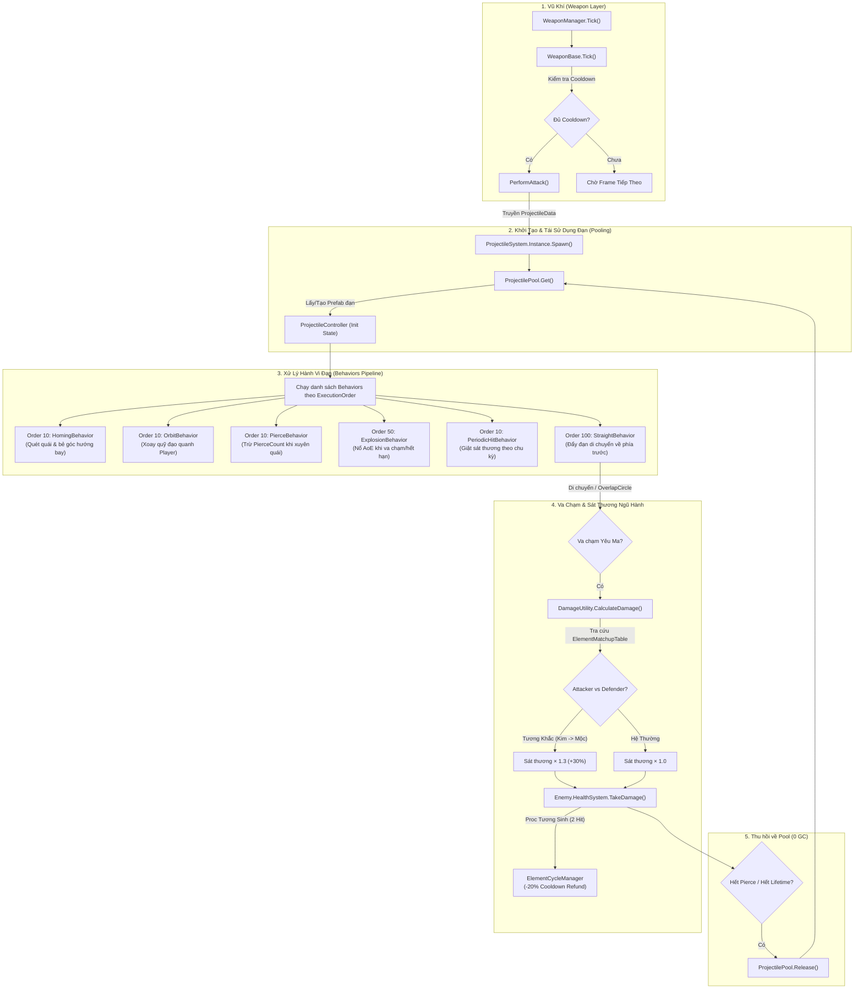

# Tài Liệu Hệ Thống Đạn & Vật Thể Bay (Projectile System)

Hệ thống Projectile được thiết kế theo kiến trúc **Data-Driven** (tương tự như Gameplay Ability System của Unreal Engine). Mục tiêu cốt lõi là tách biệt hoàn toàn logic đạn ra khỏi Skill/Weapon, cho phép những nhà thiết kế game có thể tạo ra hàng trăm loại đạn phức tạp chỉ bằng cách kết hợp các `Behavior` trên Inspector.

---

## 0. Sơ Đồ Luồng Hoạt Động Kỹ Thuật (Technical Flow Diagram)



---

## 1. Cấu Trúc Hệ Thống

Hệ thống được chia làm 4 layer rõ rệt:
- **Data (Dữ liệu)**: `ProjectileData` (chứa các thông số như Speed, Lifetime, HitLayer) và danh sách các `ProjectileBehaviorData` (Quy định đạn sẽ hoạt động thế nào).
- **Core (Cốt lõi)**: `ProjectileSystem` (API chính để gọi Spawn), `ProjectilePool` (Quản lý tái chế đạn), `ProjectileEventDispatcher` (Phát sự kiện), `ProjectileRuntimeState` (Lưu trữ bộ nhớ tạm của đạn).
- **Components (Thành phần vật lý)**: `ProjectileController`, `ProjectileMovement`, `ProjectileCollision`, `ProjectileLifetime`. Gắn trên Prefab và tự động chạy logic cơ bản.
- **Behaviors (Hành vi)**: Các module logic độc lập như `Homing`, `Pierce`, `Bounce`, `Split`, `Explosion`. 

---

## 2. Hướng Dẫn Nhanh: Cách Tạo Viên Đạn Mới

1. **Tạo Behavior Data (Nếu cần)**: Chuột phải `Create > ProjectZombie > Projectiles > Behaviors > [Tên Behavior]`. Thiết lập các thông số như độ nảy, lực đuổi mục tiêu...
2. **Tạo Projectile Data**: Chuột phải `Create > ProjectZombie > Projectiles > ProjectileData`. Gắn các Behavior Data vừa tạo vào danh sách `Behaviors`.
3. **Chuẩn bị Visual Prefab**: Tạo một GameObject trống. Gắn `Rigidbody2D` (Khuyên dùng `Kinematic`). **Tuyệt đối không gắn code logic lên Prefab này**, toàn bộ visual (Sprite, Trail, Particle) phải là Child GameObject của Prefab. Kéo Prefab vào ô `LogicPrefab` trong `ProjectileData`.
4. **Bắn đạn**: Từ trong code Weapon hoặc Skill, gọi:
   ```csharp
   ProjectileSystem.Instance.Spawn(myData, spawnPos, fireDirection, playerObj);
   ```

---

## 3. Các Nguyên Tắc Vàng (Rules) Cần Tuân Thủ Khi Code Thêm Behavior

Nếu bạn muốn lập trình một Behavior mới (Ví dụ: `OrbitBehavior`, `FreezeBehavior`), hãy bắt buộc tuân theo các quy tắc sau:

### Quy tắc 1: Không lưu State (Biến thay đổi liên tục) trong BehaviorData
`ProjectileBehaviorData` là ScriptableObject. Nếu bạn sửa giá trị trong đó runtime, toàn bộ đạn dùng chung Data đó sẽ bị lỗi và lưu luôn vào file. 
👉 **Cách làm đúng**: Chỉ chứa thông số cấu hình cố định.

### Quy tắc 2: Không lưu State vào Projectile Controller nếu nó thuộc về một tính năng phụ
Sử dụng **`ProjectileRuntimeState`**. Đây là bộ não (Blackboard) của viên đạn.
👉 Ví dụ: Khi làm `PierceBehavior`, số lần xuyên thấu còn lại được lưu vào `controller.State.RemainingPierce`. Khi làm đạn dí, mục tiêu đang theo dõi được lưu vào `controller.State.CurrentTarget`.
👉 Nếu Behavior mới cần một State hoàn toàn dị biệt, hãy bổ sung trường đó vào `ProjectileRuntimeState`.

### Quy tắc 3: Tôn trọng EventContext & BehaviorHitResult Consensus
Khi đạn chạm mục tiêu, hàm `OnHit(ProjectileEventContext context)` sẽ được gọi và trả về enum `BehaviorHitResult`:
- `Neutral`: Không can thiệp (dùng cho đạn bắn thường hoặc đạn dí `Homing`).
- `KeepAlive`: Yêu cầu giữ đạn tồn tại tiếp tục (dùng cho `OrbitBehavior`, `PeriodicHitBehavior`, `BounceBehavior` còn lượt).
- `RequireDespawn`: Ép buộc tiêu hủy đạn ngay lập tức (dùng cho `PierceBehavior` hết lượt, `ExplosionBehavior` va chạm, `VampiricBehavior`).

👉 **Cơ chế quyết định Despawn trong `ProjectileController.HandleHit`**:
- Nếu **có bất kỳ Behavior nào** trả về `RequireDespawn`, đạn sẽ bị tiêu hủy lập tức.
- Nếu không có `RequireDespawn` nhưng có ít nhất 1 Behavior trả về `KeepAlive`, đạn sẽ giữ nguyên trạng thái bay/xoay.
- Nếu tất cả Behavior trả về `Neutral` hoặc không có Behavior can thiệp, mặc định đạn bị tiêu hủy.

### Quy tắc 4: Phân loại thuộc tính đạn (`ProjectileCategory`)
Trường `Category` trong `ProjectileData` giúp phân định loại đạn:
- `Transient`: Đạn bay ngắn hạn bình thường (tự hủy khi đi quá `MaxRange` điểm sinh ban đầu).
- `Orbit`: Đạn xoay quanh người chơi (bỏ qua kiểm tra `MaxRange` theo khoảng cách điểm sinh ban đầu).
- `PersistentAura`: Vòng hào quang cố định.

### Quy tắc 5: Tôn trọng Thứ tự chạy (Execution Order)
Các Behavior phải được set `ExecutionOrder` trong Data.
👉 Số càng nhỏ chạy càng sớm.
👉 **Ví dụ**: Đạn nảy (`BounceBehavior`) phải được tính góc nảy TRƯỚC KHI đạn bay tiếp (`StraightBehavior`). Homing cũng phải đổi góc TRƯỚC KHI Straight đẩy đạn lên phía trước. Hãy cẩn thận khi quy định con số này (Thường để Straight cuối cùng ~ 100).

### Quy tắc 6: Ngăn chặn đệ quy vô hạn với Generation
Khi làm các hiệu ứng đẻ đạn (Spawn đạn từ đạn, vd: `SplitBehavior`), luôn phải tăng `Generation` (thế hệ đạn) lên 1:

### Quy tắc 7: Tuyệt đối Zero GC Allocation trong Physics & Targeting (Mobile Standard)
- **Cấm gọi `Physics2D.OverlapCircleAll`:** Thay bằng `Physics2D.OverlapCircleNonAlloc` kết hợp buffer mảng tĩnh tái sử dụng (`_hitBuffer = new Collider2D[60]`).
- **Luôn truyền `LayerMask` vào tầng Vật lý:** Sử dụng `TargetingUtility.EnemyLayerMask` hoặc `_controller.Data.HitLayer` để lọc va chạm ngay tại tầng C++ Physics Engine (Bitwise O(1)).
- **Dùng `TargetingUtility.FindNearestEnemy`:** Khi đạn cần tự tìm mục tiêu (như `HomingBehavior`, `VampiricBehavior`), luôn gọi qua `TargetingUtility` để đảm bảo 0 GC Allocation.
```csharp
ProjectileSystem.Instance.Spawn(..., controller.State.Generation + 1);
```
👉 Điều này giúp bạn dễ dàng viết code giới hạn: "Nếu Generation > 2 thì cấm tách tiếp", tránh làm đứng máy (Crash) do đẻ đạn vô tận.

---

## 4. Danh sách các Behavior hiện có

1. **Straight**: Đẩy đạn về phía trước theo `CurrentDirection`. (Thường Order = 100).
2. **Homing**: Quét vùng xung quanh bằng Physics2D và từ từ bẻ `CurrentDirection` về phía mục tiêu. (Order = 10).
3. **Pierce**: Đâm xuyên mục tiêu mà không tiêu hủy đạn cho tới khi hết `RemainingPierce`.
4. **Bounce**: Khi chạm quái, tính toán `Vector2.Reflect` dựa trên `HitNormal` để nảy sang hướng khác. Giảm `RemainingBounce`.
5. **Explosion**: Gây sát thương AOE (`OverlapCircleAll`) khi va chạm hoặc khi tự hủy.
6. **Split**: Nổ ra nhiều mảnh vụn đạn con theo một góc xòe nhất định. Phải cấu hình bằng một `ChildProjectileData` riêng.

---

## 5. Hướng Dẫn Setup Prefab Cho Từng Loại Viên Đạn

Để hệ thống hoạt động đúng và hiệu năng cao, việc cấu hình Prefab cho đạn cần tuân theo chuẩn sau:

### A. Cấu trúc chung của một viên đạn chuẩn
Nên áp dụng thiết kế Component-based rỗng (Logic và Hình ảnh tách biệt hoàn toàn):
```
Đạn_Fireball_Prefab (Chứa toàn bộ Logic)
 ├── Visual_Root (Chứa hình ảnh, quay/scale thoải mái không sợ hỏng logic)
 │    ├── SpriteRenderer / Particle System
 │    └── TrailRenderer
```

### B. Các Component bắt buộc phải có trên GameObject Gốc (Đạn_Fireball_Prefab)
1. **`Rigidbody2D`**:
   - Bắt buộc phải có để `ProjectileMovement` và `Physics2D` hoạt động.
   - **Body Type**: Khuyến cáo chọn `Kinematic` để tránh đạn bị tác động bởi trọng lực (Gravity) hoặc bị va đập văng đi sai hướng bởi physics engine. Hệ thống tự di chuyển nó bằng script.
   - **Collision Detection**: `Continuous` (Nếu đạn bay rất nhanh để chống xuyên tường lọt góc).
2. **`Collider2D`** (VD: `BoxCollider2D`, `CircleCollider2D`):
   - Phải check **`IsTrigger = true`**.
   - Nếu bạn quên bật `IsTrigger`, đạn sẽ đập vào tường và kẹt lại thay vì kích hoạt sự kiện `OnTriggerEnter2D` trong `ProjectileCollision`.

### C. Gắn Logic
- Bạn **KHÔNG CẦN** phải kéo thả thủ công các script như `ProjectileController`, `ProjectileMovement`, `ProjectileCollision` hay `ProjectileLifetime` vào Prefab này.
- Hệ thống `ProjectileSpawner` sẽ **tự động** gắn (AddComponent) toàn bộ các script cốt lõi đó vào Prefab khi khởi tạo Object Pool. Bạn chỉ việc lo phần Hình ảnh!

### D. Setup cho đạn có Homing / Bounce (Xoay theo hướng)
- Script `ProjectileMovement` luôn cố gắng xoay GameObject gốc hướng về phía nó đang bay (theo `CurrentDirection`).
- Vì vậy, thiết kế Sprite của bạn trong `Visual_Root` hãy luôn hướng về bên phải (trục X dương - Góc 0 độ) làm mặc định. Hệ thống sẽ xoay đúng lại khi đạn bay đi.

---

## 6. Kiến Trúc Hiệu Ứng Hình Ảnh & Âm Thanh (Event-Driven VFX & SFX)

Để code đạn luôn sạch, dễ đọc và dễ bảo trì, phần hiển thị/âm thanh được tách biệt 100% ra khỏi logic tính toán sát thương:

1. **`VFXConfigData`**: Nằm trong `ProjectileData`. Quản lý các Prefab `SpawnVFXPrefab`, `HitImpactVFXPrefab`, `DespawnVFXPrefab` và các `AudioClip`.
2. **`ProjectileVFXListener`**: Gắn trên Prefab đạn. Script này tự động đăng ký các sự kiện từ `ProjectileEventDispatcher`:
   - `OnProjectileSpawned`: Tự động phát hiệu ứng Muzzle Flash / Launch VFX.
   - `OnProjectileHit`: Tự động phát Hit Impact VFX tại vị trí `HitPoint` và hướng pháp tuyến `HitNormal` từ `GlobalVFXPoolManager`.
   - `OnProjectileDespawned`: Tự động phát hiệu ứng nổ tan biến.
3. **Quy tắc vàng**: Không bao giờ viết câu lệnh spawn particle hay chỉnh màu sắc trực tiếp trong logic `Behavior` hoặc `Controller`. Mọi hiệu ứng hiển thị đều chảy qua Event Listener và `GlobalVFXPoolManager`.

