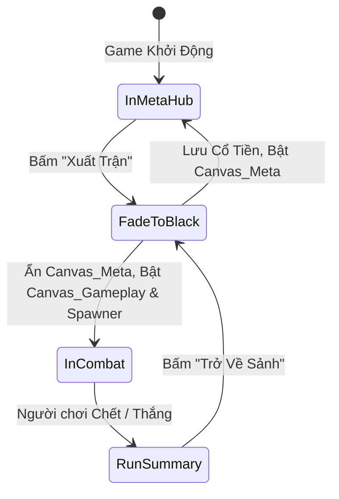

# Tài Liệu Thiết Kế Kỹ Thuật: Hệ Thống UI Ngoài Game (Meta Menu System — Hướng A)

**Dự án:** Vong Xuyên (Action Roguelike RPG)  
**Kiến trúc:** All-in-One Single-Scene UI Architecture (Tích hợp liền mạch trong 1 Scene duy nhất, không tốn thời gian Async Scene Loading).  
**Quy chuẩn áp dụng:** MVP (Model-View-Presenter), Data-Driven (ScriptableObjects), Zero-Alloc Object Pooling, và Screen Navigation Stack.

---

## 📌 1. Tổng Quan & Ưu Điểm Của Hướng A (All-in-One Architecture)

```mermaid
graph TD
    subgraph "Canvas_MetaMenu (Single Scene)"
        Hub["🏠 Sảnh Hoàng Tuyền (Main Hub Panel)"]
        Hub -->|Push Screen| Hero["🧑 Điện Anh Hùng (Character Selection)"]
        Hub -->|Push Screen| Sanctuary["⛩️ Miếu Tứ Bất Tử (Permanent Talents Tree)"]
        Hub -->|Push Screen| Codex["🗡️ Bách Bảo Các (Codex / Sơ Đồ Ngũ Hành)"]
        Hub -->|Push Screen| Settings["⚙️ Cài Đặt (Settings & Audio)"]
    end
    
    Hub -->|⚔️ Bấm XUẤT TRẬN (Fade Transition)| GamePlay["⚔️ Canvas_Gameplay (Bắt đầu Run ải 1)"]
    GamePlay -->|☠️ Hết Máu / 🏆 Chiến Thắng| Summary["📊 Màn Hình Tổng Kết (Run Summary)"]
    Summary -->|Trở Về Sảnh| Hub
```

### Tại sao Hướng A là tối ưu nhất cho Vong Xuyên Mobile?
1. **0 Giây Thời Gian Chờ Tải Scene (Zero Loading Screen Delay):**
   - Không cần gọi `SceneManager.LoadSceneAsync` tạo GC spike và giật lag trên các dòng máy Android tầm trung/yếu.
   - Chuyển cảnh từ Sảnh Menu vào trận chiến diễn ra tức thì qua hiệu ứng Fade In / Fade Out bằng `CanvasGroup` (hoặc mở cửa Hoàng Tuyền).
2. **Quản Lý Bộ Nhớ & Asset Tối Ưu:**
   - Các Sprite, Audio và Shader đã được nạp sẵn trong bộ nhớ, không bị giải phóng rồi nạp lại (Reload Thrashing).
3. **Luồng Chơi Mượt Mà (Seamless Run-to-Hub Loop):**
   - Khi chết hoặc phá đảo $\rightarrow$ Màn hình Tổng Kết hiện lên trao **Cổ Tiền** $\rightarrow$ Bấm nút "Trở Về" $\rightarrow$ Quay lại ngay Sảnh Chính để nâng cấp chỉ số.

---

## 🏛️ 2. Cấu Trúc Các Màn Hình Chi Tiết (Screen Specifications)

### 🏠 2.1. Sảnh Hoàng Tuyền (Main Hub Panel)
- **Visual:** Nền u linh tĩnh mịch cõi Âm Ty, dòng sông Vong Xuyên trôi nhẹ phía sau. Nhân vật đã chọn đứng ở trung tâm (Idle breathing animation).
- **Header:**
  - `Txt_CoTien`: Hiển thị số lượng Cổ Tiền hiện có (VD: `🪙 12,450`).
  - `Btn_Settings`: Nút cài đặt (Âm lượng, Safe Area, đồ họa).
- **Body & Footer:**
  - `Btn_StartRun` (Nút lớn nhất): **`⚔️ XUẤT TRẬN`** $\rightarrow$ Đóng Meta Canvas, kích hoạt `GameplayBootstrapper` bắt đầu ải 1.
  - Cụm nút điều hướng:
    - `Btn_Hero`: 🧑 **Điện Anh Hùng** (Đổi/Xem nhân vật).
    - `Btn_Sanctuary`: ⛩️ **Miếu Tứ Bất Tử** (Cây nâng cấp vĩnh viễn).
    - `Btn_Codex`: 🗡️ **Bách Bảo Các** (Tra cứu Pháp bảo & Ngũ Hành).

---

### 🧑 2.2. Điện Anh Hùng (Character Selection Panel)
- **Dữ liệu (Data-Driven):** Đọc trực tiếp từ danh sách `CharacterSelectionData.asset`.
- **Thành phần hiển thị:**
  - Avatar nhân vật to bản, tên nhân vật, danh hiệu dân gian.
  - **Hệ Ngũ Hành Khởi Điểm:** Badge màu ngũ hành (Kim / Mộc / Thủy / Hỏa / Thổ / Âm Dương).
  - **Chỉ số RPG cơ bản:** HP Tối đa, Sát thương cơ bản, Tốc độ chạy, Tốc độ đánh.
  - **Kỹ năng Tuyệt Kỹ (Signature Skill):** Mô tả chiêu thức chủ động kèm thời gian hồi.
  - **Pháp Bảo Mặc Định:** Icon & tên pháp bảo khởi điểm.
- **Tương tác:** Nút `< (Prev)` / `> (Next)` để chuyển nhân vật, nút **`Chọn Anh Hùng`** (Lưu vào PlayerPrefs / SaveSystem).

---

### ⛩️ 2.3. Miếu Tứ Bất Tử (Permanent Talents Tree Panel)
- **Mục đích:** Tiêu Cổ Tiền để nâng cấp sức mạnh vĩnh viễn (Meta Progression).
- **Cấu trúc 3 Nhánh Thần Linh (3 Tab Navigation):**
  1. ⚔️ **Nhánh Tản Viên Sơn Thánh (Thiên về Công):**
     - *Ngoại Công:* Tăng +5%/cấp Sát thương vật lý & pháp thuật (Max Lv 10).
     - *Khắc Chế:* Tăng thêm +5%/cấp Sát thương khi đánh trúng Tương Khắc Ngũ Hành (Max Lv 5).
     - *Bạo Kích:* Tăng +3%/cấp Tỉ lệ Chí mạng (Max Lv 5).
  2. 🛡️ **Nhánh Phù Đổng Thiên Vương (Thiên về Thủ):**
     - *Kim Cang Thể:* Tăng +15 Máu tối đa/cấp (Max Lv 10).
     - *Thiềm Thừ Giáp:* Tăng +1 Giáp giảm sát thương/cấp (Max Lv 5).
     - *Tật Phong Bộ:* Giảm -5%/cấp Cooldown Lướt (Dash) (Max Lv 5).
  3. 📜 **Nhánh Thánh Mẫu Liễu Hạnh / Chử Đồng Tử (Thiên về Bổ Trợ & Tài Phú):**
     - *Hút Tiền:* Tăng +10%/cấp Tỉ lệ rớt & Bán kính hút Cổ Tiền (Max Lv 10).
     - *Thiên Cơ:* Cho phép +1 Lượt Reroll thẻ nâng cấp trong trận (Max Lv 3).
     - *Trợ Mệnh:* Hồi phục 20% Máu khi bước qua mỗi phòng mới (Max Lv 3).
- **Tương tác:** Click vào từng Node $\rightarrow$ Hiển thị chi phí Cổ Tiền $\rightarrow$ Nút **`Nâng Cấp`** (Sáng xanh nếu đủ tiền, xám mờ nếu thiếu tiền).

---

### 🗡️ 2.4. Bách Bảo Các (Codex & Sơ Đồ Ngũ Hành)
- **Mục đích:** Giáo dục cơ chế chuyên sâu cho người chơi, tra cứu danh mục báu vật.
- **Nội dung:**
  - **Sơ Đồ Vòng Bát Quái Ngũ Hành:** Hiển thị trực quan mối quan hệ Tương Khắc (+30% DMG) và Tương Sinh (-20% Cooldown).
  - **Thư Viện 12 Pháp Bảo & 12 Thẻ Tiến Hóa:** Hiển thị danh sách thẻ (đã mở khóa thì sáng rõ, chưa mở khóa thì hiển thị bóng đen Silhouette kèm gợi ý mở khóa).

---

## 🏗️ 3. Kiến Trúc Kỹ Thuật (Architecture & Implementation Details)

### 🧩 3.1. Điều Hướng Màn Hình: `MetaUIManager` & `ScreenNavigationStack`
Áp dụng mẫu **Screen Stack** để hỗ trợ nút Back (kể cả phím Back cứng trên Android):

```csharp
namespace ProjectZombie.Features.UI.Meta
{
    public enum MetaScreenType
    {
        MainHub,
        CharacterSelect,
        SanctuaryTree,
        Codex,
        Settings
    }

    public abstract class BaseMetaScreenView : MonoBehaviour
    {
        public abstract MetaScreenType ScreenType { get; }
        
        public virtual void Show()
        {
            gameObject.SetActive(true);
        }

        public virtual void Hide()
        {
            gameObject.SetActive(false);
        }
    }
}
```

```csharp
public class MetaUIManager : MonoBehaviour
{
    private Stack<BaseMetaScreenView> _screenStack = new Stack<BaseMetaScreenView>();

    public void PushScreen(BaseMetaScreenView nextScreen)
    {
        if (_screenStack.Count > 0)
        {
            _screenStack.Peek().Hide();
        }
        _screenStack.Push(nextScreen);
        nextScreen.Show();
    }

    public void PopScreen()
    {
        if (_screenStack.Count > 1)
        {
            var current = _screenStack.Pop();
            current.Hide();
            _screenStack.Peek().Show();
        }
    }
}
```

---

### 🔄 3.2. Luồng Chuyển Giao Trận Đấu (Scene State Transition Manager)



1. **Khi ở `InMetaHub`:**
   - Camera cố định vào vị trí Hub.
   - Gameplay Spawners và AI quái vật ở trạng thái `Disabled`.
   - `Canvas_Gameplay` (HUD, Joystick, Nút Đánh) bị ẩn (`active = false`).
2. **Khi bấm `Xuất Trận`:**
   - Kích hoạt hiệu ứng Fade màn hình đen (0.3s).
   - Tắt `Canvas_MetaMenu`.
   - Kích hoạt `Canvas_Gameplay`, đưa nhân vật đã chọn về điểm xuất phát Phòng 1, khởi động `RoomEncounterManager`.
   - Mở Fade sáng lại $\rightarrow$ Bắt đầu chiến đấu!

---

## 🧪 4. Kế Hoạch Triển Khai & Kiểm Thử (Implementation & Verification Plan)

### Lộ trình 3 Bước:
1. **Bước 1: Khung Điều Hướng (`MetaUIManager` & `ScreenNavigationStack`):**
   - Dựng `Canvas_MetaMenu` chứa các Panel rỗng và liên kết nút Back hoạt động trơn tru.
2. **Bước 2: Triển Khai Chi Tiết Các Màn Hình MVP:**
   - Hoàn thiện `MainHubView` (Sảnh), `CharacterSelectionView` (Điện Anh Hùng) và `MetaUpgradeShopView` (Miếu Tứ Bất Tử).
3. **Bước 3: Đấu Nối Chuyển Cảnh Trận Đấu (`GameStateController`):**
   - Kết nối nút "Xuất Trận" chuyển đổi mượt mà giữa Sảnh Menu và Gameplay trong cùng 1 Scene.
