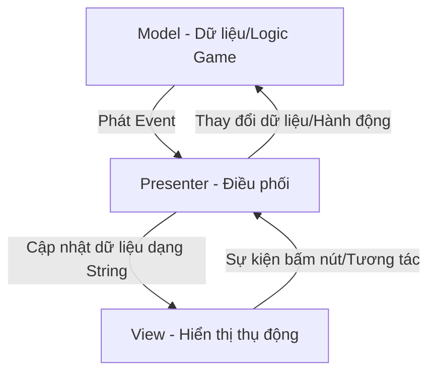

# Hệ thống UI (UI System Documentation)

Tài liệu này hướng dẫn chi tiết về Kiến trúc UI, các quy chuẩn viết code, thiết lập Editor và cách tích hợp màn hình UI mới trong dự án **Projectzombie**.

---

## 1. Kiến Trúc UI — Mô Hình MVP (Model-View-Presenter)

Dự án sử dụng mô hình **MVP** để tách biệt rõ ràng giữa dữ liệu nghiệp vụ của game (Model) và hiển thị giao diện người dùng (View).



### Phân chia Trách nhiệm (Roles)

| Thành phần | Trách nhiệm chính | Được phép | KHÔNG được phép |
| :--- | :--- | :--- | :--- |
| **Model** | Lưu trữ chỉ số, trạng thái game (vd: `PlayerStats`, `RunStatsTracker`). | Tính toán logic game, phát event khi dữ liệu thay đổi. | Biết hoặc tham chiếu tới bất kỳ thành phần UI nào. |
| **View** | Hiển thị giao diện vật lý (Text, Image, Slider, Animator). | Nhận dữ liệu dạng nguyên thủy (`string`, `float`), bắt sự kiện UI thô. | Tự ý đọc dữ liệu từ Singleton/Model hoặc thay đổi logic game. |
| **Presenter** | Làm cầu nối trung gian, điều phối luồng UI. | Đăng ký sự kiện từ Model, format dữ liệu sang `string`, gọi View cập nhật. | Chứa dữ liệu game trực tiếp hoặc thao tác trực tiếp với UI component. |

---

## 2. Quy Tắc Thiết Kế Bắt Buộc (Mandatory Rules)

### 2.1. Sử dụng TextMeshPro (TMP)
*   **Bắt buộc** sử dụng `TextMeshProUGUI` (Namespace `TMPro`) cho toàn bộ thành phần văn bản.
*   **Tuyệt đối nghiêm cấm** sử dụng component `Text` (Legacy) của Unity.
*   *Khai báo chuẩn:* `[SerializeField] private TextMeshProUGUI _myText;` (Luôn để `private` và serialize).

### 2.2. Xử lý Hoạt ảnh UI khi Tạm Dừng Game (Pause/timeScale = 0)
Khi mở các UI chọn nâng cấp hoặc Game Over, `Time.timeScale` sẽ được set về `0`. Để Animator của UI không bị đóng băng, bắt buộc đặt chế độ update sang `UnscaledTime` trong `Awake()` của View:
```csharp
private void Awake()
{
    var animator = GetComponent<Animator>();
    if (animator != null)
        animator.updateMode = AnimatorUpdateMode.UnscaledTime;
}
```

### 2.3. Định dạng Rich Text
Thay vì thay đổi màu sắc trực tiếp qua code UI (ví dụ `text.color = Color.red`), hãy định dạng chuỗi bằng thẻ **TMP Rich Text** trong Presenter trước khi đẩy xuống View:
```csharp
_view.SetStatus($"Trạng thái: <color=#FF4444>ĐANG NGUY HIỂM</color>");
```

### 2.4. Nguyên tắc Null-guard (Bảo vệ giá trị Null)
Các phương thức trong View bắt buộc phải có câu lệnh kiểm tra null để tránh vỡ game (NullReferenceException) khi Game Designer chưa kéo thả tham chiếu trên Editor:
```csharp
public void SetText(string text)
{
    if (_myText == null) return;
    _myText.text = text;
}
```

---

## 3. Bản Đồ Các Màn Hình UI Hiện Tại

Hệ thống UI được đặt hoàn toàn trong thư mục `Assets/Features/UI/`:

### 3.1. HUD Trong Trận (HUD)
*   **Thư mục:** `Assets/Features/UI/HUD/`
*   **View:** `RunHUDView.cs` — Hiển thị thời gian trôi qua, số quái đã hạ.
*   **Presenter:** `RunHUDPresenter.cs` — Nhận thông tin từ `RunStatsTracker` và cập nhật đều đặn mỗi giây.

### 3.2. Bảng Chỉ Số & Kỹ Năng (Stats And Skills)
*   **Thư mục:** `Assets/Features/UI/StatsAndSkills/`
*   **View:** 
    *   `PlayerHUDView.cs` — Hiển thị thanh HP, EXP trên màn hình chính.
    *   `PlayerStatsMenuUIView.cs` — Bảng thuộc tính chi tiết khi ấn mở túi đồ/chỉ số.
    *   `StatUIEntry.cs` / `SkillUIEntry.cs` — Đại diện cho một dòng chỉ số/kỹ năng đơn lẻ.
    *   `TooltipUI.cs` — Khung hiển thị mô tả khi di chuột qua kỹ năng.
*   **Presenter:** `PlayerInfoUIPresenter.cs` — Đồng bộ hóa chỉ số từ `PlayerStats` để cập nhật đồng thời lên HUD và Bảng chỉ số.

### 3.3. Bảng Chọn Thẻ Nâng Cấp (Upgrades UI)
*   **Thư mục:** `Assets/Features/UI/`
*   **View:** 
    *   `UpgradeUIView.cs` — Quản lý bật/tắt Panel nâng cấp và danh sách các thẻ.
    *   `UpgradeCardView.cs` — Hiển thị thông tin một thẻ nâng cấp (icon, tên, mô tả, level, category).
*   **Presenter:** `UpgradeUIPresenter.cs` — Lắng nghe sự kiện lên cấp, gọi `UpgradeManager` để lấy các lựa chọn ngẫu nhiên, định dạng thông tin và gán callback click cho từng thẻ.

### 3.4. Màn Hình Kết Quả (Game Over UI)
*   **Thư mục:** `Assets/Features/UI/`
*   **View:** `GameOverScreenView.cs` — Hiển thị kết quả thắng/thua, nút Chơi lại và nút Về Menu chính.
*   **Presenter:** `GameOverScreenPresenter.cs` — Nhận thông báo kết trận, thu thập dữ liệu tổng hợp từ `RunStatsTracker` để hiển thị và điều phối chuyển cảnh.

---

## 4. Hướng Dẫn Thiết Lập Một UI Mới Theo Chuẩn MVP

Nếu bạn cần tạo một màn hình UI mới (ví dụ: `PauseMenu`):

### Bước 1: Tạo View
Tạo script kế thừa `MonoBehaviour`. Chỉ khai báo các component UI và phơi ra các hàm nhận dữ liệu thô:
```csharp
namespace ProjectZombie.Features.UI
{
    public class PauseMenuView : MonoBehaviour
    {
        [SerializeField] private GameObject panelRoot;
        [SerializeField] private Button resumeButton;
        
        public event System.Action OnResumePressed;

        private void Awake()
        {
            resumeButton.onClick.AddListener(() => OnResumePressed?.Invoke());
        }

        public void SetPanelActive(bool active) => panelRoot.SetActive(active);
    }
}
```

### Bước 2: Tạo Presenter
Tạo script trung gian kết nối giữa sự kiện game và View:
```csharp
namespace ProjectZombie.Features.UI
{
    public class PauseMenuPresenter : MonoBehaviour
    {
        [SerializeField] private PauseMenuView view;

        private void Start()
        {
            view.OnResumePressed += ResumeGame;
            // Subscribe các event mở menu ở đây
        }

        private void OnDestroy()
        {
            view.OnResumePressed -= ResumeGame;
        }

        private void ResumeGame()
        {
            Time.timeScale = 1f;
            view.SetPanelActive(false);
        }
    }
}
```

### Bước 3: Cấu hình trên Unity Editor
1. Tạo GameObject UI trong Canvas.
2. Gắn cả View và Presenter vào GameObject đó.
3. Kéo thả các tham chiếu vào ô SerializeField tương ứng.
