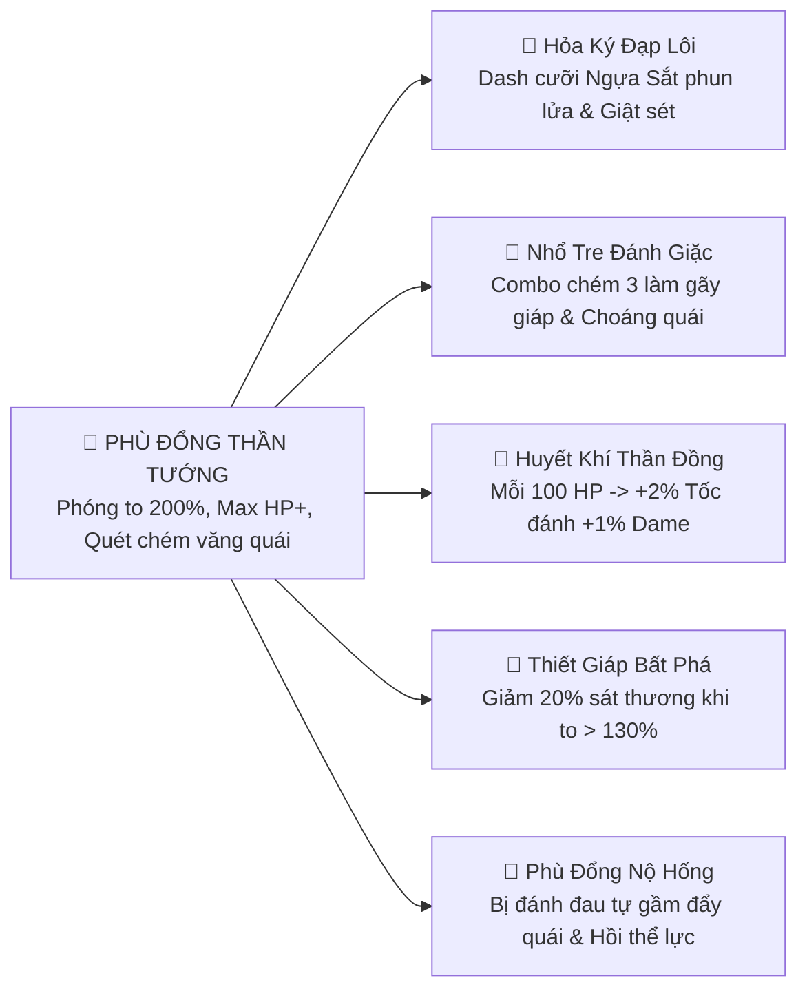
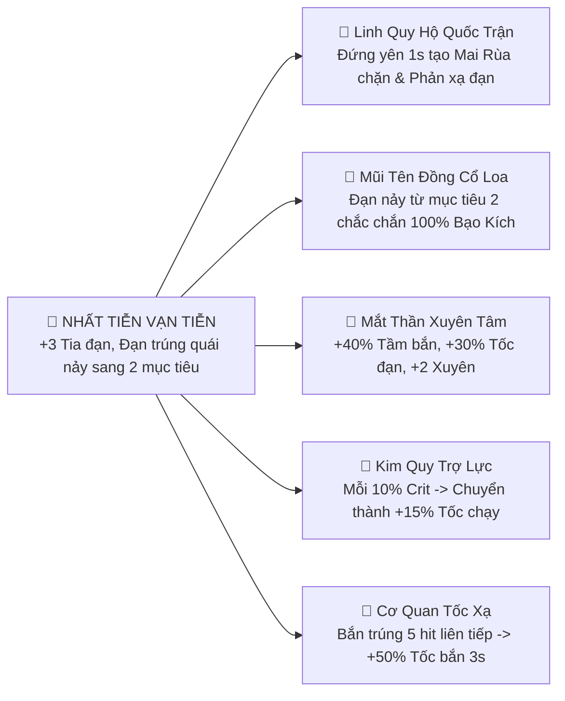
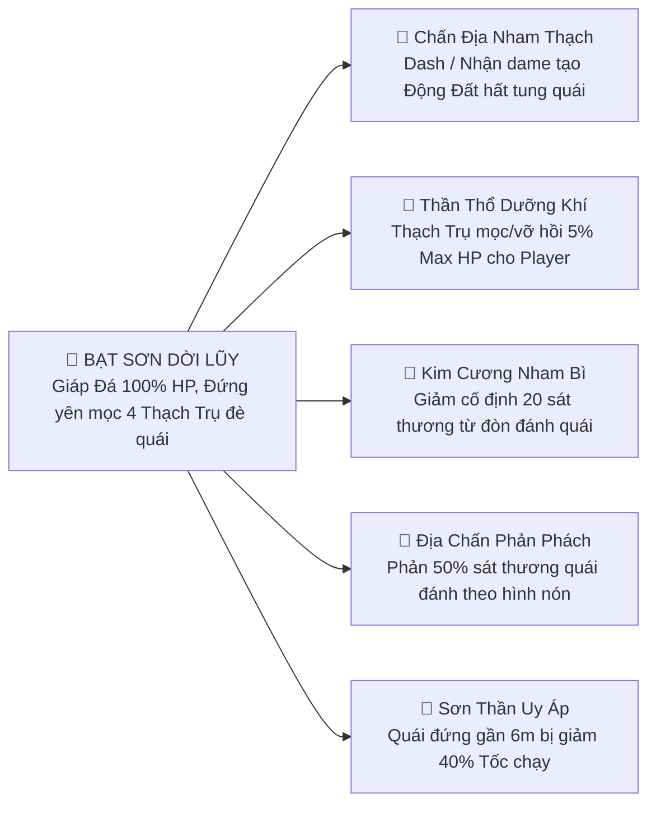
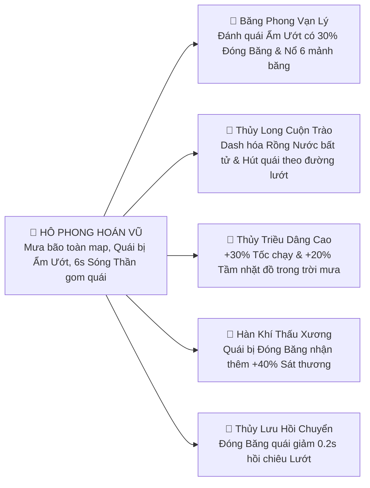
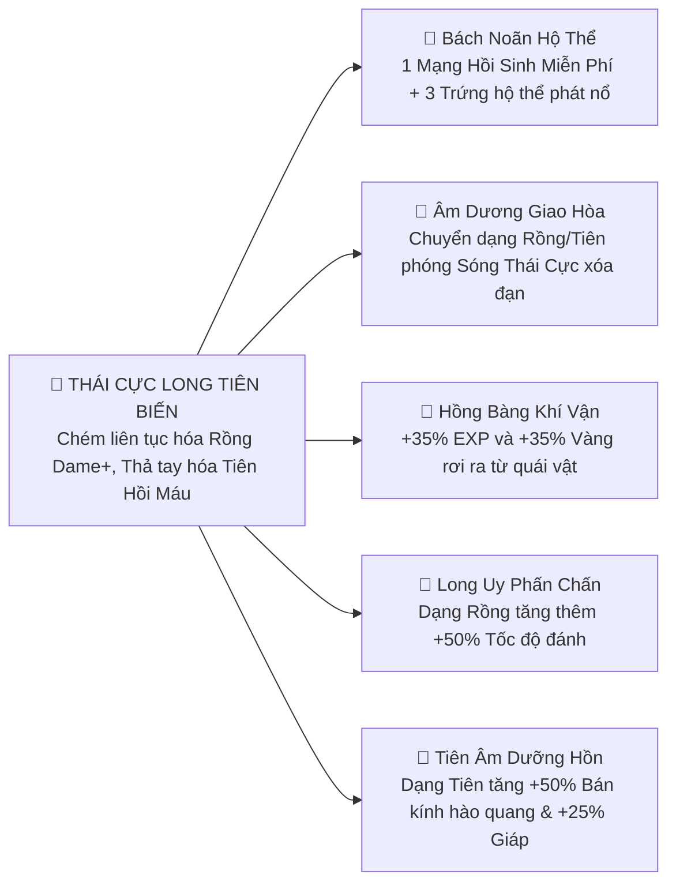

# Hệ Thống Nâng Cấp Trận Đấu (In-Match Upgrades & Mythic Cores System)

Tài liệu này mô tả chi tiết toàn bộ kiến trúc kỹ thuật của hệ thống Nâng Cấp trong trận đấu (**In-Match Upgrades**) cho dự án **Projectzombie** (Unity 2022 - Top-down Survival Roguelite phong cách Cổ Phong Thần Thoại Việt Nam).

---

## 1. Kiến Trúc Cốt Lõi (Core Architecture)

Hệ thống được thiết kế theo 5 tầng phân lập độc lập, triệt tiêu hoàn toàn `GetComponent` trong gameplay loop và bảo đảm **0 GC Allocation** trên thiết bị di động Android 60 FPS:

```mermaid
graph TD
    subgraph TẦNG 1: DỮ LIỆU CẤU HÌNH (ScriptableObjects)
        A[UpgradeData] --> B[MythicCoreUpgradeData]
        A --> C[SynergyTraitUpgradeData]
        A --> D[WeaponUpgradeData]
        A --> E[EvolutionUpgradeData]
    end

    subgraph TẦNG 2: TUYỂN CHỌN & GACHA (Selection & Filter Pipeline)
        F[UpgradeSelector] --> G[ArchetypeExclusionFilter]
        F --> H[DynamicSynergyWeighter]
    end

    subgraph TẦNG 3: COMPOSITION ROOT (PlayerContext)
        I[PlayerContext] --> J[PlayerStats]
        I --> K[HealthSystem]
        I --> L[PlayerCombatEvents]
        I --> M[PlayerMythicManager]
    end

    subgraph TẦNG 4: THỰC THI RUNTIME & LIFECYCLE (Execution Layer)
        M --> N[MythicCoreRuntime]
        N --> O[PhuDongCoreRuntime]
        N --> P[KimQuyCoreRuntime]
        N --> Q[SonThanhCoreRuntime]
        N --> R[ThuyBaCoreRuntime]
        N --> S[LongTienCoreRuntime]
    end

    subgraph TẦNG 5: GIAO DIỆN HIỂN THỊ (MVP Pattern)
        T[UpgradeUIPresenter] --> U[UpgradeCardView]
    end
```

### 1.1. Lớp Dữ Liệu: `UpgradeData` (Abstract ScriptableObject)
Mọi thẻ bài đều kế thừa từ `UpgradeData`. Điểm cải tiến quan trọng: Phương thức kiểm tra và áp dụng chỉ nhận `PlayerContext` làm tham số (không nhận `GameObject` thô):

```csharp
public abstract class UpgradeData : ScriptableObject
{
    public string id;
    public string upgradeName;
    [TextArea] public string description;
    public Sprite icon;
    public UpgradeType upgradeType;
    public float spawnWeight = 1f;
    public ElementType element = ElementType.None;

    public abstract bool IsAvailable(PlayerContext context);
    public abstract void ApplyUpgrade(PlayerContext context);
    public virtual float GetDynamicWeightMultiplier(PlayerContext context) => 1.0f;
}
```

### 1.2. Hợp Đồng Sự Kiện Chiến Đấu: `CombatEventContracts.cs`
Sử dụng `readonly struct` truyền qua từ khóa `in` để đạt **0 GC Allocation** và đảm bảo tính mở rộng không làm vỡ các hàm đã subscribe:

```csharp
public readonly struct DamageDealtEvent
{
    public readonly GameObject Attacker;
    public readonly GameObject Target;
    public readonly float Damage;
    public readonly Vector2 HitPosition;
    public readonly bool IsCrit;
    public readonly ElementType Element;
}

public readonly struct KillEvent
{
    public readonly GameObject Killer;
    public readonly GameObject Enemy;
    public readonly Vector2 Position;
    public readonly bool IsCrit;
    public readonly ElementType Element;
}

public readonly struct DashEvent
{
    public readonly GameObject Instigator;
    public readonly Vector2 StartPosition;
    public readonly Vector2 EndPosition;
    public readonly Vector2 DashDirection;
}

public readonly struct HealEvent
{
    public readonly GameObject Target;
    public readonly float HealAmount;
    public readonly float CurrentHealth;
    public readonly float MaxHealth;
}

public readonly struct ReviveEvent
{
    public readonly GameObject Player;
    public readonly float HealthPercent;
    public readonly float InvulnerableDuration;
    public readonly string Source;
}
```

---

## 2. Phác Thảo Cây Thẻ 5 Đại Lõi Thần Thoại Việt Nam (Mythic Core Trees)

Trận đấu được xây dựng quanh **5 Đại Lõi Thần Thoại Cổ Phong**, mỗi Lõi sở hữu một nhánh cây kỹ năng gồm **1 Lõi Gốc (Kim Cương) + 2 Thẻ Vàng (Cơ Chế) + 3 Thẻ Bạc (Chỉ Số)**:

### Cây 1: PHÙ ĐỔNG THIÊN UY (Hệ Hỏa - Thể Tu Khổng Lồ, Càn Quét)


### Cây 2: KIM QUY THẦN CƠ (Hệ Kim - Xạ Kích Vạn Tiễn, Đạn Nảy Xuyên Phá)


### Cây 3: TẢN VIÊN SƠN THÁNH (Hệ Thổ - Bất Tử Địa Trận, Đè Bẹp Quái)


### Cây 4: THỦY BÁ CUỒNG NỘ (Hệ Thủy - Sóng Thần Cuốn Trôi, Băng Tê Liệt)


### Cây 5: LONG TIÊN HUYẾT MẠCH (Hệ Âm Dương - Chuyển Đổi Rồng/Tiên, Miễn Tử)


---

## 3. Quy Hoạch Kho Thẻ Toàn Diện (60 Thẻ)

| Nhóm Thẻ | Số Lượng | Cơ Chế Xuất Hiện |
|---|:---:|---|
| **Đại Lõi Thần Thoại (Prismatic Core)** | **5 Thẻ** | Chỉ xuất hiện tại **Level 1** (Khởi đầu trận). |
| **Thẻ Nhánh Độc Quyền (Synergy Traits)** | **25 Thẻ** | Mỗi Lõi có 5 thẻ con. Tự động tăng +50% tỉ lệ ra khi mang đúng Lõi. |
| **Thẻ Bổ Trợ Dùng Chung (Universal Passives)** | **15 Thẻ** | Xuất hiện tự do cho mọi Lõi (Máu, Giáp, Tốc chạy, Crit, Exp, Nam châm...). |
| **Thẻ Nâng Cấp & Tiến Hóa Vũ Khí** | **13 Thẻ** | Nâng cấp vũ khí (`W001-W012`) và mở khóa Thần Binh Tối Thượng (`E001-E012`). |
| **Thẻ Cứu Cánh (Fallback Rewards)** | **2 Thẻ** | Tiên Đan Hồi Máu (40% HP) & Túi Vàng (+150 Vàng) khi cạn pool thẻ. |
| **TỔNG CỘNG** | **60 THẺ** | **Đáp ứng chuẩn quy mô Roguelite Mobile 60 FPS.** |

---

## 4. Dòng Thời Gian Trận Đấu & Cơ Chế Tuyển Chọn (Game Flow)

```
[Bắt đầu ván] ──► [MỐC 1: NHẬP ĐẠO (Level 1)]       ──► Bốc 1 trong 3 ĐẠI LÕI KIM CƯƠNG
                        │
                        ▼ (Các Level 2, 3, 4, 5: Bốc Thẻ Bạc/Vàng bổ trợ cho Lõi)
[Giữa trận]    ──► [MỐC 2: CƯỜNG HÓA (Level 6)]      ──► Bốc 1 trong 3 LÕI VÀNG / HYBRID
                        │
                        ▼ (Các Level 7-11: Nâng cấp vũ khí & Tiến hóa Thần Binh E001-E012)
[Cuối trận]    ──► [MỐC 3: ĐỘT PHÁ TỐI THƯỢNG (Lv 12)] ──► Mở khóa Tuyệt Kỹ Thần Minh trước Boss
```

### Cơ chế Tăng Trọng Số Cộng Hưởng (Dynamic Synergy Weight):
*   Khi người chơi chọn Lõi **A**, `UpgradeSelector` tự động tăng **+50% trọng số xuất hiện** cho 5 thẻ nhánh của Lõi **A** và các thẻ cùng Hệ Ngũ Hành.
*   Bộ lọc `ArchetypeExclusionFilter` tự động chặn hoàn toàn các Đại Lõi khác xuất hiện ở các level sau.

---

## 5. Giải Quyết Xung Đột & Quản Lý Vòng Đời (Lifecycle & Conflict Resolution)

### 5.1. Xử Lý Xung Đột Chỉ Số (Layered Stat Pipeline)
Chỉ số nhân vật được tính toán qua 3 tầng rõ ràng, tránh xung đột giữa thẻ cộng % và thẻ khóa giá trị (như Khóa 1 HP):
$$\text{FinalStat} = (\text{Base} + \sum \text{FlatBonus}) \times (1 + \sum \text{PercentBonus})$$
*(Nếu có modifier dạng `Override/Clamp`, giá trị Override sẽ có quyền ưu tiên cao nhất).*

### 5.2. Quản Lý Vòng Đời Runtimes (Lifecycle Contract)
`MythicCoreRuntime` tuân thủ vòng đời nghiêm ngặt với cờ bảo vệ `_isDisposed`:
*   **Initialize:** Đăng ký lắng nghe `CombatEvents`, tạo Aura VFX.
*   **Teardown (Idempotent):** Hủy đăng ký tất cả Event, thu hồi VFX, hoàn trả chỉ số.
*   **4 Kịch Bản Hủy:**
    1. *Core Replaced:* `PlayerMythicManager` gọi `Teardown()` trước khi `Instantiate` Core mới.
    2. *Player Destroyed:* `OnDestroy()` tự động kích hoạt `Teardown()`.
    3. *Run Restarted:* `ResetState()` giải phóng toàn bộ Runtime và reset về `None`.
    4. *Scene Changed:* Unity hủy scene, `_isDisposed` ngăn chặn `NullReferenceException`.

### 5.3. Cơ Chế Soft Death & Hồi Sinh (Revive Flow)
*   Khi Máu về 0, Player **KHÔNG BỊ DESTROY** mà chuyển sang trạng thái **Hấp Hối (Incapacitated)** trong 5 giây.
*   Nếu hồi sinh (qua Ads, Linh Đan, hoặc Nội tại Miễn Tử của Long Tiên):
    *   Phát sự kiện `PlayerCombatEvents.PublishPlayerRevived(new ReviveEvent(...))`.
    *   `MythicCoreRuntime` bắt sự kiện và kích hoạt hiệu ứng Thần Thoại (Phù Đổng giáng sét dọn map, Sơn Tinh hồi giáp đá, v.v.).
    *   Player tiếp tục chơi mượt mà, không tốn chi phí nạp lại dữ liệu.
*   Nếu từ chối hồi sinh / hết giờ -> Kích hoạt **Hard Death (GameOver)** và dọn dẹp bộ nhớ sạch sẽ.

---

## 6. Hướng Dẫn Mở Rộng Thẻ Mới (Extensibility Guide)

### Cách tạo thêm 1 Lõi Thần Thoại mới:
1. **Bước 1:** Khai báo Archetype mới trong `MythicArchetype` enum.
2. **Bước 2:** Tạo Runtime Controller kế thừa từ `MythicCoreRuntime` (ví dụ: `LieuHanhCoreRuntime.cs`), override `SubscribeCombatEvents()` và `UnsubscribeCombatEvents()`.
3. **Bước 3:** Tạo ScriptableObject `MythicCoreUpgradeData`, gán Prefab chứa Runtime vừa tạo.
4. **Bước 4:** Xong! Hệ thống Gacha và Filter sẽ tự động nhận diện và vận hành mà không cần sửa bất kỳ file quản lý nào.
