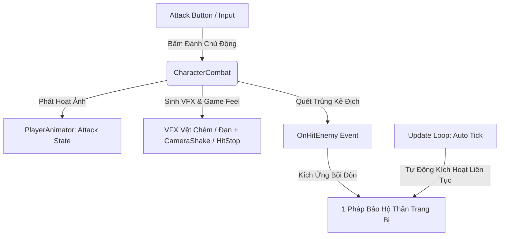
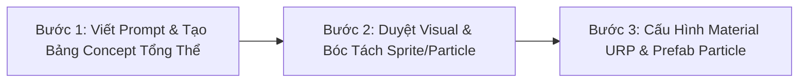

# Tài Liệu Hệ Thống Chiến Đấu & Pháp Bảo (Combat & Relic System v5.0)

Hệ thống chiến đấu của trò chơi được chuẩn hóa theo mô hình **Action RPG Survivor 2.5D Cổ Phong**:
1. **Đòn Đánh Bản Thể Nhân Vật (`CharacterCombat`)**: Gắn liền với bản thể từng vị Tướng, điều khiển qua nút **Attack Button** (Animation + VFX Vệt chém Melee / Đạn Ranged + Combo 1-2-3 + Tap Buffer Window 0.18s).
2. **Pháp Bảo Hộ Thân Duy Nhất (`WeaponManager` & `Relic` - Giới hạn 1 Slot)**: Mọi vũ khí rời trong game đều được quy chuẩn là **Pháp Bảo Hộ Thân (Relics)**. Người chơi mang theo **đúng 1 Pháp Bảo** từ Tàng Bảo Các, vận hành **100% Tự Động (Auto-Trigger / Orbit / Passive Aura / On-Hit)** theo chu kỳ `Tick()` để hỗ trợ chiến đấu.

---

## 1. Kiến Trúc Vận Hành Chiến Đấu



### 1.1. `CharacterCombat` (Đòn Đánh Bản Thể Tướng)
- **Nơi gắn**: Trực tiếp trên thực thể `Player`.
- **Vai trò**: Đòn đánh tay cơ bản đặc trưng theo nhân vật (Melee Slash / Ranged Projectile).
- **Tính năng**: Combo 1-2-3, Tap Buffer Window 0.18s, Zero-Allocation OverlapBox, HitStop, Knockback và CameraShake.

### 1.2. `WeaponManager` (Quản Lý 1 Pháp Bảo Hộ Thân)
- **Nơi gắn**: Trên `Player`.
- **Giới hạn**: `MAX_WEAPONS = 1` (Chỉ mang 1 Pháp Bảo Hộ Thân vào trận).
- **Chế độ**: `isPrimaryActiveWeapon = false` (100% Tự Động xuất chiêu, không chiếm nút đánh tay).

---

## 2. Danh Mục 17 Pháp Bảo Hộ Thân (12 Cổ Phong + 5 Dân Gian Slapstick)

Tất cả trang bị dưới đây đều được lưu trữ trong **Tàng Bảo Các (`Assets/_Data/Weapons/`)** và chọn 1 mang vào trận:

### 2.1. Nhóm 12 Pháp Bảo Cổ Phong (Vòng Xuyến Truyền Thuyết)

| Mã ID | Tên Pháp Bảo | Hệ Ngũ Hành | Vai Trò Pháp Bảo (`WeaponRole`) | Cơ Chế Hộ Thân Trong Trận |
| :--- | :--- | :---: | :---: | :--- |
| **W001** | **Nỏ Thần** | Kim | `RelicOnHitTrigger` | Tự động bắn linh tiễn An Dương Vương thẳng về kẻ địch gần nhất, xuyên 2 mục tiêu. |
| **W002** | **Bút Phán Quan** | Kim | `RelicOnHitTrigger` | Tự động vung nhát chém phán quyết âm ty gây sát thương chí mạng 2 bên. |
| **W003** | **Bùa Trấn Yêu** | Mộc | `RelicOrbitalShield` | Vòng lá bùa thần xoay quanh bảo vệ người chơi, cản đạn và đẩy lùi quái. |
| **W004** | **Cửu Vĩ Hồ Trảo** | Hỏa | `RelicOnHitTrigger` | Móng vuốt cáo lửa tự tìm diệt quái và hút sinh khí hồi phục cho Tướng. |
| **W005** | **Trống Đồng Đông Sơn** | Thổ | `RelicOrbitalShield` | Tự động phát sóng âm trảm linh 5 hướng gây choáng diện rộng xung quanh. |
| **W006** | **Lựu Đạn Thần Sa** | Hỏa | `RelicOnHitTrigger` | Quăng hạt thần sa phát nổ tạo bão lửa thiêu rụi vùng rộng và đẩy lùi mạnh. |
| **W007** | **Cung Thạch Sanh** | Kim | `RelicOnHitTrigger` | Bắn mũi tên thần lực Thạch Sanh xuyên qua hàng loạt yêu tinh trên đường thẳng. |
| **W008** | **Đao Cửu Vĩ** | Hỏa | `RelicSupportAura` | Phun luồng rồng lửa thiêu đốt liên tục kẻ địch trước mặt (DoT). |
| **W009** | **Trượng Long Vương** | Thủy | `RelicSupportAura` | Phóng sét nước thủy cung lan truyền qua chuỗi 6 yêu quái gây Choáng 0.5s. |
| **W010** | **Linh Phù Ma Da** | Thủy | `RelicSupportAura` | Triệu hồi linh thú Ma Da phun độc sát thương liên tục lên kẻ địch. |
| **W011** | **Nước Thánh Chùa Hương** | Thổ | `RelicSupportAura` | Tạo bãi giếng thiêng trên mặt đất làm chậm quái và gây sát thương liên tục. |
| **W012** | **Phi Tiêu Bát Quái** | Mộc | `RelicOnHitTrigger` | Phi tiêu ma thuật tự động xoay tròn quét kẻ địch theo hình cánh cung rồi quy hồi. |

### 2.2. Nhóm 5 Pháp Bảo Dân Gian Hài Hước (Slapstick Relics)

| Mã ID | Tên Pháp Bảo | Hệ Ngũ Hành | Vai Trò Pháp Bảo (`WeaponRole`) | Cơ Chế Hộ Thân Trong Trận |
| :--- | :--- | :---: | :---: | :--- |
| **`W_SLIPPER`** | **Dép Tổ Ong Thần Sa** | Kim | `RelicOnHitTrigger` | Ném Boomerang dép tự động; Hit 3 quăng lốc dép gây hiệu ứng **"Quê Độ"** (quái quay sang đấm nhau). |
| **`W_POT`** | **Nồi Cơm Thạch Sanh** | Thổ | `RelicOrbitalShield` | Gom tối đa 3-5 quái vào nồi và phóng ra như đạn pháo; chạm đất rơi cơm nắm hồi máu. |
| **`W_PIPE`** | **Điếu Cày Cửu U** | Hỏa | `RelicSupportAura` | Phun bão khói **"Say Thuốc Lào"** dày đặc khiến quái đi giật lùi và nổ sát thương ho sặc sụa. |
| **`R007`** | **Chiếu Trải Hoàng Tuyền** | Mộc | `RelicSupportAura` | Thả chiếu bẫy ngủ say (nhận x2 Crit DMG); Tướng bước lên trượt ván ủi bay quái. |
| **`R008`** | **Chổi Lông Gà Gia Truyền** | Kim | `RelicOnHitTrigger` | Triệu hồi chổi khổng lồ giáng từ trời, tạo lực đẩy lùi cực đại 12m/s găm quái vào tường gây Choáng. |

---

## 3. Hệ Thống Phân Loại Pháp Bảo (3 Trục Chuẩn Hóa)

### 3.1. Phân Loại Theo Vai Trò Hộ Thân Trong Trận (`WeaponRole`)
1. **🛡️ Pháp Bảo Quỹ Đạo Hộ Vệ (`RelicOrbitalShield`)**: Tự động bay quanh thân hoặc kích hoạt hào quang bảo vệ cận thân liên tục (Cản đạn, ngăn quái áp sát, bảo vệ sau lưng):
   - `W003 Bùa Trấn Yêu`, `W005 Trống Đồng Đông Sơn`, `W_POT Nồi Cơm Thạch Sanh`.
2. **⚔️ Pháp Bảo Kích Ứng Bồi Đòn (`RelicOnHitTrigger`)**: Tự động xuất chiêu/bắn thêm đòn phụ khi Tướng đánh trúng quái (Khuếch đại sát thương & dứt điểm nhanh):
   - `W001 Nỏ Thần`, `W002 Bút Phán Quan`, `W004 Cửu Vĩ Hồ Trảo`, `W006 Lựu Đạn Thần Sa`, `W007 Cung Thạch Sanh`, `W012 Phi Tiêu Bát Quái`, `W_SLIPPER Dép Tổ Ong`, `R008 Chổi Lông Gà`.
3. **🌀 Pháp Bảo Hỗ Trợ & Khống Chế (`RelicSupportAura`)**: Tự động triệu hồi linh thú, bẫy sàn (Hazard), thiêu đốt hoặc làm chậm / gây tê liệt quái theo chu kỳ:
   - `W008 Đao Cửu Vĩ`, `W009 Trượng Long Vương`, `W010 Linh Phù Ma Da`, `W011 Nước Thánh Chùa Hương`, `W_PIPE Điếu Cày Cửu U`, `R007 Chiếu Trải Hoàng Tuyền`.

### 3.2. Phân Loại Theo Thuộc Tính Ngũ Hành (`ElementType`)
* **⚡ Hệ Kim (Bạo kích, xuyên thấu, đẩy lùi cực mạnh):** `W001`, `W002`, `W007`, `W_SLIPPER`, `R008`.
* **🌿 Hệ Mộc (Hồi phục, trói chân, bẫy ngủ say):** `W003`, `W012`, `R007`.
* **💧 Hệ Thủy (Làm chậm, đóng băng, sét nước lan truyền):** `W009`, `W010`.
* **🔥 Hệ Hỏa (Thiêu đốt DoT, bão khói, nổ lan):** `W004`, `W006`, `W008`, `W_PIPE`.
* **⛰️ Hệ Thổ (Sóng âm chấn động, choáng cứng, gom quái, giếng thiêng):** `W005`, `W011`, `W_POT`.

### 3.3. Phân Loại Theo Chủ Đề Nghệ Thuật (Art Theme)
* **Cổ Phong Thần Thoại (12 Pháp Bảo `W001` - `W012`):** Trống đồng Đông Sơn, Nỏ thần An Dương Vương, Bút phán quan Âm Ty, Linh bùa chu sa...
* **Dân Gian Slapstick Meme (5 Pháp Bảo `W_SLIPPER`, `W_POT`, `W_PIPE`, `R007`, `R008`):** Dép tổ ong, Nồi cơm Thạch Sanh, Điếu cày thuốc lào, Chiếu cói trượt ván, Chổi lông gà...

---

## 4. Giao Diện Tàng Bảo Các & Nạp Loadout (UI/UX)

- **`WeaponLoadoutPresenter`**:
  - Lưới vật phẩm: Hiển thị đầy đủ **17 Pháp Bảo Hộ Thân**.
  - Ô xuất trận:
    - **Ô 1 (Lục Giác Vàng)**: Đòn Đánh Cơ Bản Của Tướng (Cố định theo Hero đang chọn).
    - **Ô 2 (Khung Lam)**: **1 Pháp Bảo Hộ Thân** được người chơi lựa chọn mang vào trận.

---

## 5. Hệ Thống Nâng Cấp & Tiến Hóa In-Game

Khi lên cấp trong trận, người chơi nhận ngẫu nhiên 3 thẻ:
1. **Thẻ Cường Hóa Đòn Đánh Tướng (`ComboAugmentUpgradeData`)**: Tăng kích thước vùng chém, thêm vệt lửa, tăng tốc độ đánh và sát thương combo của Hero.
2. **Thẻ Nâng Cấp Pháp Bảo (`WeaponUpgradeData`)**: Tăng cấp độ từ **Level 1 ➔ Level 6** cho đúng 1 Pháp Bảo Hộ Thân mang theo (Thêm tia đạn, tăng bán kính, mở khóa hiệu ứng đặc biệt).
3. **Thẻ Tiến Hóa Tối Thượng (`EvolutionUpgradeData`)**: Đột phá Pháp Bảo thành hình thái Thần Khí Tối Thượng khi đạt Lv6 và có thẻ bổ trợ tương thích.

---

## 6. Quy Trình Thiết Kế & Sản Xuất Visual VFX Cho Vũ Khí / Pháp Bảo (VFX Pipeline)

Để đảm bảo chất lượng hình ảnh đồng nhất theo phong cách **2D Stylized Anime / Kingdom Rush Cổ Phong**, toàn bộ hiệu ứng kỹ năng / vũ khí đạn / pháp bảo phải tuân thủ nghiêm ngặt **Quy Trình 3 Bước Tiêu Chuẩn**:



### 🎯 Bước 1: Tạo Bảng Concept VFX Tổng Thể (VFX Concept Sheet 2x2 Grid)
* **Nguyên tắc cốt lõi**: Tuyệt đối **không sinh ngay từng hạt rời rạc**. Phải viết prompt tạo **1 bức ảnh Concept toàn cảnh** chia bố cục lưới **2x2 (4 góc rõ ràng)** trên nền đen thuần khiết (`pure solid black background #000000`), không chứa text và không có vật thể chồng chéo lên nhau.

```
┌───────────────────────────────────┬───────────────────────────────────┐
│  1. [Góc Trên-Trái] THỰC THỂ ĐẠN │  2. [Góc Trên-Phải] VỆT XOÁY      │
│     (Projectile Entity)           │     (Trail / Vortex Energy Arc)   │
│  - Chiếc dép xoay / Nồi / Mũi tên │  - Luồng gió cuộn, vệt tốc độ     │
├───────────────────────────────────┼───────────────────────────────────┤
│  3. [Góc Dưới-Trái] SÓNG VA CHẠM  │  4. [Góc Dưới-Phải] BỤI PHỤ & FX │
│     (Impact Shockwave / Hit Spark)│     (Embers / Sparkles / Comic FX)│
│  - Vòng sóng chấn động nổ bung    │  - Hạt sáng, đốm than, icon comic │
└───────────────────────────────────┴───────────────────────────────────┘
```

* **Cấu trúc Prompt chuẩn Studio**:
  > `2D mobile game VFX concept design sheet, top-down view, 4 separate isolated elements arranged neatly with wide spacing in a 2x2 grid layout on pure solid black background: Top-left: a single [Projectile Entity] in mid-air with speedlines. Top-right: a glowing [Element Color] curved energy vortex slash arc. Bottom-left: a dynamic radial comic hit impact shockwave star. Bottom-right: tiny flying [Element Color] sparkles and comic effect particles. Bold stylized vector outlines, vibrant [Color Theme] palette, high contrast, no text, no overlapping, clean game assets sheet.`

### ✂️ Bước 2: Duyệt Visual & Bóc Tách Từng Thành Phần (Sprite Slicing)
1. **Tiêu chí duyệt Concept**:
   - Đúng ngũ hành màu sắc (Kim: Vàng sáng, Mộc: Xanh ngọc, Thủy: Lam biếc, Hỏa: Đỏ cam, Thổ: Nâu hổ phách).
   - Đúng tỷ lệ Cartoon Chibi 1:2 (nét viền đậm, khối màu rõ ràng, không bị nhiễu hạt siêu nhỏ).
2. **Quy trình bóc tách tự động (Chroma Keying Black-to-Alpha)**:
   - Thuật toán tự động nhận diện 4 Bounding Box độc lập từ 4 góc lưới.
   - Khử nền đen $100\%$ sang kênh Alpha trong suốt mịn màng (Linear Smooth Alpha Falloff).
   - Tạo ảnh vuông chuẩn Game Texture ($256\times 256$ hoặc $512\times 512$ có padding $8\%$ chống tràn viền khi xoay):
     - `Tex_[Weapon]_Projectile.png` (Đạn bay)
     - `Tex_[Weapon]_Vortex.png` (Vệt gió / Vòng xoáy)
     - `Tex_[Weapon]_HitSpark.png` (Sóng va chạm)
     - `Tex_[Weapon]_Ember.png` (Đốm sáng bổ trợ)
3. **Unity Texture Importer Meta**:
   - `alphaIsTransparency: 1`
   - `textureType: 8` (Sprite 2D and UI)
   - `wrapMode: Clamp` (Tránh lặp viền khi trôi UV)

### ⚙️ Bước 3: Cấu Hình Material URP & Multi-Layer Particle System
1. **Material Shader Phù Hợp**:
   - Khói / Mây đục / Bẫy sàn: Dùng `ProjectZombie/VFX/Slash_Additive` hoặc `URP/Particles/Unlit` với `Blend Mode = AlphaBlend` (`SrcAlpha, OneMinusSrcAlpha`) để êm dịu, không bị chói mắt.
   - Tia lửa / Vệt chém / Sóng năng lượng: Dùng `Blend Mode = Additive` (`SrcAlpha, One`) để phát quang rực rỡ.
2. **Cấu trúc Prefab Particle Đa Tầng (Multi-layer)**:
   - **Root**: `SimulationSpace = World`, `SortingOrder` thấp hơn nhân vật (thường là 8 - 9).
   - **Layer 1 (Core Entity)**: Đạn chính / Lốc xoáy trung tâm (Burst hoặc Loop có kiểm soát).
   - **Layer 2 (Trail / Plumes)**: Vệt cuộn khí động học tản rìa ngoài.
   - **Layer 3 (Embers / Sparkles)**: Tàn than, đốm sáng li ti tạo điểm nhấn sống động.
3. **Đồng bộ Gameplay**: Cân chỉnh bán kính va chạm `Collider` (`Physics2D.OverlapCircleAll`) trong Script tương ứng khớp $100\%$ với ranh giới của hiệu ứng hiển thị trên màn hình.


