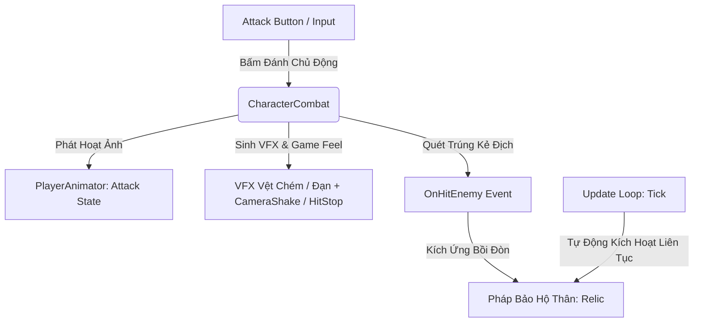

# Tài Liệu Hệ Thống Chiến Đấu & Pháp Bảo (Combat & Relic System v5.0)

Hệ thống chiến đấu của trò chơi được tái cấu trúc theo mô hình **Action RPG Survivor 2.5D Cổ Phong**:
1. **Đòn Đánh Cơ Bản Nhân Vật (`CharacterCombat`)**: Gắn liền với bản thể từng vị Tướng, điều khiển qua nút **Attack Button** (Animation + VFX Vệt chém Melee / Đạn tầm xa Ranged + Combo 1-2-3).
2. **Pháp Bảo Hộ Thân Duy Nhất (`WeaponManager` & `RelicWeapon`)**: Mỗi trận đấu người chơi chỉ mang theo **đúng 1 Pháp Bảo** từ Tàng Bảo Các, tự động bay quanh bảo vệ (`Orbit`) hoặc bồi đòn (`On-Hit / Auto-Cast`) liên tục mỗi chu kỳ.

---

## 1. Hệ Sinh Thái Chiến Đấu (Combat & Relic Architecture)

### 1.1. `CharacterCombat` (Đòn Đánh Bản Thể Nhân Vật)
- **Nơi gắn**: Trực tiếp trên thực thể `Player`.
- **Vai trò**: Quản lý đòn đánh tay cơ bản đặc trưng cho từng nhân vật, tách biệt hoàn toàn khỏi việc tháo lắp vũ khí ngoài:
  - **Melee Slash (Cận chiến)**: Quét vùng OverlapBox (Zero Allocation), sinh VFX Vệt Chém hình quạt, áp dụng lực đẩy lùi (Knockback), rung lắc màn hình (`CameraShake`) và dừng hình tạo lực đầm (`HitStop`).
  - **Ranged Projectile (Tầm xa)**: Phóng linh kiếm/đạn phép hướng về mục tiêu với tốc độ cao.
  - **Combo 1-2-3**: Quản lý bước combo (`CurrentComboStep`), thời gian giữ nhịp (`comboResetWindow`) và hệ số sát thương tăng tiến cho từng nhát.
  - **Tap Buffer Window (0.18s)**: Cho phép đệm nhịp bấm nút đánh mượt mà không bị khựng hình.

### 1.2. `WeaponManager` (Quản Lý 1 Pháp Bảo Hộ Thân)
- **Nơi gắn**: Trên `Player`.
- **Giới hạn**: `MAX_WEAPONS = 1` (Chỉ mang 1 Pháp Bảo Hộ Thân vào trận).
- **Chế độ Vận hành**: **100% Tự Động (Auto-Trigger / Passive Orbit)**.
  - Mọi Pháp bảo khi trang bị đều được đặt `isPrimaryActiveWeapon = false` để liên tục tự động ra đòn qua hàm `Tick()` mỗi khung hình mà không chiếm quyền của nút bấm đánh tay.

### 1.3. `CharacterAttackConfig` (Cấu Hình Data-Driven)
- Tích hợp trực tiếp bên trong [CharacterSelectionData.cs](file:///c:/Users/thuon/Unity/Projectzombie/Assets/Features/Player/CharacterSelectionData.cs):
  - `attackType`: `MeleeSlash` hoặc `RangedProjectile`.
  - `attackName`, `attackIcon`: Tên và icon hiển thị trên nút Attack HUD.
  - `baseDamageMultiplier`, `baseAttackSpeed`, `knockbackForce`.
  - `slashVfxPrefab` (Vệt chém) hoặc `projectilePrefab` (Đạn bay).

---

## 2. Giao Diện Nút Tấn Công & Tàng Bảo Các (UI/UX)

1. **`AttackButtonPresenter`**:
   - Tự động bind vào `CharacterCombat` của Player.
   - Hiển thị Icon đòn đánh riêng của Tướng và cập nhật thanh hồi chiêu linh hoạt.
2. **`WeaponLoadoutPresenter` (Tàng Bảo Các)**:
   - Cột trái: Tab duy nhất `[ KHO PHÁP BẢO HỘ THÂN (CHỌN 1) ]` hiển thị lưới 12 ô Pháp bảo.
   - Cột phải: Hiển thị 2 ô trang bị xuất trận:
     - **Ô 1 (Lục Giác Vàng)**: Đòn Đánh Cơ Bản Của Tướng (Cố định theo nhân vật đang chọn).
     - **Ô 2 (Khung Lam)**: 1 Pháp Bảo Hộ Thân đã chọn từ kho.

---

## 3. Hệ Thống Nâng Cấp In-Game (`UpgradeManager`)

Khi nhân vật lên cấp trong trận đấu, các thẻ nâng cấp sẽ phân phối tập trung:
- **Thẻ Cường Hóa Đòn Đánh Tướng (`ComboAugmentUpgradeData`)**: Tăng kích thước vùng chém, thêm vệt lửa, tăng tốc độ đánh và sát thương combo của bản thân nhân vật.
- **Thẻ Cường Hóa & Tiến Hóa Pháp Bảo (`WeaponUpgradeData` & `EvolutionUpgradeData`)**: Nâng cấp cấp độ (Level 1 -> 6) và tiến hóa cho đúng **1 Pháp bảo hộ thân duy nhất** đang mang theo.

## 4. Hệ Thống Nâng Cấp (Upgrade System)

Trong trận đấu, người chơi nhận EXP từ việc tiêu diệt quái vật. Khi lên cấp, người chơi được chọn 1 trong 3 nâng cấp ngẫu nhiên.

### Mục tiêu của hệ thống:
- Tạo cảm giác phát triển sức mạnh liên tục.
- Tạo nhiều hướng build khác nhau.
- Dễ theo dõi trên livestream.
- Không yêu cầu người chơi sử dụng kỹ năng thủ công.

### Phân loại Nâng cấp:
Mỗi nâng cấp thuộc một trong các nhóm sau:
1. **Weapon Upgrade**
2. **Signature Skill Upgrade**
3. **Common Upgrade**
4. **Faction Counter Upgrade**
5. **Rare Upgrade**
6. **Evolution Upgrade**

---

### Chi Tiết: Weapon Upgrade

Nâng cấp trực tiếp cho vũ khí chính của Hero. Mỗi vũ khí có **tối đa 6 cấp**.

- **LEVEL 1 (Cơ bản):** Mở khóa vũ khí cơ bản.
  - *Ví dụ: Stream Blade - Phóng 1 lưỡi kiếm năng lượng, tấn công mục tiêu gần nhất.*
- **LEVEL 2 (Đa mục tiêu):** Tăng số lượng đòn đánh / đạn (`+1 Projectile`).
  - *Ghi chú: Giúp tăng khả năng dọn quái đầu trận.*
- **LEVEL 3 (Sát thương):** Tăng sát thương (`+20% Damage`).
  - *Ghi chú: Là nâng cấp ổn định cho mọi build.*
- **LEVEL 4 (Hiệu ứng phụ):** Mở khóa hiệu ứng đặc biệt (Ricochet, Chain Attack, Explosion).
  - *Ghi chú: Đây là mốc thay đổi gameplay đầu tiên.*
- **LEVEL 5 (Tốc độ):** Tăng tốc độ tấn công (`+30% Attack Speed`).
  - *Ghi chú: Tăng DPS tổng thể.*
- **LEVEL 6 (Hiệu ứng cuối):** Mở khóa hiệu ứng tối thượng (Nổ diện rộng, Xuyên nhiều mục tiêu, Bắn thêm đạn phụ).
  - *Ghi chú: Đây là cấp tối đa của vũ khí.*
