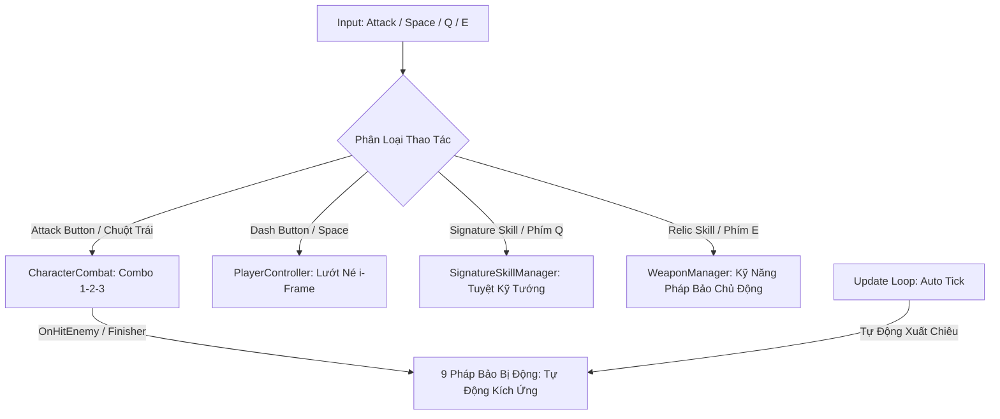
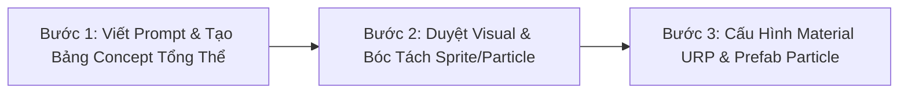

# Tài Liệu Hệ Thống Chiến Đấu & Pháp Bảo (Hybrid Relic System v6.0)

Hệ thống chiến đấu của trò chơi được chuẩn hóa theo mô hình **Action RPG Survivor 2.5D Cổ Phong**:
1. **Đòn Đánh Bản Thể Nhân Vật (`CharacterCombat`)**: Gắn liền với bản thể từng vị Tướng, điều khiển qua nút **Attack Button** (Animation + VFX Vệt chém Melee / Đạn Ranged + Combo 1-2-3 + Tap Buffer Window 0.18s).
2. **Kỹ Năng Tuyệt Kỹ Bản Thể (`SignatureSkillManager`)**: Chiêu nộ đặc trưng của từng vị Tướng, điều khiển qua nút **Signature Skill Button** (Phím `Q` / Touch).
3. **Pháp Bảo Hộ Thân Duy Nhất (`WeaponManager` & `Relic` - Giới hạn 1 Slot)**: Mọi vũ khí rời trong game đều được quy chuẩn là **Pháp Bảo Hộ Thân (Relics)** theo mô hình **Hệ Thống Lai (Hybrid Relics)**:
   - **8 Pháp Bảo Chủ Động (Active Relics)**: Khi trang bị, nút **Relic Skill Button (`Btn_RelicSkill`)** (Phím `E` / Touch) sẽ xuất hiện trên HUD để người chơi chủ động thi triển kỹ năng chiến thuật, có Cooldown và Countdown.
   - **9 Pháp Bảo Bị Động (Passive Relics)**: Khi trang bị, nút Relic Skill **tự động ẩn** khỏi HUD để giữ giao diện tinh gọn, pháp bảo tự động kích ứng (Auto-Tick / Orbital / On-Hit / Finisher Proc).

---

## 1. Kiến Trúc Vận Hành Chiến Đấu



---

## 2. Danh Mục 17 Pháp Bảo Hộ Thân (8 Chủ Động + 9 Bị Động)

### 2.1. ⚔️ Nhóm 8 Pháp Bảo Chủ Động (Active Relics - Có Nút Bấm HUD)

| Mã ID | Tên Pháp Bảo | Hệ Ngũ Hành | Tên Kỹ Năng Chủ Động | Cooldown | Cơ Chế Thi Triển Khi Bấm Nút |
| :--- | :--- | :---: | :--- | :---: | :--- |
| **W001** | **Nỏ Thần** | Kim | **Vạn Tiễn Phá Trận** | 6.0s | Bắn chùm 5 linh tiễn thần uy định hướng xuyên quái và đẩy lùi 8m. |
| **W005** | **Trống Đồng Đông Sơn** | Thổ | **Thần Âm Trảm Linh** | 10.0s | Dậm 3 đợt sóng âm 360 độ cực đại gây choáng cứng 1.5s và đẩy lùi toàn bộ quái. |
| **W006** | **Lựu Đạn Thần Sa** | Hỏa | **Bão Lửa Thần Sa** | 8.0s | Quăng chùm 3 hạt Thần Sa nổ tung bão lửa thiêu rụi vùng rộng trong 4s. |
| **W008** | **Đao Cửu Vĩ** | Hỏa | **Hỏa Long Bộc Phát** | 12.0s *(Duy trì 5s)* | Bộc phát thần uy trong 5s, liên tục vung trảm hỏa long 8 hướng và tăng tốc chạy. |
| **W011** | **Nước Thánh Chùa Hương** | Thổ | **Trận Pháp Giếng Thiêng** | 15.0s *(Duy trì 6s)* | Tạo trận pháp 3 giếng thiêng phong tỏa làm chậm 50% quái và hồi ngay 10% Max HP. |
| **`W_SLIPPER`** | **Dép Tổ Ong Thần Sa** | Kim | **Tổ Ong Lượn Cánh** | 7.0s | Quăng Boomerang Dép khổng lồ + Lốc Dép Vạn Năng gây Quê Độ 100% (quái đánh nhau). |
| **`W_POT`** | **Nồi Cơm Thạch Sanh** | Thổ | **Hút Chân Không & Tiên Cơm** | 14.0s | Gom quái diện rộng 6m vào tâm nồi trong 2s, nổ hất văng 18m/s và rơi Cơm Nắm hồi máu. |
| **`W_PIPE`** | **Điếu Cày Cửu U** | Hỏa | **Bão Khói Thuốc Lào** | 9.0s *(Duy trì 5s)* | Rít hơi dài nhả bão khói diện rộng làm quái đi giật lùi và ho nổ sát thương diện rộng. |

### 2.2. 🛡️ Nhóm 9 Pháp Bảo Bị Động (Passive Relics - Tự Động Ẩn Nút HUD)

| Mã ID | Tên Pháp Bảo | Hệ Ngũ Hành | Kiểu Kích Ứng | Cơ Chế Hộ Thân Tự Động |
| :--- | :--- | :---: | :---: | :--- |
| **W002** | **Bút Phán Quan** | Kim | `On-Hit Proc` | Tự vung nhát chém phán quyết âm ty khi Hero đánh trúng quái. |
| **W003** | **Bùa Trấn Yêu** | Mộc | `Orbital Shield` | Vòng lá bùa thần xoay quanh cản đạn bay của yêu ma và cản quái áp sát. |
| **W004** | **Cửu Vĩ Hồ Trảo** | Hỏa | `On-Hit Lifesteal` | Móng vuốt cáo lửa tự cào xé quái và hút sinh khí hồi phục cho Tướng. |
| **W007** | **Cung Thạch Sanh** | Kim | `Auto Tick` | Tự động bắn mũi tên thần lực Thạch Sanh xuyên qua hàng loạt yêu tinh ở xa. |
| **W009** | **Trượng Long Vương** | Thủy | `Auto Chain` | Tự động giáng sét nước thủy cung lan truyền qua chuỗi 6 yêu quái (Choáng 0.5s). |
| **W010** | **Linh Phù Ma Da** | Thủy | `Pet Companion` | Triệu hồi linh thú Ma Da bơi theo phun dịch độc làm chậm liên tục. |
| **W012** | **Phi Tiêu Bát Quái** | Mộc | `Auto Orbit` | Phi tiêu ma thuật tự động xoay tròn quét kẻ địch theo hình cánh cung rồi quy hồi. |
| **`R007`** | **Chiếu Trải Hoàng Tuyền** | Mộc | `Periodic Trap` | Cứ mỗi 8s tự thả chiếu khiến quái ngủ say (x2 Crit); Hero bước lên trượt ván +100% tốc chạy. |
| **`R008`** | **Chổi Lông Gà Gia Truyền** | Kim | `Finisher Proc` | Tự động giáng Chổi Lông Gà khổng lồ khi Hero kết thúc Combo Hit 3, Knockback 12m/s gây choáng. |

---

## 3. Giao Diện HUD & Thao Tác Thông Minh (Smart Adaptive UI)

- **HUD Mobile Controls:**
  - `Btn_Attack`: Đòn đánh bản thể Tướng (Combo 1-2-3).
  - `Btn_Dash`: Lướt né tránh.
  - `Btn_SignatureSkill`: Tuyệt kỹ Nộ của Hero.
  - `Btn_RelicSkill`: Kỹ năng Pháp Bảo (Tự động **HIỆN** khi mang Active Relic, tự động **ẨN** khi mang Passive Relic).
- **Phím Tắt PC:**
  - `Chuột Trái / J`: Đánh thường.
  - `Space`: Lướt né.
  - `Q / U`: Tuyệt kỹ Tướng.
  - `E / R / I`: Kỹ năng Pháp Bảo Chủ Động.

---

## 4. Giao Diện Tàng Bảo Các & Nạp Loadout (UI/UX)

- **`WeaponLoadoutPresenter`**:
  - Lưới vật phẩm: Hiển thị đầy đủ **17 Pháp Bảo Hộ Thân**.
  - Ô xuất trận:
    - **Ô 1 (Lục Giác Vàng)**: Đòn Đánh Cơ Bản Của Tướng (Cố định theo Hero đang chọn).
    - **Ô 2 (Khung Lam)**: **1 Pháp Bảo Hộ Thân** được người chơi lựa chọn mang vào trận.

---

## 5. Hệ Thống Nâng Cấp & Tiến Hóa In-Game

Khi lên cấp trong trận, người chơi nhận ngẫu nhiên 3 thẻ:
1. **Thẻ Cường Hóa Đòn Đánh Tướng (`ComboAugmentUpgradeData`)**: Tăng kích thước vùng chém, thêm vệt lửa, tăng tốc độ đánh và sát thương combo của Hero.
2. **Thẻ Nâng Cấp Pháp Bảo (`WeaponUpgradeData`)**: Tăng cấp độ từ **Level 1 ➔ Level 6** cho đúng 1 Pháp Bảo Hộ Thân mang theo (Thêm tia đạn, tăng bán kính, mở khóa hiệu ứng đặc biệt).
3. **Thẻ Tiến Hóa Tối Thượng (`EvolutionUpgradeData`)**: Đột phá Pháp Bảo thành hình thái Thần Khí Tối Thượng khi đạt Lv6 và có thẻ bổ trợ tương thích.

---

## 6. Quy Trình Thiết Kế & Sản Xuất Visual VFX Cho Vũ Khí / Pháp Bảo (VFX Pipeline)

Để đảm bảo chất lượng hình ảnh đồng nhất theo phong cách **2D Stylized Anime / Kingdom Rush Cổ Phong**, toàn bộ hiệu ứng kỹ năng / vũ khí đạn / pháp bảo phải tuân thủ nghiêm ngặt **Quy Trình 3 Bước Tiêu Chuẩn**:



### 🎯 Bước 1: Tạo Bảng Concept VFX Tổng Thể (VFX Concept Sheet 2x2 Grid)
* **Nguyên tắc cốt lõi**: Tuyệt đối **không sinh ngay từng hạt rời rạc**. Phải viết prompt tạo **1 bức ảnh Concept toàn cảnh** chia bố cục lưới **2x2 (4 góc rõ ràng)** trên nền đen thuần khiết (`pure solid black background #000000`), không chứa text và không có vật thể chồng chéo lên nhau.

```
┌───────────────────────────────────┬───────────────────────────────────┐
│  1. [Góc Trên-Trái] THỰC THỂ ĐẠN │  2. [Góc Trên-Phải] VỆT XOÁY      │
│     (Projectile Entity)           │     (Trail / Vortex Energy Arc)   │
│  - Chiếc dép xoay / Nồi / Mũi tên │  - Luồng gió cuộn, vệt tốc độ     │
├───────────────────────────────────┼───────────────────────────────────┤
│  3. [Góc Dưới-Trái] SÓNG VA CHẠM  │  4. [Góc Dưới-Phải] BỤI PHỤ & FX │
│     (Impact Shockwave / Hit Spark)│     (Embers / Sparkles / Comic FX)│
│  - Vòng sóng chấn động nổ bung    │  - Hạt sáng, đốm than, icon comic │
└───────────────────────────────────┴───────────────────────────────────┘
```

* **Cấu trúc Prompt chuẩn Studio**:
  > `2D mobile game VFX concept design sheet, top-down view, 4 separate isolated elements arranged neatly with wide spacing in a 2x2 grid layout on pure solid black background: Top-left: a single [Projectile Entity] in mid-air with speedlines. Top-right: a glowing [Element Color] curved energy vortex slash arc. Bottom-left: a dynamic radial comic hit impact shockwave star. Bottom-right: tiny flying [Element Color] sparkles and comic effect particles. Bold stylized vector outlines, vibrant [Color Theme] palette, high contrast, no text, no overlapping, clean game assets sheet.`

### ✂️ Bước 2: Duyệt Visual & Bóc Tách Từng Thành Phần (Sprite Slicing)
1. **Tiêu chí duyệt Concept**:
   - Đúng ngũ hành màu sắc (Kim: Vàng sáng, Mộc: Xanh ngọc, Thủy: Lam biếc, Hỏa: Đỏ cam, Thổ: Nâu hổ phách).
   - Đúng tỷ lệ Cartoon Chibi 1:2 (nét viền đậm, khối màu rõ ràng, không bị nhiễu hạt siêu nhỏ).
2. **Quy trình bóc tách tự động (Chroma Keying Black-to-Alpha)**:
   - Thuật toán tự động nhận diện 4 Bounding Box độc lập từ 4 góc lưới.
   - Khử nền đen $100\%$ sang kênh Alpha trong suốt mịn màng (Linear Smooth Alpha Falloff).
   - Tạo ảnh vuông chuẩn Game Texture ($256\times 256$ hoặc $512\times 512$ có padding $8\%$ chống tràn viền khi xoay):
     - `Tex_[Weapon]_Projectile.png` (Đạn bay)
     - `Tex_[Weapon]_Vortex.png` (Vệt gió / Vòng xoáy)
     - `Tex_[Weapon]_HitSpark.png` (Sóng va chạm)
     - `Tex_[Weapon]_Ember.png` (Đốm sáng bổ trợ)
3. **Unity Texture Importer Meta**:
   - `alphaIsTransparency: 1`
   - `textureType: 8` (Sprite 2D and UI)
   - `wrapMode: Clamp` (Tránh lặp viền khi trôi UV)

### ⚙️ Bước 3: Cấu Hình Material URP & Multi-Layer Particle System
1. **Material Shader Phù Hợp**:
   - Khói / Mây đục / Bẫy sàn: Dùng `ProjectZombie/VFX/Slash_Additive` hoặc `URP/Particles/Unlit` với `Blend Mode = AlphaBlend` (`SrcAlpha, OneMinusSrcAlpha`) để êm dịu, không bị chói mắt.
   - Tia lửa / Vệt chém / Sóng năng lượng: Dùng `Blend Mode = Additive` (`SrcAlpha, One`) để phát quang rực rỡ.
2. **Cấu trúc Prefab Particle Đa Tầng (Multi-layer)**:
   - **Root**: `SimulationSpace = World`, `SortingOrder` thấp hơn nhân vật (thường là 8 - 9).
   - **Layer 1 (Core Entity)**: Đạn chính / Lốc xoáy trung tâm (Burst hoặc Loop có kiểm soát).
   - **Layer 2 (Trail / Plumes)**: Vệt cuộn khí động học tản rìa ngoài.
   - **Layer 3 (Embers / Sparkles)**: Tàn than, đốm sáng li ti tạo điểm nhấn sống động.
3. **Đồng bộ Gameplay**: Cân chỉnh bán kính va chạm `Collider` (`Physics2D.OverlapCircleAll`) trong Script tương ứng khớp $100\%$ với ranh giới của hiệu ứng hiển thị trên màn hình.


