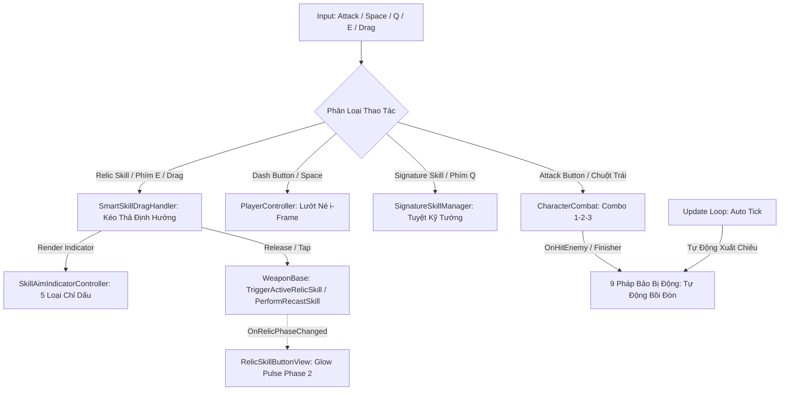
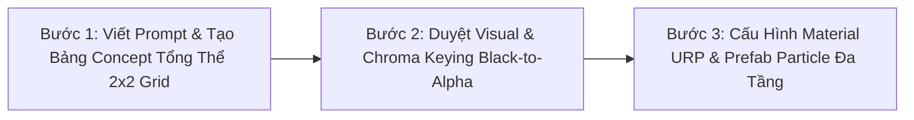

# Tài Liệu Hệ Thống Chiến Đấu & Pháp Bảo (Hybrid Relic System v6.5 - Multi-Phase & Aiming Indicators)

Hệ thống chiến đấu của trò chơi được chuẩn hóa theo mô hình **Action RPG Survivor 2.5D Cổ Phong**:
1. **Đòn Đánh Bản Thể Nhân Vật (`CharacterCombat`)**: Gắn liền với bản thể từng vị Tướng, điều khiển qua nút **Attack Button** (Animation + VFX Vệt chém Melee / Đạn Ranged + Combo 1-2-3 + Tap Buffer Window 0.18s).
2. **Kỹ Năng Tuyệt Kỹ Bản Thể (`SignatureSkillManager`)**: Chiêu nộ đặc trưng của từng vị Tướng, điều khiển qua nút **Signature Skill Button** (Phím `Q` / Touch).
3. **Pháp Bảo Hộ Thân Duy Nhất (`WeaponManager` & `Relic` - Giới hạn 1 Slot)**: Mọi vũ khí rời trong game đều được quy chuẩn là **Pháp Bảo Hộ Thân (Relics)** theo mô hình **Hệ Thống Lai (Hybrid Relics v6.5)**:
   - **8 Pháp Bảo Chủ Động (Active Relics)**: Khi trang bị, nút **Relic Skill Button (`Btn_RelicSkill`)** (Phím `E` / Touch) sẽ xuất hiện trên HUD để người chơi chủ động thi triển kỹ năng chiến thuật, có Cooldown, Countdown và hỗ trợ **Chỉ Dấu Định Hướng MOBA (Aiming Indicators)** + **Cơ chế Tái Kích Hoạt (Recast 2 Phase)**.
   - **9 Pháp Bảo Bị Động (Passive Relics)**: Khi trang bị, nút Relic Skill **tự động ẩn** khỏi HUD để giữ giao diện tinh gọn, pháp bảo tự động kích ứng theo sự kiện nhịp chém của Tướng (Auto-Tick / Orbital / On-Hit / Finisher Proc / Low-HP Berserk).

---

## 1. Kiến Trúc Vận Hành Chiến Đấu

---

## 2. Hệ Thống 5 Loại Chỉ Dấu Định Hướng (Skill Aiming Indicators)

Toàn bộ chỉ dấu được tính toán và vẽ mượt mà qua [SkillAimIndicatorController.cs](file:///c:/Users/thuon/Unity/Projectzombie/Assets/Features/Combat/Aiming/SkillAimIndicatorController.cs) (Zero GC Alloc):

1. **`LineArrow` (Mũi Tên Định Hướng Dài):** Dùng cho các đòn bắn thẳng xuyên thấu tầm xa (Ví dụ: *Nỏ Thần W001 - Tầm 14m*).
2. **`ConeSector` (Hình Quạt Vùng Rộng):** Dùng cho các đòn trảm quét góc rộng (Ví dụ: *Đao Cửu Vĩ W008 - Góc 120 độ*).
3. **`CircleReticle` (Tâm Tròn Thả Điểm Từ Xa):** Dùng cho các chiêu thả cọc, cắm bẫy và bom chùm (Ví dụ: *Nồi Cơm Thạch Sanh W_POT, Lựu Đạn Thần Sa W006*).
4. **`VectorWall` (Tường Trận Địa Kéo Vạch):** Dùng cho các kỹ năng rạch đường dựng tường phong tỏa địa hình (Ví dụ: *Nước Thánh Chùa Hương W011, Điếu Cày Cửu U W_PIPE*).
5. **`CurvedTrajectory` (Quỹ Đạo Cong Parabol / Boomerang):** Bẻ cong góc ngắm và đánh dấu điểm quay đầu (Ví dụ: *Dép Tổ Ong W_SLIPPER Phase 1*).
6. **`RhythmPulse` (Sóng Âm Nhịp Điệu):** Vòng tròn co bóp theo nhịp điệu tiếng trống (Ví dụ: *Trống Đồng Đông Sơn W005*).

---

## 3. Danh Mục Chi Tiết 17 Pháp Bảo Hộ Thân

### 3.1. ⚔️ Nhóm 8 Pháp Bảo Chủ Động (Active Relics - Có Nút Bấm HUD & Chỉ Dấu)

| Mã ID | Tên Pháp Bảo | Hệ Ngũ Hành | Loại Chỉ Dấu | Cơ Chế Thi Triển Khi Kích Hoạt |
| :--- | :--- | :---: | :---: | :--- |
| **`W_SLIPPER`** | **Dép Tổ Ong Thần Sa** | Kim | `CurvedTrajectory` $\rightarrow$ `DashLine` | **Combo Song Phi 2 Giai Đoạn:**  • *Phase 1:* Ném Boomerang bay vòng cung gom quái. • *Phase 2 (Recast 3s):* Tướng lướt vụt tới vị trí Dép xoay, tung cước **Song Phi** dẫm nổ Shockwave tan xác quái! |
| **`W011`** | **Nước Thánh Chùa Hương** | Thủy | `VectorWall` | **Dựng Tường Trận Địa:** Rạch 1 đường dựng Bức Tường Nước Thánh 4 giếng thiêng phong tỏa làm chậm 50% bầy quái và hồi ngay 10% Max HP. |
| **`W005`** | **Trống Đồng Đông Sơn** | Thổ | `RhythmPulse` | **Thần Âm Trảm Linh:** Sóng âm 360 độ cực đại dậm theo nhịp trống Đông Sơn gây choáng cứng 1.5s và đẩy lùi bầy quái. |
| **`W_POT`** | **Nồi Cơm Thạch Sanh** | Thổ | `CircleReticle` | **Cắm Nồi Gom Quái Từ Xa:** Đặt Nồi Cơm tại điểm rơi chỉ định, tạo lốc xoáy hút toàn bộ quái trong 6m rồi bắn nổ văng 18m/s và rơi Cơm Nắm hồi máu. |
| **`W001`** | **Nỏ Thần** | Kim | `LineArrow` (14m) | **Vạn Tiễn Phá Trận:** Khai hỏa liên tiếp 3 đợt bão Linh Tiễn Thần Uy xuyên thấu 100% mục tiêu và đẩy lùi bầy quái 8m. |
| **`W006`** | **Lựu Đạn Thần Sa** | Hỏa | `CircleReticle` (8.5m) | **Bão Lửa Thần Sa:** Quăng chùm 3 hạt Thần Sa nổ liên hoàn tạo bão lửa thiêu rụi vùng rộng trong 4s. |
| **`W008`** | **Đao Cửu Vĩ** | Hỏa | `ConeSector` (120°) | **Hỏa Long Bộc Phát:** Kích hoạt trạng thái thần uy trong 5s: Tăng 35% tốc đánh, vung trảm Hỏa Long 8 hướng quét sạch quái. |
| **`W_PIPE`** | **Điếu Cày Cửu U** | Hỏa | `VectorWall` | **Bão Khói Địa Hình:** Rít hơi dài nhả bức tường bão khói diện rộng 6m làm quái đi giật lùi, say thuốc và ho nổ thiêu đốt liên tục. |

---

### 3.2. 🛡️ Nhóm 9 Pháp Bảo Bị Động (Passive Relics - Tự Động Ẩn Nút HUD & Bồi Đòn)

| Mã ID | Tên Pháp Bảo | Hệ Ngũ Hành | Kiểu Kích Ứng | Cơ Chế Hộ Thân Tự Động Đột Phá |
| :--- | :--- | :---: | :---: | :--- |
| **`R007`** | **Chiếu Trải Hoàng Tuyền** | Mộc | `Periodic Trap` | **Trượt Ván Bowling:** Cứ mỗi 8s thả chiếu khiến quái ngủ say (x2 Crit). Khi Tướng dẫm lên chiếu sẽ trượt ván siêu tốc ủi bay quái và gây sát thương va chạm! |
| **`R008`** | **Chổi Lông Gà Gia Truyền** | Kim | `Finisher Proc` | **Đòn Phạt Tuổi Thơ:** Tự động giáng Chổi Lông Gà khổng lồ từ trên trời khi Hero kết thúc Combo Hit 3, Knockback 12m/s và gây Choáng 0.8s. |
| **`W004`** | **Cửu Vĩ Hồ Trảo** | Hỏa | `On-Hit Lifesteal` | **Cửu Vĩ Cuồng Nộ:** Bắn dơi hồ ly hút máu. Khi máu Tướng dưới 35%, tự động x2 số lượng đàn dơi và x2.5 hiệu suất Hút Máu (Lifesteal). |
| **`W009`** | **Trượng Long Vương** | Thủy | `Auto Chain` | **Sét Thủy Long:** Cầu sét nước tự động phóng ra và nảy chuỗi lan truyền qua 6 quái vật (Choáng 0.5s). |
| **`W002`** | **Bút Phán Quan** | Kim | `On-Hit Proc` | **Nét Bút Chu Sa:** Tự động vung nhát chém mực Chu Sa phán quyết khi Hero đánh trúng quái. |
| **`W003`** | **Bùa Trấn Yêu** | Mộc | `Orbital Shield` | **Lá Bùa Hộ Mệnh:** Vòng lá bùa thần bảo hộ xoay quanh triệt tiêu và đẩy lùi quái vật áp sát. |
| **`W007`** | **Cung Thạch Sanh** | Kim | `Auto Tick` | Tự động bắn mũi tên thần lực Thạch Sanh xuyên qua hàng loạt yêu tinh ở xa. |
| **`W010`** | **Linh Phù Ma Da** | Thủy | `Pet Companion` | Triệu hồi linh thú Ma Da bơi theo phun dịch độc làm chậm liên tục. |
| **`W012`** | **Phi Tiêu Bát Quái** | Mộc | `Auto Orbit` | Phi tiêu ma thuật tự động xoay tròn quét kẻ địch theo hình cánh cung rồi quy hồi. |

---

## 4. Giao Diện HUD & Thao Tác Thông Minh (Smart Adaptive UI)

- **Cơ Chế Viền Sáng Tái Kích Hoạt (Recast Glow Pulse):**
  - Khi người chơi sử dụng Pháp bảo có cơ chế 2 Phase (như *Dép Tổ Ong*), nút `Btn_RelicSkill` sẽ bước vào cửa sổ 3 giây và phát hiệu ứng viền sáng **Vàng Kim (Glow Pulse)** co bóp theo nhịp sóng sin.
  - Người chơi chỉ cần chạm lần 2 (hoặc nhấn phím `E` lần 2) để thi triển đòn kết liễu trước khi pháp bảo bước vào thời gian Cooldown.
- **HUD Mobile Controls:**
  - `Btn_Attack`: Đòn đánh bản thể Tướng (Combo 1-2-3).
  - `Btn_Dash`: Lướt né tránh.
  - `Btn_SignatureSkill`: Tuyệt kỹ Nộ của Hero.
  - `Btn_RelicSkill`: Kỹ năng Pháp Bảo (Tự động **HIỆN** khi mang Active Relic, tự động **ẨN** khi mang Passive Relic).
- **Phím Tắt PC:**
  - `Chuột Trái / J`: Đánh thường.
  - `Space`: Lướt né.
  - `Q / U`: Tuyệt kỹ Tướng.
  - `E / R / I`: Kỹ năng Pháp Bảo Chủ Động (Kéo chuột để định hướng).

---

## 5. Cơ Chế Thu Hồi & Dọn Dẹp Bộ Nhớ (Zero-Leak Cleanup Engine)

Khi người chơi bấm **Pause ➔ Thoát Trận** về Sảnh Chờ (Meta Hub):
1. **`ProjectilePool` & `ProjectileSystem`**: Gọi `DespawnAllProjectiles()` thu hồi toàn bộ đạn/quả cầu đang bay về Pool.
2. **`GlobalVFXPoolManager`**: Gọi `ClearAllActiveEffects()` dập tắt ngay lập tức các hiệu ứng Particle System và thu hồi VFX GameObject.
3. **`BatQuaiTranZone` & `Relic_SleepingMat`**: Hủy sạch các thực thể vùng trận đồ trên Scene Gameplay, đảm bảo không còn bất kỳ tàn dư nào che khuất giao diện Menu.

---

## 6. Quy Trình Thiết Kế & Sản Xuất Visual VFX Cho Vũ Khí / Pháp Bảo (VFX Pipeline)

Tuân thủ nghiêm ngặt **Quy Trình 3 Bước Tiêu Chuẩn** theo phong cách **2D Stylized Anime / Kingdom Rush Cổ Phong**:

