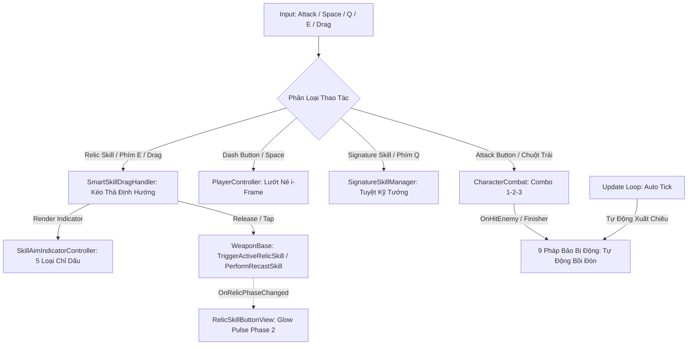

# Tài Liệu Hệ Thống Chiến Đấu & Pháp Bảo (Hybrid Relic System v6.5 - Multi-Phase & Aiming Indicators)

Hệ thống chiến đấu của trò chơi được chuẩn hóa theo mô hình **Action RPG Survivor 2.5D Cổ Phong**:
1. **Đòn Đánh Bản Thể Nhân Vật (`CharacterCombat`)**: Gắn liền với bản thể từng vị Tướng, điều khiển qua nút **Attack Button** (Animation + VFX Vệt chém Melee / Đạn Ranged + Combo 1-2-3 + Tap Buffer Window 0.18s).
2. **Kỹ Năng Tuyệt Kỹ Bản Thể (`SignatureSkillManager`)**: Chiêu nộ đặc trưng của từng vị Tướng, điều khiển qua nút **Signature Skill Button** (Phím `Q` / Touch).
3. **Pháp Bảo Hộ Thân Duy Nhất (`WeaponManager` & `Relic` - Giới hạn 1 Slot)**: Mọi vũ khí rời trong game đều được quy chuẩn là **Pháp Bảo Hộ Thân (Relics)** theo mô hình **Hệ Thống Lai (Hybrid Relics v6.5)**:
   - **8 Pháp Bảo Chủ Động (Active Relics)**: Khi trang bị, nút **Relic Skill Button (`Btn_RelicSkill`)** (Phím `E` / Touch) sẽ xuất hiện trên HUD để người chơi chủ động thi triển kỹ năng chiến thuật, có Cooldown, Countdown và hỗ trợ **Chỉ Dấu Định Hướng MOBA (Aiming Indicators)** + **Cơ chế Tái Kích Hoạt (Recast 2 Phase)**.
   - **9 Pháp Bảo Bị Động (Passive Relics)**: Khi trang bị, nút Relic Skill **tự động ẩn** khỏi HUD để giữ giao diện tinh gọn, pháp bảo tự động kích ứng theo sự kiện nhịp chém của Tướng (Auto-Tick / Orbital / On-Hit / Finisher Proc / Low-HP Berserk).

---

## 1. Kiến Trúc Vận Hành Chiến Đấu

---

## 2. Hệ Thống 5 Loại Chỉ Dấu Định Hướng (Skill Aiming Indicators)

Toàn bộ chỉ dấu được tính toán và vẽ mượt mà qua [SkillAimIndicatorController.cs](file:///c:/Users/thuon/Unity/Projectzombie/Assets/Features/Combat/Aiming/SkillAimIndicatorController.cs) (Zero GC Alloc):

1. **`LineArrow` (Mũi Tên Định Hướng Dài):** Dùng cho các đòn bắn thẳng xuyên thấu tầm xa (Ví dụ: *Nỏ Thần W001 - Tầm 14m*).
2. **`ConeSector` (Hình Quạt Vùng Rộng):** Dùng cho các đòn trảm quét góc rộng (Ví dụ: *Đao Cửu Vĩ W008 - Góc 120 độ*).
3. **`CircleReticle` (Tâm Tròn Thả Điểm Từ Xa):** Dùng cho các chiêu thả cọc, cắm bẫy và bom chùm (Ví dụ: *Nồi Cơm Thạch Sanh W_POT, Lựu Đạn Thần Sa W006*).
4. **`VectorWall` (Tường Trận Địa Kéo Vạch):** Dùng cho các kỹ năng rạch đường dựng tường phong tỏa địa hình (Ví dụ: *Nước Thánh Chùa Hương W011, Điếu Cày Cửu U W_PIPE*).
5. **`CurvedTrajectory` (Quỹ Đạo Cong Parabol / Boomerang):** Bẻ cong góc ngắm và đánh dấu điểm quay đầu (Ví dụ: *Dép Tổ Ong W_SLIPPER Phase 1*).
6. **`RhythmPulse` (Sóng Âm Nhịp Điệu):** Vòng tròn co bóp theo nhịp điệu tiếng trống (Ví dụ: *Trống Đồng Đông Sơn W005*).

---

## 3. Danh Mục Chi Tiết 17 Pháp Bảo Hộ Thân

### 3.1. ⚔️ Nhóm 8 Pháp Bảo Chủ Động (Active Relics - Có Nút Bấm HUD & Chỉ Dấu)

| Mã ID | Tên Pháp Bảo | Hệ Ngũ Hành | Loại Chỉ Dấu | Cơ Chế Thi Triển Khi Kích Hoạt |
| :--- | :--- | :---: | :---: | :--- |
| **`W_SLIPPER`** | **Dép Tổ Ong Thần Sa** | Kim | `CurvedTrajectory` $\rightarrow$ `DashLine` | **Combo Song Phi 2 Giai Đoạn:**  • *Phase 1:* Ném Boomerang bay vòng cung gom quái. • *Phase 2 (Recast 3s):* Tướng lướt vụt tới vị trí Dép xoay, tung cước **Song Phi** dẫm nổ Shockwave tan xác quái! |
| **`W011`** | **Nước Thánh Chùa Hương** | Thủy | `VectorWall` | **Dựng Tường Trận Địa:** Rạch 1 đường dựng Bức Tường Nước Thánh 4 giếng thiêng phong tỏa làm chậm 50% bầy quái và hồi ngay 10% Max HP. |
| **`W005`** | **Trống Đồng Đông Sơn** | Thổ | `RhythmPulse` | **Thần Âm Trảm Linh:** Sóng âm 360 độ cực đại dậm theo nhịp trống Đông Sơn gây choáng cứng 1.5s và đẩy lùi bầy quái. |
| **`W_POT`** | **Nồi Cơm Thạch Sanh** | Thổ | `CircleReticle` | **Cắm Nồi Gom Quái Từ Xa:** Đặt Nồi Cơm tại điểm rơi chỉ định, tạo lốc xoáy hút toàn bộ quái trong 6m rồi bắn nổ văng 18m/s và rơi Cơm Nắm hồi máu. |
| **`W001`** | **Nỏ Thần** | Kim | `LineArrow` (14m) | **Vạn Tiễn Phá Trận:** Khai hỏa liên tiếp 3 đợt bão Linh Tiễn Thần Uy xuyên thấu 100% mục tiêu và đẩy lùi bầy quái 8m. |
| **`W006`** | **Lựu Đạn Thần Sa** | Hỏa | `CircleReticle` (8.5m) | **Bão Lửa Thần Sa:** Quăng chùm 3 hạt Thần Sa nổ liên hoàn tạo bão lửa thiêu rụi vùng rộng trong 4s. |
| **`W008`** | **Đao Cửu Vĩ** | Hỏa | `ConeSector` (120°) | **Hỏa Long Bộc Phát:** Kích hoạt trạng thái thần uy trong 5s: Tăng 35% tốc đánh, vung trảm Hỏa Long 8 hướng quét sạch quái. |
| **`W_PIPE`** | **Điếu Cày Cửu U** | Hỏa | `VectorWall` | **Bão Khói Địa Hình:** Rít hơi dài nhả bức tường bão khói diện rộng 6m làm quái đi giật lùi, say thuốc và ho nổ thiêu đốt liên tục. |

---

### 3.2. 🛡️ Nhóm 9 Pháp Bảo Bị Động (Passive Relics - Tự Động Ẩn Nút HUD & Bồi Đòn)

| Mã ID | Tên Pháp Bảo | Hệ Ngũ Hành | Kiểu Kích Ứng | Cơ Chế Hộ Thân Tự Động Đột Phá |
| :--- | :--- | :---: | :---: | :--- |
| **`R007`** | **Chiếu Trải Hoàng Tuyền** | Mộc | `Periodic Trap` | **Trượt Ván Bowling:** Cứ mỗi 8s thả chiếu khiến quái ngủ say (x2 Crit). Khi Tướng dẫm lên chiếu sẽ trượt ván siêu tốc ủi bay quái và gây sát thương va chạm! |
| **`R008`** | **Chổi Lông Gà Gia Truyền** | Kim | `Finisher Proc` | **Đòn Phạt Tuổi Thơ:** Tự động giáng Chổi Lông Gà khổng lồ từ trên trời khi Hero kết thúc Combo Hit 3, Knockback 12m/s và gây Choáng 0.8s. |
| **`W004`** | **Cửu Vĩ Hồ Trảo** | Hỏa | `On-Hit Lifesteal` | **Cửu Vĩ Cuồng Nộ:** Bắn dơi hồ ly hút máu. Khi máu Tướng dưới 35%, tự động x2 số lượng đàn dơi và x2.5 hiệu suất Hút Máu (Lifesteal). |
| **`W009`** | **Trượng Long Vương** | Thủy | `Auto Chain` | **Sét Thủy Long:** Cầu sét nước tự động phóng ra và nảy chuỗi lan truyền qua 6 quái vật (Choáng 0.5s). |
| **`W002`** | **Bút Phán Quan** | Kim | `On-Hit Proc` | **Nét Bút Chu Sa:** Tự động vung nhát chém mực Chu Sa phán quyết khi Hero đánh trúng quái. |
| **`W003`** | **Bùa Trấn Yêu** | Mộc | `Orbital Shield` | **Lá Bùa Hộ Mệnh:** Vòng lá bùa thần bảo hộ xoay quanh triệt tiêu và đẩy lùi quái vật áp sát. |
| **`W007`** | **Cung Thạch Sanh** | Kim | `Auto Tick` | Tự động bắn mũi tên thần lực Thạch Sanh xuyên qua hàng loạt yêu tinh ở xa. |
| **`W010`** | **Linh Phù Ma Da** | Thủy | `Pet Companion` | Triệu hồi linh thú Ma Da bơi theo phun dịch độc làm chậm liên tục. |
| **`W012`** | **Phi Tiêu Bát Quái** | Mộc | `Auto Orbit` | Phi tiêu ma thuật tự động xoay tròn quét kẻ địch theo hình cánh cung rồi quy hồi. |

---

## 4. Giao Diện HUD & Thao Tác Thông Minh (Smart Adaptive UI)

- **Cơ Chế Viền Sáng Tái Kích Hoạt (Recast Glow Pulse):**
  - Khi người chơi sử dụng Pháp bảo có cơ chế 2 Phase (như *Dép Tổ Ong*), nút `Btn_RelicSkill` sẽ bước vào cửa sổ 3 giây và phát hiệu ứng viền sáng **Vàng Kim (Glow Pulse)** co bóp theo nhịp sóng sin.
  - Người chơi chỉ cần chạm lần 2 (hoặc nhấn phím `E` lần 2) để thi triển đòn kết liễu trước khi pháp bảo bước vào thời gian Cooldown.
- **HUD Mobile Controls:**
  - `Btn_Attack`: Đòn đánh bản thể Tướng (Combo 1-2-3).
  - `Btn_Dash`: Lướt né tránh.
  - `Btn_SignatureSkill`: Tuyệt kỹ Nộ của Hero.
  - `Btn_RelicSkill`: Kỹ năng Pháp Bảo (Tự động **HIỆN** khi mang Active Relic, tự động **ẨN** khi mang Passive Relic).
- **Phím Tắt PC:**
  - `Chuột Trái / J`: Đánh thường.
  - `Space`: Lướt né.
  - `Q / U`: Tuyệt kỹ Tướng.
  - `E / R / I`: Kỹ năng Pháp Bảo Chủ Động (Kéo chuột để định hướng).

---

## 5. Cơ Chế Thu Hồi & Dọn Dẹp Bộ Nhớ (Zero-Leak Cleanup Engine)

Khi người chơi bấm **Pause ➔ Thoát Trận** về Sảnh Chờ (Meta Hub):
1. **`ProjectilePool` & `ProjectileSystem`**: Gọi `DespawnAllProjectiles()` thu hồi toàn bộ đạn/quả cầu đang bay về Pool.
2. **`GlobalVFXPoolManager`**: Gọi `ClearAllActiveEffects()` dập tắt ngay lập tức các hiệu ứng Particle System và thu hồi VFX GameObject.
3. **`BatQuaiTranZone` & `Relic_SleepingMat`**: Hủy sạch các thực thể vùng trận đồ trên Scene Gameplay, đảm bảo không còn bất kỳ tàn dư nào che khuất giao diện Menu.

---

---

## 6. Cơ Chế Phân Cấp Sức Mạnh & Visual VFX Theo Level (Early-Game Balance & Progression)

Nhằm đảm bảo trải nghiệm sinh tồn kịch tính ở đầu trận (Early Game) và bùng nổ sức mạnh ở giai đoạn cuối:
- **Component `VFXLevelScaler`:** Tự động điều chỉnh kích thước hạt (`Scale / Radius`) và phân tầng bật/tắt các lớp con (Sub-layers) theo cấp độ vũ khí (`WeaponLevel` 1 $\rightarrow$ 5/6):
  - **Level 1 - 2 (Nhập Môn):** Kích thước hiệu ứng thu gọn ở mức **55% - 60%**, chỉ hiển thị đòn đập/đường chém cơ bản (`Base_Layer`), không có rung chấn mạnh để tránh làm rối mắt.
  - **Level 3 - 4 (Nâng Cao):** Kích hoạt thêm các tầng hạt văng, bụi khói bồi đòn (`tier2SubLayers`).
  - **Level 5 - 6 / Evolution (Đại Thành / Tiến Hóa):** Mở khóa toàn bộ các hiệu ứng bão hòa màn hình như Vết nứt đất (Ground Crack Decal), Sóng xung kích (Shockwave Ring) (`tier3UltimateLayers`).
- **Tích Hợp Zero-GC Pool:** `VFXPoolManager.SpawnVFX(prefab, position, rotation, duration, weaponLevel)` tự động cấu hình và áp dụng scaling ngay khi lấy từ pool.

---

## 7. Ma Trận Tiến Hóa Tối Thượng (Evolution Matrix - 17 Cặp Hoàn Chỉnh)

Điều kiện kích hoạt: Vũ khí Base đạt **Level Max (Lv5/Lv6)** + Đã sở hữu **Thẻ Bị Động (Passive Upgrade)** tương ứng.

| Vũ Khí / Pháp Bảo Gốc | Hệ | Thẻ Passive Cần | Dạng Tiến Hóa Cuối (`Evolution`) | Hiệu Ứng Bùng Nổ Đặc Trưng |
| :--- | :---: | :---: | :--- | :--- |
| **`W_SLIPPER`** (Dép Tổ Ong) | Kim | `P001` (Tốc Đánh) | **`E_SLIPPER` - Vạn Dép Quy Tông** | Bão Dép bay 360 độ, tăng 200% bán kính Dropkick Shockwave. |
| **`W_POT`** (Nồi Cơm Thạch Sanh) | Thổ | `P005` (Giáp/HP) | **`E_POT` - Nồi Thần Bất Tử** | Hố đen hút liên tục không ngừng, tăng hồi 8% HP và bọc Thổ Giáp. |
| **`W_PIPE`** (Điếu Cày Cửu U) | Hỏa | `P004` (Sát Thương) | **`E_PIPE` - Cửu U Long Phun Khói** | Khói rồng biến thành Bão Lửa Tận Thế xoay tròn thiêu rụi toàn map. |
| **`R007`** (Chiếu Trải Hoàng Tuyền) | Mộc | `P003` (Bán Kính) | **`E_R007` - Chiếu Thần Hoàng Kim** | Chiếu Thần dát vàng biến quái vật bước vào thành Tiền Vàng/Linh Thạch. |
| **`R008`** (Chổi Lông Gà) | Kim | `P001` (Tốc Đánh) | **`E_R008` - Thiên Binh Chổi Quét** | Triệu hồi hàng loạt chổi khổng lồ quét liên hoàn càn quét quái. |
| **`W001`** (Nỏ Thần) | Kim | `P001` (Tốc Đánh) | **`E001` - Nỏ Liên Châu** | Xả 5 làn tên thần uy liên thanh xòe quạt tốc độ cực đại. |
| **`W002`** (Bút Phán Quan) | Thủy | `P002` (Sát Thương Crit) | **`E002` - Bút Sinh Tử** | Tự động gạch tên và trảm lập tức (Instakill) quái thường dưới 30% HP. |
| **`W003`** (Bùa Trấn Yêu) | Mộc | `P003` (Bán Kính) | **`E003` - Bùa Cửu Huyền** | Bùa nổ tạo Trận Đồ Bát Quái giữ chân toàn bộ yêu ma trên sàn. |
| **`W004`** (Cửu Vĩ Hồ Trảo) | Hỏa | `P004` (Sát Thương) | **`E004` - Hồ Ly Cửu Vĩ** | Triệu hồi Linh Hồ 9 Đuôi phóng bão lửa xoáy di động quét map. |
| **`W005`** (Trống Đồng Đông Sơn) | Thổ | `P005` (Giáp/Hồi Máu) | **`E005` - Trống Trấn Quốc** | X2 số lượng sóng xoay, phát nổ sóng chấn động gây choáng toàn màn hình. |
| **`W006`** (Lựu Đạn Thần Sa) | Hỏa | `P006` (Phạm Vi Nổ) | **`E006` - Bão Hỏa Diệm** | Để lại biển lửa bất tử thiêu đốt liên tục tại tâm các vụ nổ. |
| **`W007`** (Cung Thạch Sanh) | Kim | `P007` (Xuyên Thấu) | **`E007` - Cung Thần Tiễn** | Mũi tên ánh sáng tự phân nhánh 3 tia khi xuyên qua quái. |
| **`W008`** (Đao Cửu Vĩ) | Hỏa | `P008` (Sát Thương Gần) | **`E008` - Hỏa Long Đao** | Mỗi nhát chém phóng ra hình tượng Hỏa Long phi thân càn quét. |
| **`W009`** (Trượng Long Vương) | Thủy | `P009` (Tốc Hồi Chiêu) | **`E009` - Long Vương Trượng** | Triệu hồi Cột Sét Thiên Lôi giáng xuống liên tục làm tê liệt quái. |
| **`W010`** (Linh Phù Ma Da) | Thủy | `P010` (Hiệu Ứng Trừ Tốc) | **`E010` - Thủy Cung Linh** | Vùng đầm lầy hóa Thủy Triều cuộn sóng cuốn phăng hàng ngũ quái. |
| **`W011`** (Nước Thánh Chùa Hương) | Thủy | `P011` (Hồi Máu Đội) | **`E011` - Giếng Thiêng** | Tạo suối nguồn thanh tẩy hồi máu liên tục cho Hero và diệt ma. |
| **`W012`** (Phi Tiêu Bát Quái) | Kim | `P012` (Số Lượng Đạn) | **`E012` - Phi Tiêu Cửu Cung** | Phân thân thành 9 chiếc phi tiêu bay zíc zắc bao phủ phòng đấu. |

---

---

## 8. Hướng Dẫn Sử Dụng Bộ Công Cụ Test Tiến Hóa (Debug & Testing Suite)

Khi cần thử nghiệm nhanh các cấp độ (Lv1 $\rightarrow$ Lv5) và các dạng Tiến Hóa Cuối:
1. Mở cửa sổ: **`Tools > ProjectZombie > Evolution & Relic Tester Window`**.
2. Bấm **Play Game** (`Ctrl + P`).
3. Chọn một trong các tính năng:
   - **`Trang Bị (Lv1)`:** Thay thế ngay lập tức Pháp Bảo đang mang bằng Pháp Bảo đã chọn ở cấp 1 (Tự động cập nhật nút HUD nếu là Active Relic).
   - **`Max Lv5`:** Đẩy vũ khí lên cấp 5 để kiểm tra sự mở rộng của hạt và hiệu ứng bồi đòn.
   - **`⚡ [Tên Evo]` (Nút Vàng):** Kích hoạt trực tiếp dạng Tiến Hóa Tối Thượng để kiểm tra sát thương và VFX toàn màn hình.

---

## 9. QUY CHUẨN KỸ THUẬT VFX & DANH MỤC ĐƯỜNG DẪN CỐ ĐỊNH (ASSET MAPPING SPEC)

Nhằm đảm bảo **tính nhất quán tuyệt đối**, không bị thay đổi logic/asset tùy tiện qua các lần cập nhật:

### 9.1. Quy Chuẩn Shaders Sử Dụng (URP 2D Pipeline)
1. **Shader Additive / Hào Quang Nổ Sáng:** `ProjectZombie/VFX/Slash_Additive` hoặc `Universal Render Pipeline/Particles/Unlit` (Blend Mode: Additive).
2. **Shader Sprite / Vết Cắt / Decal Sàn:** `Universal Render Pipeline/2D/Sprite-Unlit-Default` (Blend Mode: Alpha Blend).
3. **Shader Trail Renderer (Dải Ribbon):** `Universal Render Pipeline/Particles/Unlit` (Color over Lifetime Gradient).

---

### 9.2. Bảng Tra Cứu Đường Dẫn Asset & Prefab Chuẩn Của Từng Pháp Bảo

| Mã ID | Tên Pháp Bảo | Prefab Vũ Khí Gắn Vào Player | Prefab VFX Chính (Spawn Pool) | Material Chính (Materials/) | Texture VFX Gốc (Textures/ / VFX/) |
| :--- | :--- | :--- | :--- | :--- | :--- |
| **`W_SLIPPER`** | Dép Tổ Ong Thần Sa | `Assets/_Prefabs/Weapons/Weapon_W_SLIPPER.prefab` | `Assets/VFX/SkillLibrary/Prefabs/VFX_Relic_Slipper_Whirlwind.prefab` | `Assets/VFX/SkillLibrary/Materials/MAT_VFX_Slipper_Whirlwind.mat` | `Assets/Art/Weapons/Icon_W_SLIPPER.png` `Assets/Art/VFX/Tex_VFX_Cinnabar_Shockwave_Ring.png` |
| **`W_POT`** | Nồi Cơm Thạch Sanh | `Assets/_Prefabs/Weapons/Weapon_W_POT.prefab` | `Assets/VFX/SkillLibrary/Prefabs/VFX_Relic_Pot_Suction.prefab` | `Assets/VFX/SkillLibrary/Materials/M_Pot_Suction_Vortex.mat` `Assets/VFX/SkillLibrary/Materials/M_Rice_Collectible.mat` | `Assets/Art/Weapons/VFX/Tex_Pot_Suction_Vortex.png` `Assets/Art/Weapons/VFX/Tex_Rice_Collectible.png` |
| **`W_PIPE`** | Điếu Cày Cửu U | `Assets/_Prefabs/Weapons/Weapon_W_PIPE.prefab` | `Assets/VFX/SkillLibrary/Prefabs/VFX_Relic_Pipe_DragonSmoke.prefab` | `Assets/VFX/SkillLibrary/Materials/MAT_VFX_Pipe_SmokeCloud.mat` | `Assets/Art/Weapons/VFX/Tex_DragonSmoke_Loop.png` |
| **`R007`** | Chiếu Trải Hoàng Tuyền | `Assets/Prefabs/Weapons/Weapon_R007.prefab` | `Assets/VFX/SkillLibrary/Prefabs/VFX_Relic_SleepingMat_Decal.prefab` `Assets/VFX/SkillLibrary/Prefabs/VFX_Relic_SleepingMat_SlideHit.prefab` | `Assets/VFX/SkillLibrary/Materials/MAT_VFX_SleepingMat_Decal.mat` `Assets/VFX/SkillLibrary/Materials/MAT_VFX_SleepingMat_DreamMist.mat` `Assets/VFX/SkillLibrary/Materials/MAT_VFX_SleepingMat_Zzz.mat` `Assets/VFX/SkillLibrary/Materials/MAT_VFX_SleepingMat_Bubble.mat` `Assets/VFX/SkillLibrary/Materials/MAT_VFX_SleepingMat_StrikeImpact.mat` | `Assets/VFX/SkillLibrary/Textures/Tex_SleepingMat_Mat_Clean.png` `Assets/VFX/SkillLibrary/Textures/Tex_SleepingMat_SleepZzz_Clean.png` `Assets/VFX/SkillLibrary/Textures/Tex_SleepingMat_Bubble_Clean.png` `Assets/VFX/SkillLibrary/Textures/Tex_SleepingMat_DreamMist.png` `Assets/VFX/SkillLibrary/Textures/Tex_SleepingMat_StrikeImpact.png` |
| **`R008`** | Chổi Lông Gà Gia Truyền | `Assets/Prefabs/Weapons/Weapon_R008.prefab` | `Assets/VFX/SkillLibrary/Prefabs/VFX_Relic_ChickenBroom_Smash.prefab` `Assets/VFX/SkillLibrary/Prefabs/VFX_Relic_Chicken_Stampede.prefab` | `Assets/VFX/SkillLibrary/Materials/MAT_VFX_ChickenBroom_Giant.mat` `Assets/VFX/SkillLibrary/Materials/MAT_VFX_ChickenBroom_Whirlwind.mat` `Assets/VFX/SkillLibrary/Materials/MAT_VFX_ChickenBroom_Feathers.mat` | `Assets/VFX/SkillLibrary/Textures/Tex_ChickenBroom_Giant_Clean.png` `Assets/VFX/SkillLibrary/Textures/Tex_VFX_Broom_Whirlwind.png` |
| **`W001`** | Nỏ Thần | `Assets/_Prefabs/Weapons/Weapon_W001_NoThan.prefab` | `Assets/VFX/SkillLibrary/Prefabs/VFX_W001_GoldenArrow.prefab` | `Assets/VFX/SkillLibrary/Materials/MAT_Arrow_Golden_Beam.mat` | `Assets/Art/VFX/Tex_VFX_GoldenArrow_Beam.png` |
| **`W002`** | Bút Phán Quan | `Assets/_Prefabs/Weapons/Weapon_W002_ButPhanQuan.prefab` | `Assets/VFX/SkillLibrary/Prefabs/VFX_W002_PenSlash.prefab` | `Assets/VFX/SkillLibrary/Materials/MAT_InkSlash_Arc.mat` | `Assets/Art/VFX/Tex_VFX_InkStroke_Splash.png` |
| **`W003`** | Bùa Trấn Yêu | `Assets/_Prefabs/Weapons/Weapon_W003_BuaTranYeu.prefab` | `Assets/VFX/SkillLibrary/Prefabs/VFX_W003_TalismanTrail.prefab` | `Assets/VFX/SkillLibrary/Materials/MAT_Talisman_Ribbon_Trail.mat` | `Assets/Art/VFX/Tex_VFX_YellowTalisman.png` |
| **`W004`** | Cửu Vĩ Hồ Trảo | `Assets/_Prefabs/Weapons/Weapon_W004_CuuViHoTrao.prefab` | `Assets/VFX/SkillLibrary/Prefabs/VFX_W004_FoxClaws.prefab` | `Assets/VFX/SkillLibrary/Materials/MAT_Fox_Claws_Slash.mat` | `Assets/Art/VFX/Tex_VFX_FoxClaw_RedSlash.png` |
| **`W005`** | Trống Đồng Đông Sơn | `Assets/_Prefabs/Weapons/Weapon_W005_TrongDong.prefab` | `Assets/VFX/SkillLibrary/Prefabs/VFX_W005_DongSonShockwave.prefab` | `Assets/VFX/SkillLibrary/Materials/MAT_Shockwave_DongSon.mat` | `Assets/Art/VFX/Tex_VFX_DongSon_SonicWave.png` |
| **`W006`** | Lựu Đạn Thần Sa | `Assets/_Prefabs/Weapons/Weapon_W006_LuuDanThanSa.prefab` | `Assets/VFX/SkillLibrary/Prefabs/VFX_W006_CinnabarExplosion.prefab` | `Assets/VFX/SkillLibrary/Materials/MAT_Cinnabar_Shockwave.mat` | `Assets/Art/VFX/Tex_VFX_Cinnabar_Shockwave_Ring.png` |
| **`W007`** | Cung Thạch Sanh | `Assets/_Prefabs/Weapons/Weapon_W007_CungThachSanh.prefab` | `Assets/VFX/SkillLibrary/Prefabs/VFX_W007_ThachSanhArrow.prefab` | `Assets/VFX/SkillLibrary/Materials/M_ThachSanh_Arrow_Trail.mat` | `Assets/Art/Weapons/VFX/Tex_ThachSanh_LaserArrow.png` |
| **`W008`** | Đao Cửu Vĩ | `Assets/_Prefabs/Weapons/Weapon_W008_DaoCuuVi.prefab` | `Assets/VFX/SkillLibrary/Prefabs/VFX_W008_FoxFlameStream.prefab` | `Assets/VFX/SkillLibrary/Materials/M_FoxFlame_Stream.mat` | `Assets/Art/Weapons/VFX/Tex_FoxFlame_Stream.png` |
| **`W009`** | Trượng Long Vương | `Assets/_Prefabs/Weapons/Weapon_W009_TruongLongVuong.prefab` | `Assets/VFX/SkillLibrary/Prefabs/VFX_W009_LightningChain.prefab` | `Assets/VFX/SkillLibrary/Materials/M_WaterLightning_Chain.mat` | `Assets/Art/Weapons/VFX/Tex_WaterLightning_Chain.png` |
| **`W010`** | Linh Phù Ma Da | `Assets/_Prefabs/Weapons/Weapon_W010_LinhPhuMaDa.prefab` | `Assets/VFX/SkillLibrary/Prefabs/VFX_W010_PoisonSwamp.prefab` | `Assets/VFX/SkillLibrary/Materials/MAT_Decal_PoisonSwamp.mat` | `Assets/Art/VFX/Tex_VFX_Poison_Decal.png` |
| **`W011`** | Nước Thánh Chùa Hương | `Assets/_Prefabs/Weapons/Weapon_W011_NuocThanh.prefab` | `Assets/VFX/SkillLibrary/Prefabs/VFX_W011_HolyWaterAoE.prefab` | `Assets/VFX/SkillLibrary/Materials/MAT_Decal_HolyWaterPuddle.mat` | `Assets/Art/VFX/Tex_VFX_HolyWater_Splash.png` |
| **`W012`** | Phi Tiêu Bát Quái | `Assets/_Prefabs/Weapons/Weapon_W012_PhiTieuBatQuai.prefab` | `Assets/VFX/SkillLibrary/Prefabs/VFX_W012_WindVortex.prefab` | `Assets/VFX/SkillLibrary/Materials/MAT_BatQuai_Wind_Vortex.mat` | `Assets/Art/VFX/Tex_VFX_BatQuai_WindRing.png` |

---

### 9.3. Nguyên Tắc Bất Biến Khi Chỉnh Sửa VFX & Script:
1. **Không Hardcode Sprite Tùy Tiện Trong Code:** Mọi hiệu ứng phải tham chiếu trực tiếp qua `GameObject vfxPrefab` hoặc nạp từ đúng đường dẫn `Assets/VFX/SkillLibrary/Prefabs/...`.
2. **Tuân Thủ Hệ Thống Phân Cấp `VFXLevelScaler`:** Mọi Prefab Particle System đa tầng khi tạo mới đều phải gắn `VFXLevelScaler` để tự động điều chỉnh theo cấp độ 1 $\rightarrow$ 5.
3. **Đồng Bộ Dạng Tiến Hóa (Evolution):** Khi mở khóa `E_...`, chỉ số và visual phải được kế thừa và khuếch đại trực tiếp từ `Base Weapon` tương ứng theo đúng Bảng Ma Trận Mục 7.

