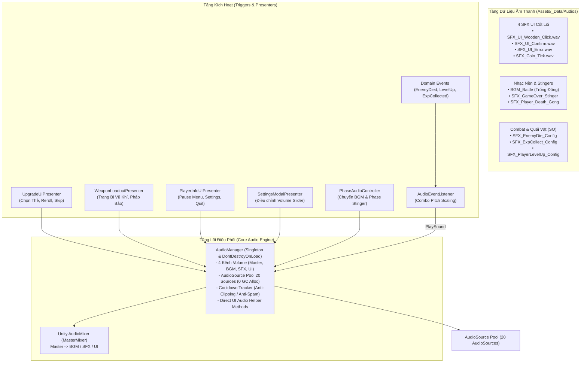

# TÀI LIỆU THIẾT KẾ HỆ THỐNG ÂM THANH (AUDIO SYSTEM DESIGN SPEC)
## Project Zombie: Vọng Xuyên Chi Mộng (Cổ Phong Đông Sơn - Anime Dark Fantasy Roguelike)

> **Phiên bản:** 2.5 (Cổ Phong Tối Giản & High-Performance Audio Engine)  
> **Kiến trúc:** Event-Driven, Data-Driven, AudioSource Pooling 0 GC Alloc.  
> **Kênh Mixer hỗ trợ:** 4 Kênh độc lập (`Master`, `BGM`, `SFX`, `UI`), đồng bộ `PlayerPrefs`.  
> **Phong cách Âm thanh (Audio DNA):** Trống đồng Đông Sơn, chiêng lệnh, đàn tranh, mõ gỗ mun kết hợp hybrid bassline, âm vang kim khí và hiệu ứng ngũ hành.

---

## 1. SƠ ĐỒ KIẾN TRÚC HỆ THỐNG (AUDIO ARCHITECTURE)



---

## 2. BỘ 4 ÂM THANH UI CỐT LÕI (CORE 4 UI SFX)

Để loại bỏ cảm giác rườm rà và tối ưu trải nghiệm người dùng trên thiết bị di động, toàn bộ hệ thống giao diện UI được chuẩn hóa về **đúng 4 âm thanh cốt lõi**:

| STT | Phương Thức Gọi Trực Tiếp | File Âm Thanh | Mô Tả & Vị Trí Kích Hoạt |
| :---: | :--- | :--- | :--- |
| **1** | `AudioManager.Instance.PlayUIClick()` | `SFX_UI_Wooden_Click.wav` | **Âm gõ mõ gỗ mun thanh thoát:** Click nút thường, chuyển tab kho đồ, mở/đóng Modal, nút Pause, nút Tiếp tục, nút Bỏ qua. |
| **2** | `AudioManager.Instance.PlayUIConfirm()` | `SFX_UI_Confirm.wav` / `SFX_UI_Card_Select.wav` | **Âm gõ ngọc/mộc âm vang trang trọng:** Bấm chọn Thẻ Nâng Cấp khi lên cấp, Trang bị Vũ Khí / Pháp Bảo trong Tàng Bảo Các, Bắt đầu ván đấu. |
| **3** | `AudioManager.Instance.PlayUIError()` | `SFX_UI_Error.wav` *(hoặc Click Pitch 0.65)* | **Âm gõ đục cạch cạch từ chối:** Hết lượt Lắc Lại Thẻ (Reroll), bấm vào tính năng chưa mở khóa, không đủ Cổ Tiền. |
| **4** | `AudioManager.Instance.PlayCoinTick()` | `SFX_Coin_Tick.wav` | **Âm nhảy số Cổ Tiền:** Đếm tiền thưởng tổng kết ván đấu, nhận ngân lượng trong trận. |

---

## 3. DANH MỤC CÁC SCRIPT VÀ THÀNH PHẦN

| Tệp Script | Đường dẫn | Trách nhiệm chính |
| :--- | :--- | :--- |
| **[`AudioManager.cs`](file:///c:/Users/thuon/Unity/Projectzombie/Assets/Core/Audio/AudioManager.cs)** | `Assets/Core/Audio/` | Quản lý tập trung Singleton, điều khiển AudioMixer 4 bus, Object Pool 20 AudioSources, Cooldown Tracker và cung cấp Public API phát âm thanh nhanh. |
| **[`AudioConfigSO.cs`](file:///c:/Users/thuon/Unity/Projectzombie/Assets/Core/Audio/AudioConfigSO.cs)** | `Assets/Core/Audio/` | ScriptableObject định nghĩa cấu hình âm thanh nâng cao (Volume, Pitch Random, Cooldown chống xé tiếng, Mixer Group). |
| **[`AudioEventListener.cs`](file:///c:/Users/thuon/Unity/Projectzombie/Assets/Core/Audio/AudioEventListener.cs)** | `Assets/Core/Audio/` | Lắng nghe Domain Events (`EnemyDiedEvent`, `PlayerLevelUpEvent`, `ExpCollectedEvent`). Có cơ chế **Pitch Combo Scaling** (+0.04 pitch mỗi lần nhặt Exp liên tiếp). |
| **[`PhaseAudioController.cs`](file:///c:/Users/thuon/Unity/Projectzombie/Assets/Core/Audio/PhaseAudioController.cs)** | `Assets/Core/Audio/` | Tự động chuyển BGM và phát âm Stinger báo hiệu khi chuyển Phase theo thời gian trận đấu (`SpawnManager.MatchTime`). |
| **[`AudioTrigger.cs`](file:///c:/Users/thuon/Unity/Projectzombie/Assets/Core/Audio/AudioTrigger.cs)** | `Assets/Core/Audio/` | Component hỗ trợ gắn trực tiếp vào GameObject, Button hoặc Animation Event. |

---

## 4. BẢNG THÔNG SỐ CẤU HÌNH AUDIOMIXER & COOLDOWN TRACKER

### 1. Cấu trúc Kênh Mixer (`MasterMixer.mixer`):
* **Master (0 dB)**
  * ├── **BGM (-6 dB)**: Nhạc nền (Looping, Streaming).
  * ├── **SFX (0 dB)**: Hiệu ứng đòn đánh, quái vật, kỹ năng, thăng cấp.
  * └── **UI (-2 dB)**: Âm thanh giao diện 4 món cốt lõi.

### 2. Bảng Preset AudioConfigSO Khuyến Nghị:
| Config Name | Clip | Volume | Pitch Range | Cooldown | Max Voices |
| :--- | :--- | :---: | :---: | :---: | :---: |
| `SFX_ExpCollect_Config` | `SFX_Exp_Gem_Pickup.mp3` | `0.45` | `0.95 - 1.20` | `0.05s` | `3` |
| `SFX_PlayerLevelUp_Config` | `SFX_Player_LevelUp.wav` | `0.90` | `1.00 - 1.00` | `0.20s` | `1` |
| `SFX_EnemyDie_Config` | `SFX_Enemy_Dissolve_Death.wav` | `0.30` | `0.85 - 1.15` | `0.10s` | `2` |
| `BGM_Battle_Config` | `Trống Đồng Xung Trận.mp3` | `0.40` | `1.00 - 1.00` | `0.00s` | `1` |

---

## 5. BỘ PROMPT AI TẠO CÁC ASSET COMBAT & BGM CÒN LẠI

Dành cho việc tạo âm thanh bổ sung bằng AI (Gemini Audio, ElevenLabs SFX, Suno, Udio...):

### A. Nhạc Nền & Stinger (BGM & Stinger):
* **`BGM_MainHub_VongXuyen.mp3`**:
  ```text
  Atmospheric Asian ancient dark fantasy background music, peaceful yet eerie, melancholic Vietnamese guzheng and bamboo flute melody, subtle wooden percussion, distant ambient wind, mystical sanctuary vibe, seamless loop, high quality game OST.
  ```
* **`BGM_Battle_Phase2_QuyMonQuan.mp3`**:
  ```text
  Intense and overwhelming Asian mythological horde battle music, powerful war drums, thunderous bronze gongs, frantic Asian string instruments, heavy dark synth hybrid, epic anime combat climax, seamless loop, 140 BPM.
  ```
* **`Stinger_Boss_Warning.wav`**:
  ```text
  A chilling ancient war horn blast followed by a deep ominous bronze gong strike and a sudden low brass cinematic impact, dark demonic presence alert, 3 seconds.
  ```

### B. Combat & Kỹ Năng:
* **`SFX_Player_Dash.wav`**:
  ```text
  Crisp, fast, airy anime dash sound effect, ethereal wind swoosh with a subtle mystical bell shimmer, quick evasion, 0.3 seconds.
  ```
* **`SFX_Sword_Slash_Light.wav`**:
  ```text
  Sharp, clean sword swing cutting through air, fast metallic whoosh, anime martial arts blade slash, high frequency slice, 0.2 seconds.
  ```
* **`SFX_Sword_Slash_Crit.wav`**:
  ```text
  Heavy critical sword impact, crisp metal clash blade strike followed by a deep resonant kinetic boom and glass-like spark shatter, satisfying combat hit, 0.35 seconds.
  ```
* **`SFX_Player_LevelUp.wav`**:
  ```text
  Sparkling ethereal level up sound, radiant ancient temple bell chime burst with ascending magical resonance and energy explosion, dopamine hit, 1.5 seconds.
  ```

---

## 6. HƯỚNG DẪN IMPORT VÀ BẢO TRÌ ASSET TRONG UNITY

1. **Vị trí lưu trữ asset:** Đặt toàn bộ file `.wav` và `.mp3` tại: `Assets/_Data/Audios/`.
2. **Cấu hình Import Settings:**
   * **SFX ngắn (< 2s):** `Load Type: Decompress On Load`, `Preload Audio Data: True`.
   * **BGM & Stinger dài:** `Load Type: Streaming`, `Compression: Vorbis` (Bitrate `128 - 160 kbps`).
3. **Gọi âm thanh từ Code C#:**
   ```csharp
   // 1. Âm thanh UI cốt lõi
   AudioManager.Instance.PlayUIClick();
   AudioManager.Instance.PlayUIConfirm();
   AudioManager.Instance.PlayUIError();
   AudioManager.Instance.PlayCoinTick();

   // 2. Phát trực tiếp bất kỳ AudioClip nào
   AudioManager.Instance.PlaySound(myAudioClip, transform.position, volume: 1f, pitch: 1f);

   // 3. Phát qua AudioConfigSO (tối ưu chống spam tiếng)
   AudioManager.Instance.PlaySound(myAudioConfigSO);
   ```
