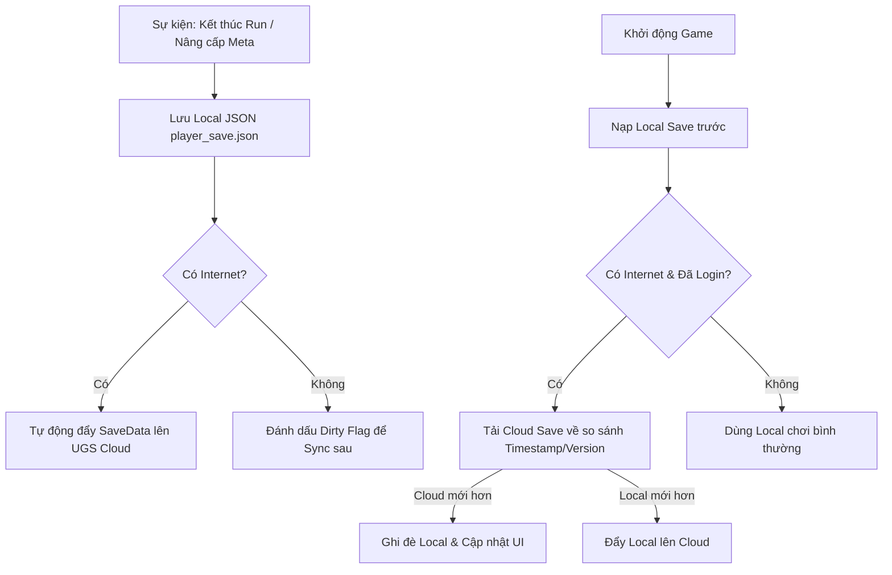

# Tài Liệu Kỹ Thuật: Hệ Thống Lưu Trữ Dữ Liệu Đám Mây (Cloud Save System)
**Dự án:** Project Zombie (2D Top-down Roguelike Action Cổ Phong)  
**Tác giả:** AI Assistant  
**Trạng thái:** Bản thiết kế đề xuất  

---

## 1. Hiện Trạng Hệ Thống Lưu Trữ

- **Dữ liệu hiện tại:** [`MetaProgressionSaveData`](file:///c:/Users/thuon/Unity/Projectzombie/Assets/Features/MetaProgression/MetaProgressionSaveData.cs) bao gồm:
  - `totalCurrency`: Tổng số Cổ Tiền tích luỹ.
  - `upgradeNodeLevels`: Cấp độ các nút nâng cấp vĩnh viễn (Meta-Tree).
  - `unlockedCharacters`: Danh sách ID nhân vật đã mở khóa.
  - `totalRunsPlayed`, `bestRunTime`, `bestKillCount`: Thống kê thành tựu và kỷ lục cá nhân.
- **Cơ chế hiện tại:** [`SaveSystem.cs`](file:///c:/Users/thuon/Unity/Projectzombie/Assets/Core/Save/SaveSystem.cs) lưu trữ định dạng JSON cục bộ tại `Application.persistentDataPath/player_save.json`. Quản lý vòng đời qua [`GameManager.cs`](file:///c:/Users/thuon/Unity/Projectzombie/Assets/Core/Save/GameManager.cs).
- **Đặc thù Gameplay:** Chơi offline theo từng Run (trận đấu). Chỉ cần đồng bộ khi hoàn thành Run, mua nâng cấp tại sảnh chính hoặc khởi động game.

---

## 2. Giải Pháp Đề Xuất: Unity Gaming Services (UGS) Cloud Save & Authentication

### 2.1. Lý Do Lựa Chọn
1. **Tích hợp trực tiếp (Native Unity):** Không cần cài plugin native ngoài nặng nề, tương thích 100% với Android/iOS/PC.
2. **Xác thực linh hoạt (Authentication):** Cho phép người chơi trải nghiệm ẩn danh (**Anonymous Login**) ngay khi vào game và hỗ trợ liên kết tài khoản Google Play Games / Apple ID sau này.
3. **Chi phí & Giới hạn:** Miễn phí lên tới **50.000 Monthly Active Users (MAU)**.

---

## 3. Kiến Trúc Đồng Bộ (Offline-First + Cloud Sync)



---

## 4. Cấu Trúc Dữ Liệu Nâng Cấp (Conflict Resolution)

Bổ sung 2 trường quan trọng vào `MetaProgressionSaveData`:
```csharp
[System.Serializable]
public class MetaProgressionSaveData
{
    // Dữ liệu gameplay
    public int totalCurrency = 0;
    public int[] upgradeNodeLevels = new int[0];
    public string[] unlockedCharacters = new string[] { "default" };
    public int totalRunsPlayed = 0;
    public float bestRunTime = 0f;
    public int bestKillCount = 0;

    // Quản lý phiên bản & giải quyết xung đột Cloud
    public long lastUpdatedTimestamp = 0; // Unix Timestamp (UTC)
    public int saveVersion = 1;
}
```

---

## 5. Kế Hoạch Triển Khai

1. **Cài đặt Package qua Unity Package Manager:**
   - `com.unity.services.core`
   - `com.unity.services.authentication`
   - `com.unity.services.cloudsave`
2. **Tạo Wrapper C# `CloudSaveManager.cs`:**
   - `InitAndSignInAsync()`: Đăng nhập ẩn danh khi bật game.
   - `SaveToCloudAsync(MetaProgressionSaveData data)`: Gửi JSON data lên key `PlayerProgression`.
   - `LoadFromCloudAsync()`: Lấy data về so sánh với `SaveFilePath` cục bộ.
