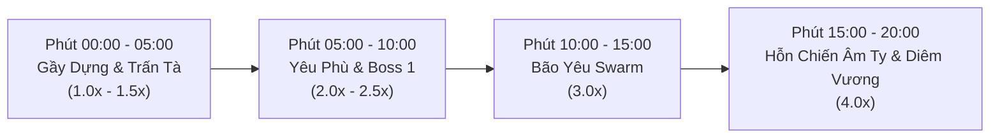

# Kịch Bản & Diễn Biến Màn Chơi — VONG XUYÊN (Run Scenario & Level Objectives Guide)

**Dự án:** Vong Xuyên (Android Top-down Survival Roguelite — GDD v4.0)  
**Tài liệu:** Kịch bản Mục tiêu, Tiến trình Spawn Yêu Ma & Thiết kế Trận đấu (Run Duration: 20 Phút)

---

## 1. Mục Tiêu Màn Chơi (Run Objectives — Chương 1: Bến Đò Vong Xuyên)

### 1.1. Mục Tiêu Chính (Primary Victory Condition)
- **Mục tiêu:** Người chơi điều khiển nhân vật (Thư Sinh, Đạo Sĩ, Võ Tăng) sống sót qua **20 phút** nghẹt thở giữa **Bến Đò Vong Xuyên (Chương 1)** và tiêu diệt thành công **Final Boss của Map (Diêm Vương)** xuất hiện ở mốc **20:00** nhằm phá tan phong ấn cõi Hoàng Tuyền, mở lối trở về dương gian bắt đầu đại nghiệp tìm kiếm & thức tỉnh **Tứ Bất Tử** để tiêu diệt Ma Vương.
- **Điều kiện Thắng (Victory):** Hạ gục **Diêm Vương**, nhận *Rương Đầu Thai* (+2,000 Cổ Tiền & Mở khóa Chương 2 / Nhân vật mới) và hoàn thành Chương 1.

### 1.2. Điều Kiện Thất Bại (Defeat Condition)
- **Cạn Máu ($HP \le 0$):** Nhân vật hết máu trước khi hạ gục Diêm Vương. Game Over và chuyển sang màn hình tổng kết (Thống kê số lượng yêu ma diệt, thời gian sống sót, nhận Cổ Tiền tích lũy).

### 1.3. Mục Tiêu Phụ Trong Trận (Sub-Objectives & Milestones)
1. **Hạ gục Boss 1 (Phút 10:00 - Ngưu Đầu Mã Diện):** Thu thập *Rương U Minh* chứa thẻ Tiến Hóa pháp bảo hoặc 3 Thẻ Nâng cấp ngẫu nhiên + 500 Cổ Tiền.
2. **Kích hoạt Pháp Bảo Tiến Hóa (Evolution):** Nâng cấp ít nhất 1 pháp bảo chính lên Cấp 5 (Max) và nhặt đúng thẻ Passive tương ứng trước phút 12:00 để vượt qua đợt bão yêu ma Swarm Event.
3. **Cân Bằng Cán Cân Âm Dương:** Điều khiển lối chơi (di chuyển linh hoạt / đứng yên phòng thủ) để nghiêng về Âm hoặc Dương nhằm mở khóa các thẻ Gacha độc quyền (*"Cuồng Nộ"*, *"Tịch Diệt"*, hoặc *"Thái Cực"*).
4. **Tích Lũy Cổ Tiền:** Tiêu diệt Yêu Ma Elite/Boss và tích lũy Cổ Tiền để nâng cấp cây chỉ số vĩnh viễn (Permanent Upgrade Tree) trong Main Menu.

---

## 2. Phân Chia 4 Giai Đoạn Trận Đấu (Pacing Phases)

### 🔹 Giai Đoạn 1: Gầy Dựng & Trấn Tà (00:00 – 05:00)
- **Mục tiêu:** Giúp người chơi làm quen nhịp di chuyển, nhặt Hạt Kinh Nghiệm và xây dựng bộ khung pháp bảo / thuộc tính Ngũ Hành đầu tiên.
- **Tốc độ Spawn:** $1.0\times \rightarrow 1.5\times$.
- **Kẻ địch:** Hồn tử sĩ `Ma Giáp` (hệ Kim) đi chậm, theo sau là `Ma Trơi` (hệ Hỏa) lao nhanh áp sát từ phút 02:00.

### 🔹 Giai Đoạn 2: Yêu Phù & Thử Thách Cực Hạn (05:00 – 10:00)
- **Mục tiêu:** Kiểm tra khả năng né đạn từ xa, sát thương AoE và khắc chế Ngũ Hành.
- **Tốc độ Spawn:** $2.0\times \rightarrow 2.5\times$.
- **Kẻ địch:** Cột mốc Elite 1 `Quỷ Nhập Tràng` (hệ Thổ) xuất hiện lúc 05:00, kết hợp `Ma Da` (hệ Thủy) phun độc từ xa và `Hồ Ly Tinh Nhỏ` (hệ Hỏa) lao vào nổ tung.
- **Đỉnh điểm:** **Boss 1 Ngưu Đầu Mã Diện** xuất hiện ở phút 10:00.

### 🔹 Giai Đoạn 3: Bão Yêu & Đột Biến (10:00 – 15:00)
- **Mục tiêu:** Ép người chơi phải có Pháp Bảo Tiến Hóa (Evolution) hoặc sát thương AoE mạnh để dọn quái.
- **Tốc độ Spawn:** $3.0\times$.
- **Sự kiện đột biến:** **Swarm Event (Bão Yêu 100+ Ma Giáp & Ma Trơi)** lao tràn màn hình ở phút 12:00. Tiếp theo là mốc **Multi-Elite Rush** ở phút 15:00.

### 🔹 Giai Đoạn 4: Hỗn Chiến Âm Ty & Trùm Cuối (15:00 – 20:00)
- **Mục tiêu:** Thử thách kỹ năng né tránh tối thượng và khả năng xoay chuyển build theo 5 hệ Ngũ Hành.
- **Tốc độ Spawn:** $4.0\times$ (Mức tối đa).
- **Trùm Cuối:** Phút 20:00 **Final Boss Diêm Vương** xuất hiện với khả năng luân phiên chuyển đổi 5 hệ Ngũ Hành cùng các tuyệt kỹ phán quyết.

---

## 3. Bảng Tiến Trình Spawn Chi Tiết (Spawn Timeline Table)

| Mốc Thời Gian | Sự Kiện / Cột Mốc (Event) | Loại Yêu Ma Xuất Hiện | Thuộc Tính Ngũ Hành | Spawn Rate | Mức Độ Nguy Hiểm |
|---|---|---|---|---|---|
| **00:00 - 02:00** | Bắt đầu màn chơi | `Ma Giáp` | Kim | $1.0\times$ | 🟢 Thấp |
| **02:00 - 05:00** | Đợt yêu ma chạy nhanh | `Ma Giáp` + `Ma Trơi` | Kim + Hỏa | $1.5\times$ | 🟡 Trung bình |
| **05:00** | **Cột mốc Elite 1** | **`Quỷ Nhập Tràng` (Elite)** | Thổ | $2.0\times$ | 🟠 Cao |
| **05:00 - 08:00** | Đợt quái trâu & Bắn xa | `Quỷ Nhập Tràng` + `Ma Da` | Thổ + Thủy | $2.0\times$ | 🟠 Cao |
| **08:00 - 10:00** | Đợt yêu ma tự sát nổ AoE | `Hồ Ly Tinh Nhỏ` + `Ma Giáp Rush` | Hỏa + Kim | $2.5\times$ | 🔴 Rất cao |
| **10:00** | **BOSS 1 XUẤT HIỆN** | **`Ngưu Đầu Mã Diện`** | Thổ / Hỏa (Luân phiên) | Spec | ☠️ Cực cao (Rương U Minh) |
| **10:00 - 12:00** | Giai đoạn sau Boss 1 | `Ma Da` + `Hồ Ly Tinh Nhỏ` | Thủy + Hỏa | $3.0\times$ | 🔴 Rất cao |
| **12:00** | **SWARM EVENT (BÃO YÊU)** | `Ma Trơi Rush` + `Hồ Ly Tinh` (100+ quái) | Hỏa | $3.5\times$ | 💥 Đột biến nguy hiểm |
| **15:00** | **MULTI-ELITE RUSH** | $2\times$ Quỷ Nhập Tràng + $2\times$ Ma Da | Thổ + Thủy | $3.8\times$ | 🔴 Rất cao |
| **15:00 - 20:00** | Hỗn chiến Âm Ty tổng lực | Tất cả các chủng loại Yêu Ma tràn ngập | Đủ 5 hệ (Kim/Mộc/Thủy/Hỏa/Thổ) | $4.0\times$ | 🔥 Tối đa |
| **20:00** | **TRÙM CUỐI (FINAL BOSS)** | **`Diêm Vương`** | Luân phiên cả 5 hệ Ngũ Hành | Spec | 👑 Thử thách cuối (Rương Đầu Thai) |

---

## 4. Kịch Bản Chi Tiết Đánh Boss (Boss Encounters)

### 🔴 4.1. Boss 1: **Ngưu Đầu Mã Diện** — Phút 10:00
- **Chỉ số:** HP Base = 5,000 | Speed = 2.2 | Kháng Knockback hoàn toàn | **Hệ:** Thổ (Ngưu Đầu) / Hỏa (Mã Diện).
- **Phase 1 (HP 100% – 50%):**
  - *Ngưu Xung Thiên (Cooldown 8s):* Báo hiệu vệt đỏ 1.5s, lao thẳng về phía Player tốc độ $x3$.
  - *Địa Chấn Âm Ty (Cooldown 5s):* Đập xiềng xuống đất gây sát thương nổ AoE vòng tròn và làm chậm Player 40% trong 2s.
- **Phase 2 (HP < 50% - Song Quỷ Thịnh Nộ):**
  - Tăng 20% Tốc chạy, +15% Sát thương, luân phiên đổi hệ Thổ/Hỏa mỗi 10s.
  - *Triệu Hồn Âm Binh (Cooldown 15s):* Triệu hồi 10x Ma Giáp bao vây.
  - *Hắc Khí Âm Ty (Nội tại):* Toả khói đen độc tố gây 5 dmg/sec nếu Player ở gần.
- **Phần thưởng:** **Rương U Minh** (Chắc chắn nhận 1 thẻ Tiến Hóa hoặc 3 Thẻ Nâng cấp ngẫu nhiên + 500 Cổ Tiền).

---

### ☠️ 4.2. Boss 2 (Final Boss): **Diêm Vương** — Phút 20:00
- **Chỉ số:** HP Base = 15,000 | Speed = 1.8 | Kháng Knockback hoàn toàn | **Hệ:** Luân phiên xoay vòng cả 5 hệ Ngũ Hành (Kim/Mộc/Thủy/Hỏa/Thổ) mỗi 10s.
- **Phase 1 (HP 100% – 40%):**
  - *Bút Phán Quan (Cooldown 4s):* Bắn 3 luồng sóng bút hình quạt về phía Player.
  - *Lưới Nghiệp Báo (Cooldown 12s):* Bẫy lồng xương tự động khóa góc di chuyển của Player trong 3s.
- **Phase 2 (HP < 40% - Phán Quyết Tối Thượng):**
  - *Vực Vong Xuyên (Cooldown 20s):* Tạo hố đen hút Player vào tâm và gây sát thương liên tục.
  - *Quỷ Sứ Trấn Tứ Phương:* Gọi 4x Cung thủ quỷ canh gác ở 4 góc bản đồ.
- **Phần thưởng:** **Rương Đầu Thai** (+2,000 Cổ Tiền, Mở khóa Nhân vật mới & Thắng Run).

---

## 5. Quy Định Cân Bằng (Balancing Guidelines)

1. **HP Scaling của Yêu Ma:** Máu quái thường tăng nhẹ theo thời gian ($HP_{current} = HP_{base} \times (1 + 0.15 \times Minute)$).
2. **Kinh Nghiệm Drop Rate:** Yêu Ma thường rớt 1 Hạt Kinh Nghiệm (1 EXP), Elite rớt Hạt Lớn (10 EXP), Boss rớt Rương.
3. **Mật Độ Quái Tối Đa (Max On-Screen Enemies):** Khống chế tối đa **150 – 200 enemy** hoạt động đồng thời để duy trì **60 FPS** trên chip di động Android.
