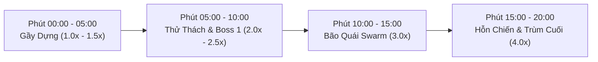

# Kịch Bản & Diễn Biến Màn Chơi (Run Scenario & Level Objectives Guide)

**Dự án:** ProjectZombie (Android Top-down Survival Roguelite)  
**Tài liệu:** Kịch bản Mục tiêu, Tiến trình Spawn & Thiết kế Trận đấu (Run Duration: 20 Phút)

---

## 1. Mục Tiêu Màn Chơi (Run Objectives)

### 1.1. Mục Tiêu Chính (Primary Victory Condition)
- **Mục tiêu:** Người chơi điều khiển nhân vật sống sót qua **20 phút** nghẹt thở và tiêu diệt thành công **Trùm Cuối (Skeleton King - Vua Xương)** xuất hiện ở mốc **20:00**.
- **Điều kiện Thắng (Victory):** Hạ gục Trùm Cuối **Skeleton King**, nhận *Victory Chest* và hoàn thành màn chơi.

### 1.2. Điều Kiện Thất Bại (Defeat Condition)
- **Cạn Máu ($HP \le 0$):** Nhân vật hết máu trước khi hạ gục Trùm Cuối. Game over và chuyển sang màn hình tổng kết (Thống kê số lượng quái diệt, thời gian sống sót, nhận Coin tích lũy).

### 1.3. Mục Tiêu Phụ Trong Trận (Sub-Objectives & Milestones)
1. **Hạ gục Boss 1 (Phút 10:00 - Abomination):** Thu thập *Evolution Chest* chứa thẻ Tiến Hóa vũ khí hoặc 3 Thẻ Nâng cấp ngẫu nhiên + 500 Coin.
2. **Kích hoạt Vũ Khí Tiến Hóa (Evolution):** Nâng cấp ít nhất 1 vũ khí chính lên Cấp 5 (Max) và nhặt đúng thẻ Passive tương ứng trước phút 12:00 để vượt qua đợt bão quái Swarm Event.
3. **Thu Tích Lũy Coin Meta:** Tiêu diệt quái Elite/Boss và tích lũy Coin để nâng cấp cây chỉ số vĩnh viễn (Permanent Upgrade Tree) trong Main Menu.

---

## 2. Phân Chia 4 Giai Đoạn Trận Đấu (Pacing Phases)

### 🔹 Giai Đoạn 1: Gầy Dựng (00:00 – 05:00)
- **Mục tiêu:** Giúp người chơi làm quen nhịp di chuyển, nhặt Exp Gem và xây dựng bộ khung vũ khí/passive đầu tiên.
- **Tốc độ Spawn:** $1.0\times \rightarrow 1.5\times$.
- **Kẻ địch:** Quái đi chậm `Walker Zombie`, theo sau là quái chạy nhanh `Runner Zombie` từ phút 02:00.

### 🔹 Giai Đoạn 2: Thử Thách Tầm Xa & Tự Sát (05:00 – 10:00)
- **Mục tiêu:** Kiểm tra khả năng né đạn và sát thương diện rộng.
- **Tốc độ Spawn:** $2.0\times \rightarrow 2.5\times$.
- **Kẻ địch:** Cột mốc Elite 1 `Zombie Tank` xuất hiện lúc 05:00, kết hợp `Spitter Zombie` bắn độc từ xa và `Exploder Zombie` áp sát phát nổ.
- **Đỉnh điểm:** **Boss 1 Abomination** xuất hiện ở phút 10:00.

### 🔹 Giai Đoạn 3: Bão Quái & Đột Biến (10:00 – 15:00)
- **Mục tiêu:** Ép người chơi phải có vũ khí Tiến hóa (Evolution) hoặc sát thương AoE mạnh để dọn quái.
- **Tốc độ Spawn:** $3.0\times$.
- **Sự kiện đột biến:** **Swarm Event (Bão Quái 100+ zombie)** lao tràn màn hình ở phút 12:00. Tiếp theo là mốc **Multi-Elite Rush** ở phút 15:00.

### 🔹 Giai Đoạn 4: Hỗn Chiến Tổng Lực & Trùm Cuối (15:00 – 20:00)
- **Mục tiêu:** Thử thách kỹ năng né tránh tối thượng của người chơi trước lượng quái đông đặc.
- **Tốc độ Spawn:** $4.0\times$ (Mức tối đa).
- **Trùm Cuối:** Phút 20:00 **Skeleton King (Vua Xương)** xuất hiện cùng các chiêu thức bẫy lồng xương và hố đen tử thần.

---

## 3. Bảng Tiến Trình Spawn Chi Tiết (Spawn Timeline Table)

| Mốc Thời Gian | Sự Kiện / Cột Mốc (Event) | Loại Quái Xuất Hiện | Spawn Rate | Mức Độ Nguy Hiểm |
|---|---|---|---|---|
| **00:00 - 02:00** | Bắt đầu màn chơi | `Walker Zombie` | $1.0\times$ | 🟢 Thấp |
| **02:00 - 05:00** | Đợt quái chạy nhanh | `Walker Zombie` + `Runner Zombie` | $1.5\times$ | 🟡 Trung bình |
| **05:00** | **Cột mốc Elite 1** | **`Zombie Tank` (Elite)** | $2.0\times$ | 🟠 Cao |
| **05:00 - 08:00** | Đợt quái trâu & Bắn xa | `Zombie Tank` + `Spitter Zombie` | $2.0\times$ | 🟠 Cao |
| **08:00 - 10:00** | Đợt quái tự sát nổ AoE | `Exploder Zombie` + `Walker Rush` | $2.5\times$ | 🔴 Rất cao |
| **10:00** | **BOSS 1 XUẤT HIỆN** | **`Abomination` (Kẻ Biến Dạng)** | Spec | ☠️ Cực cao (Evolution Chest) |
| **10:00 - 12:00** | Giai đoạn sau Boss 1 | `Spitter Zombie` + `Exploder Zombie` | $3.0\times$ | 🔴 Rất cao |
| **12:00** | **SWARM EVENT (BÃO QUÁI)** | `Runner Rush` + `Exploder` (100+ quái) | $3.5\times$ | 💥 Đột biến nguy hiểm |
| **15:00** | **MULTI-ELITE RUSH** | $2\times$ Tank + $2\times$ Spitter | $3.8\times$ | 🔴 Rất cao |
| **15:00 - 20:00** | Hỗn chiến tổng lực | Tất cả các chủng loại Zombie tràn ngập | $4.0\times$ | 🔥 Tối đa |
| **20:00** | **TRÙM CUỐI (FINAL BOSS)** | **`Skeleton King` (Vua Xương)** | Spec | 👑 Thử thách cuối (Victory Chest) |

---

## 4. Kịch Bản Chi Tiết Đánh Boss (Boss Encounters)

### 🔴 4.1. Boss 1: **Abomination (Kẻ Biến Dạng)** — Phút 10:00
- **Chỉ số:** HP Base = 5,000 | Speed = 2.2 | Kháng Knockback hoàn toàn.
- **Phase 1 (HP 100% – 50%):**
  - *Bull Dash (Cooldown 8s):* Báo hiệu vệt đỏ 1.5s, lao thẳng về phía Player tốc độ $x3$.
  - *Ground Slam (Cooldown 5s):* Đập búa gây sát thương nổ AoE vòng tròn và làm chậm Player 40% trong 2s.
- **Phase 2 (HP < 50% - Cuồng hăng):**
  - Tăng 20% Tốc chạy, +15% Sát thương.
  - *Summon Zombie Swarm (Cooldown 15s):* Triệu hồi 10x Walker bao vây.
  - *Toxic Cloud (Nội tại):* Toả khói độc gây 5 dmg/sec nếu Player ở gần.
- **Phần thưởng:** **Evolution Chest** (Chắc chắn nhận 1 thẻ Tiến Hóa hoặc 3 Thẻ Nâng cấp ngẫu nhiên + 500 Coin).

---

### ☠️ 4.2. Boss 2 (Final Boss): **Skeleton King (Vua Xương)** — Phút 20:00
- **Chỉ số:** HP Base = 15,000 | Speed = 1.8 | Kháng Knockback hoàn toàn.
- **Phase 1 (HP 100% – 40%):**
  - *Sword Wave (Cooldown 4s):* Bắn 3 luồng sóng kiếm hình quạt về phía Player.
  - *Bone Cage (Cooldown 12s):* Bẫy lồng xương tự động khóa góc di chuyển của Player trong 3s.
- **Phase 2 (HP < 40% - Linh Hồn Tối Tăm):**
  - *Death Zone (Cooldown 20s):* Tạo hố đen hút Player vào tâm và gây sát thương liên tục.
  - *Skeleton Archer Guard:* Gọi 4x Skeleton Archer canh gác ở 4 góc bản đồ.
- **Phần thưởng:** **Victory Chest** (+2,000 Coin, Mở khóa Nhân vật mới).

---

## 5. Quy Định Cân Bằng (Balancing Guidelines for Game Designers)

1. **HP Scaling của Quái:** Máu quái thường tăng nhẹ theo thời gian ($HP_{current} = HP_{base} \times (1 + 0.15 \times Minute)$).
2. **Kinh Nghiệm Drop Rate:** Quái thường rớt 1 Exp Gem (1 EXP), Elite rớt Gem Lớn (10 EXP), Boss rớt Chest.
3. **Mật Độ Quái Tối Đa (Max On-Screen Enemies):** Khống chế tối đa **150 – 200 enemy** hoạt động đồng thời để duy trì **60 FPS** trên chip di động Android.
