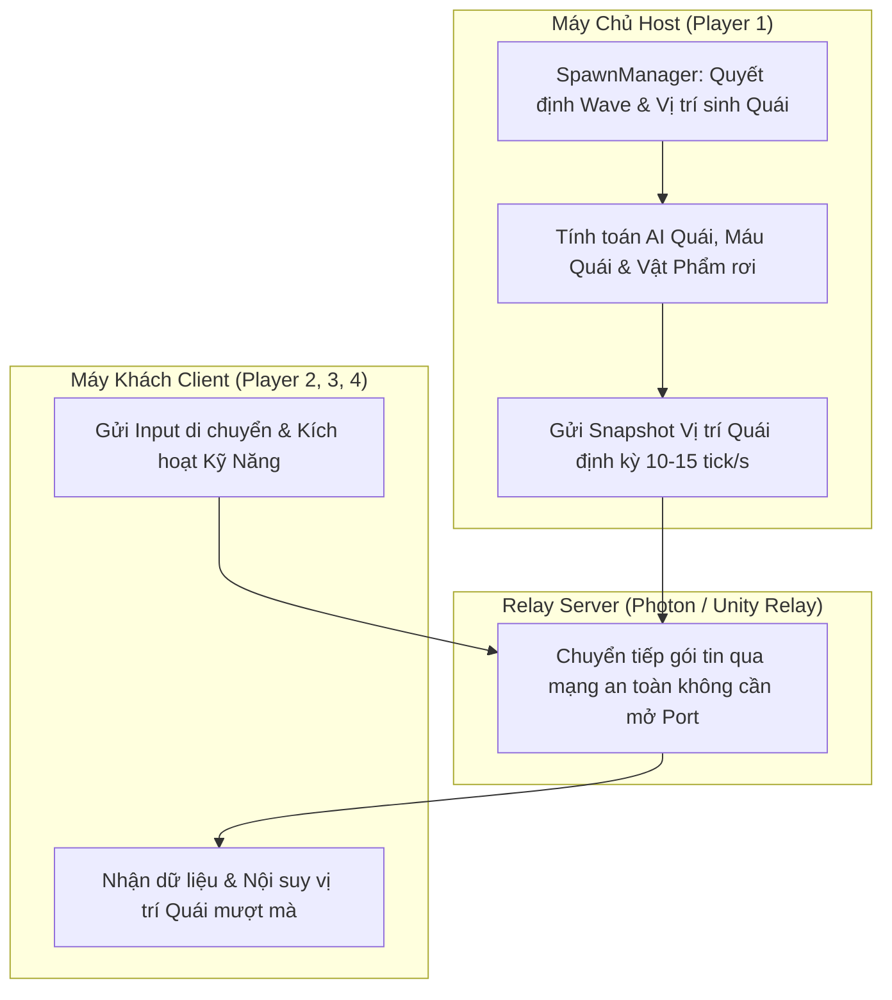

# Tài Liệu Kỹ Thuật: Hệ Thống Chơi Trực Tuyến & Co-op (Multiplayer Online Spec)
**Dự án:** Project Zombie (2D Top-down Roguelike Action Cổ Phong)  
**Tác giả:** AI Assistant  
**Trạng thái:** Bản thiết kế đề xuất  

---

## 1. Phân Tích Kỹ Thuật & Thách Thức Đặc Thù

- **Thể loại:** 2D Top-down Roguelike / Horde Survivor.
- **Thách thức cốt lõi:**
  1. **Số lượng thực thể lớn (Horde of Enemies):** Khi quái vật xuất hiện hàng trăm con qua [`SpawnManager.cs`](file:///c:/Users/thuon/Unity/Projectzombie/Assets/Features/Spawners/SpawnManager.cs), việc đồng bộ vị trí từng con quái trên mạng sẽ gây giật lag và hao tổn băng thông di động.
  2. **Kỹ năng đạn đạo dày đặc:** Đòn đánh, bùa chú, đường đao kiếm xoay quanh nhân vật ([`CharacterCombat.cs`](file:///c:/Users/thuon/Unity/Projectzombie/Assets/Features/Player/CharacterCombat.cs)).
- **Chế độ chơi hướng tới:** **Co-op 2–4 Người chơi (PVE Sinh tồn diệt Boss cùng nhau)** và **Đấu Trường 1v1 / 2v2 (PVP)**.

---

## 2. So Sánh & Lựa Chọn Công Cụ

| Tiêu chí | 🥇 **Photon Fusion** (Khuyên dùng) | 🥈 **Unity Netcode (NGO) + Unity Relay** |
| :--- | :--- | :--- |
| **Thế mạnh chính** | **Client-side Prediction & Bù lag đỉnh cao** trên Mobile | Đồng bộ 100% với hệ sinh thái **Unity Gaming Services (UGS)** |
| **Mô hình kết nối** | Host Mode / Shared Mode (Qua Photon Cloud Relay) | Host-Client (Qua Unity Relay Server) |
| **Tạo phòng & Tham gia** | Có sẵn hệ thống Photon Lobby & Mã phòng 6 số | Sử dụng Unity Lobby Service |
| **Gói Miễn Phí** | **20 CCU miễn phí vĩnh viễn** | Nằm trong gói UGS miễn phí (50k MAU) |
| **Độ mượt khi mạng yếu (4G)** | **Cực kỳ mượt** nhờ thuật toán nén Delta Snapshot | Trung bình nếu nhiều entity quái |

> **Khuyến nghị:**
> - Nếu ưu tiên **độ mượt di động tối đa**: Chọn **Photon Fusion**.
> - Nếu ưu tiên **quản lý chung 1 Dashboard với Cloud Save**: Chọn **Unity Netcode (NGO) + Unity Relay**.

---

## 3. Kiến Trúc Đồng Bộ Mạng Tối Ưu (Host-Authoritative + Event-driven RPC)

### Nguyên tắc tối ưu:
1. **Event-driven Skill RPC:** Không đồng bộ từng frame của đạn bay. Chỉ gửi 1 RPC: `RpcFireSkill(skillId, direction, originPos)` để các máy tự sinh Prefab VFX cục bộ.
2. **Deterministic Seed hoặc Host Spawning:** Máy Host đóng vai trò phân bổ quái và tính toán sát thương chính để tránh lệch dữ liệu (Desync).

---

## 4. Kế Hoạch Triển Khai (Roadmap)

1. **Giai đoạn 1: Sảnh Chờ & Kết Nối (Lobby & Room):** Tạo giao diện UI Tạo phòng / Nhập mã 6 số để vào chung trận.
2. **Giai đoạn 2: Đồng Bộ Nhân Vật:** Đồng bộ di chuyển Player, Animation và Máu giữa các người chơi.
3. **Giai đoạn 3: Đồng Bộ Chiến Đấu & Quái Vật:** Đồng bộ quái spawn từ máy Host và chia sẻ kinh nghiệm / vật phẩm nhặt được.
