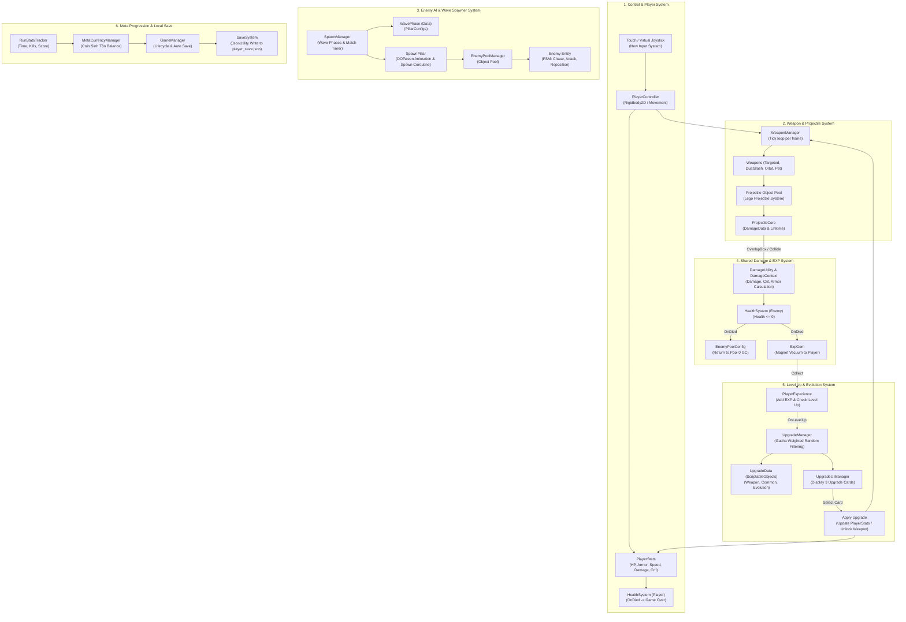

# Game Design Document — ProjectZombie

**Phiên bản:** 3.0 (Android Store Release)  
**Thể loại:** Top-down Survival Roguelite / Auto-battler (tương tự *Vampire Survivors*, *Brotato*)  
**Nền tảng:** Android Mobile (Google Play Store — Target API 33+, IL2CPP ARM64, AAB Package)  
**Phong cách đồ họa:** 2D, góc nhìn từ trên xuống (Top-down)  

---

## 1. Tổng quan (Overview)

### 1.1. Tầm nhìn sản phẩm (Vision Statement)
ProjectZombie mang đến trải nghiệm sinh tồn nghẹt thở trên thiết bị di động Android, nơi người chơi đối đầu với đàn Zombie ngày càng đông đảo, xây dựng "cỗ máy hủy diệt" của riêng mình qua các lựa chọn nâng cấp ngẫu nhiên, lưu tiến trình chơi vĩnh viễn trên thiết bị di động.

### 1.2. Đối tượng người chơi (Target Audience)
- Người chơi di động casual/mid-core, yêu thích thể loại survivor-like trên Android.
- Phiên chơi ngắn (5–20 phút/run), điều khiển dễ dàng bằng màn hình cảm ứng (Touch / Dynamic Virtual Joystick).
- Hệ thống Meta-progression hấp dẫn thúc đẩy tỉ lệ quay lại chơi mỗi ngày (Daily Retention).

### 1.3. Điểm khác biệt (Unique Selling Points)
- Hệ thống vũ khí "Lego" module hóa cho phép tổ hợp gameplay đa dạng mà không làm nặng app.
- Lưu trữ tiến trình chơi cục bộ mượt mà (Offline-first Local Save System) bảo mật và không phụ thuộc kết nối mạng.
- Tối ưu hóa hiệu năng cao cho chip di động ARM64, chạy mượt 60 FPS.

### 1.4. Yêu cầu kỹ thuật tối thiểu (Target Performance - Android)
- **Target OS:** Android 8.0 (API Level 26) trở lên; Target SDK Android 13/14 (API Level 33+).
- **Architecture:** ARM64-v8a (IL2CPP scripting backend).
- **Target FPS:** 60 FPS ổn định trên thiết bị tầm trung.
- **Kích thước App:** Mục tiêu APK/AAB dưới 60MB.
- Hỗ trợ tối thiểu 150–200 enemy + 100 projectile hoạt động đồng thời không bị giật lag.

### 1.5. Danh sách tính năng (Feature List: MVP vs Full Release)

| Hệ thống | Bản phát hành đầu (MVP) | Bản cập nhật tương lai (Update) |
|---|---|---|
| **Character (Nhân vật)** | 3 (Survivor, Gunslinger, Shadow Tank) | 8 (Bổ sung Tech Specialist, Pyromancer, Necromancer...) |
| **Weapon (Vũ khí)** | 12 (Pistol, Dual Slash, Orbit Saw, Vampiric Bats, v.v.) | 30 (Bổ sung Rocket Launcher, Laser Cannon, Poison Grenade...) |
| **Passive (Kỹ năng bị động)** | 18 (HP, Armor, Speed, Damage, Crit, Cooldown...) | 40 (Bổ sung Magnet, EXP Multiplier, Life Steal, Thorn Armor...) |
| **Boss (Trùm cuối)** | 2 (Abomination, Skeleton King) | 6 (Bổ sung Toxic Queen, Cyber Overlord...) |
| **Map (Bản đồ)** | 1 (Ruined City Square) | 5 (Graveyard, Subways, Desert Wasteland, Military Base) |
| **Skin (Trang phục)** | Không (Dùng mặc định) | Có (Mở khóa qua Coin / Achievement / Event) |
| **Daily Quest (Nhiệm vụ hàng ngày)** | Không | Có (Thưởng Coin & Reroll Token) |
| **Monetization (Kiếm tiền)** | Rewarded Ads (Xem quảng cáo nhận x2 Coin / Reroll) | Rewarded Ads + IAP mua Skin & Character |
| **Achievement (Thành tựu)** | Local Achievements (Lưu máy) | Cloud Achievements & Leaderboards |

---

## 2. Vòng lặp Gameplay (Core Gameplay Loop)

> [!NOTE]
> Gameplay tập trung vào khả năng sinh tồn của người chơi giữa bầy Zombie ngày càng đông đảo, đòi hỏi chiến thuật lựa chọn vũ khí và nâng cấp hợp lý.

### 2.1. Vòng lặp trong 1 trận (Moment-to-moment Loop)
1. **Sinh tồn & Chiến đấu**: Người chơi điều khiển nhân vật di chuyển trên bản đồ để né tránh kẻ địch. Hệ thống vũ khí tự động tấn công (Auto-attack) dựa trên tầm đánh và tốc độ đánh.
2. **Thu thập & Lên cấp**: Tiêu diệt Zombie để làm rớt Hạt Kinh Nghiệm (Exp Gem). Nhặt Exp làm đầy thanh kinh nghiệm, giúp người chơi Lên cấp (Level Up).
3. **Nâng cấp (Upgrades)**: Mỗi lần lên cấp, game tạm dừng và hiện màn hình chọn Nâng cấp (Weighted Random – Gacha). Người chơi chọn 1 trong 3 thẻ để nhận vũ khí mới, nâng cấp vũ khí cũ, hoặc nhận chỉ số bị động (Passive).
4. **Tiến hóa (Evolution)**: Khi vũ khí đạt cấp tối đa và người chơi sở hữu Passive tương ứng, vũ khí có cơ hội "Tiến hóa" thành phiên bản tối thượng.
5. **Kết thúc trận**: Trận đấu kết thúc khi người chơi chết, hoặc sống sót hết thời gian giới hạn (Survival Timer) / hạ Boss cuối.

### 2.2. Vòng lặp giữa các trận (Meta Loop) — *bổ sung*
1. Kết thúc trận → tính điểm dựa trên: thời gian sống sót, số Zombie tiêu diệt, cấp độ đạt được.
2. Điểm số quy đổi thành **Currency Meta** (vd: "Coin Sinh Tồn") tích lũy vĩnh viễn, không mất khi bắt đầu run mới.
3. Currency Meta dùng để mở khóa: nhân vật mới, vũ khí khởi đầu mới, hoặc nâng cấp vĩnh viễn (permanent upgrade tree) — vd tăng % HP khởi điểm, tăng tỉ lệ rơi Exp.
4. Người chơi quay lại chơi run mới với build mạnh hơn nhờ Meta-progression → tăng động lực retention.

### 2.3. Vòng lặp Hệ Thống Lưu Trữ Android (Android App Progression Loop)
- Bắt đầu chơi → Kết thúc run (Thắng / Thất bại) → Tính điểm & thống kê kỷ lục.
- Cập nhật số dư Currency Meta ("Coin Sinh Tồn") và Kỷ lục cá nhân (Best Run Time, High Kill Count).
- Tự động gọi `SaveSystem.Save()` lưu dữ liệu mã hóa JSON xuống đĩa ứng dụng di động (`Application.persistentDataPath`).

---

## 3. Hệ thống Nhân vật & Điều khiển (Player System)

### 3.1. Điều khiển (Controls - Android Mobile)
- Màn hình cảm ứng: Cần điều khiển ảo linh hoạt (Dynamic Virtual Joystick) góc dưới màn hình cho phép di chuyển 360 độ mượt mà.
- Bàn phím / Gamepad (Dùng khi Test Editor): Hỗ trợ WASD / Mũi tên để di chuyển.
- Không có nút tấn công thủ công — toàn bộ vũ khí tự động kích hoạt (giữ đúng tinh thần auto-battler).

### 3.2. Chỉ số nhân vật (Player Stats)
| Nhóm | Chỉ số | Mô tả |
|---|---|---|
| Phòng thủ | Health (Máu) | HP tối đa, hồi phục qua vật phẩm/passive |
| Phòng thủ | Armor (Giáp) | Giảm sát thương nhận vào theo % hoặc số cố định |
| Phòng thủ | Move Speed | Tốc độ di chuyển, ảnh hưởng khả năng né tránh |
| Tấn công | Damage | Sát thương cơ bản, hệ số nhân cho tất cả vũ khí |
| Tấn công | Attack Speed | Tốc độ đánh, giảm cooldown giữa các đòn |
| Tấn công | Range | Tầm đánh, mở rộng vùng ảnh hưởng vũ khí |
| Tấn công | Crit Chance / Crit Damage | Tỉ lệ và hệ số sát thương chí mạng |
| Utility | Pickup Radius *(bổ sung)* | Bán kính hút Exp Gem tự động |
| Utility | Luck *(bổ sung)* | Ảnh hưởng tỉ lệ xuất hiện Rare Upgrade / vật phẩm hiếm |
| Utility | Cooldown Reduction *(bổ sung)* | Giảm thời gian hồi của kỹ năng đặc trưng (Signature Skill) |

### 3.3. Passives
Danh sách kỹ năng bị động người chơi thu thập được trong trận, dùng làm điều kiện kích hoạt Tiến hóa (Evolution) và cộng dồn chỉ số nền.

### 3.4. Nhân vật khả dụng (Character Roster) — *bổ sung, cần hoàn thiện*
Mỗi nhân vật có:
- Bộ chỉ số khởi điểm khác nhau (vd: nhân vật tank thấp Move Speed nhưng cao HP/Armor).
- Vũ khí khởi đầu (Starting Weapon) cố định gắn với nhân vật.
- 1 Signature Skill riêng biệt (kỹ năng chủ động có cooldown, không phải auto-attack).
- Điều kiện mở khóa qua Currency Meta hoặc thành tựu trong game.

*(Ghi chú: cần bổ sung bảng danh sách nhân vật cụ thể — số lượng, tên, chỉ số, ở giai đoạn Production tiếp theo.)*

---

## 4. Hệ thống Vũ khí (Weapons & Projectiles)

> [!TIP]
> Hệ thống thiết kế theo kiến trúc Component-Based và Data-Driven (Lego-style), giúp dễ dàng kết hợp và tạo ra hàng chục loại vũ khí khác nhau.

### 4.1. Phân loại Vũ khí (Weapon Types)
Người chơi có thể sở hữu nhiều vũ khí cùng lúc (Multi-Weapon).

| Loại | Mô tả |
|---|---|
| `Weapon_Targeted` | Ngắm bắn tự động vào mục tiêu gần nhất |
| `Weapon_DualSlash` | Đòn cận chiến chém đồng thời hai bên trái/phải (dùng `OverlapBoxNonAlloc` để tối ưu bộ nhớ) |
| `Weapon_Orbit` | Đạn/vũ khí bay theo quỹ đạo xoay quanh nhân vật, tạo lớp phòng thủ sát thương |
| `Weapon_PetSummon` | Triệu hồi đệ/thú cưng đồng hành, tự động hỗ trợ tấn công |

### 4.2. Hệ thống đạn "Lego" (Projectile System)
- **Module Di chuyển (Movement)**: `Move_Linear` (bay thẳng), `Move_Orbit` (xoay quanh tâm).
- **Module Va chạm & Sát thương (Hit)**: `Hit_SingleTarget` (sát thương chạm 1 lần, hỗ trợ xuyên thấu), `Hit_Periodic` (sát thương AOE duy trì theo chu kỳ thời gian).
- **Behavior Scriptables**: Straight, Homing (đạn đuổi), Bounce (nảy), Explosion (nổ), Split (tách vỡ).

### 4.3. Giới hạn kỹ thuật vũ khí — *bổ sung*
- Giới hạn số lượng slot vũ khí đồng thời (đề xuất: 6 slot vũ khí + 6 slot Passive, theo chuẩn thể loại).
- Object Pooling bắt buộc cho toàn bộ Projectile để tránh Garbage Collection spike trên chip di động Android (xem mục 9.3).

### 4.4. Cơ sở dữ liệu Vũ khí (Weapon Database - MVP 12 Weapons)

| ID | Tên Vũ khí | Damage | Cooldown | Loại Projectile | Evolution Path | Max Lv | Độ hiếm |
|---|---|---|---|---|---|---|---|
| `W001` | **Pistol** | 12 | 0.6s | Straight Bullet | `E001` (Dual Magnum) | 5 | Common |
| `W002` | **Knife / Dual Slash** | 20 | 0.8s | Melee Slash | `E002` (Blood Blade) | 5 | Common |
| `W003` | **Orbit Saw** | 15 | 0.2s | Orbit Blade | `E003` (Plasma Ring) | 5 | Rare |
| `W004` | **Vampiric Bats** | 18 | 1.2s | Homing Bat | `E004` (Vampire Lord) | 5 | Rare |
| `W005` | **Shotgun** | 8 x 5 | 1.5s | Spread Pellets | `E005` (Devastator) | 5 | Common |
| `W006` | **Grenade Launcher** | 45 | 2.5s | AoE Explosive | `E006` (Cluster Bomb) | 5 | Epic |
| `W007` | **Crossbow** | 35 | 1.0s | Piercing Bolt | `E007` (Phantom Arbalest) | 5 | Rare |
| `W008` | **Flamethrower** | 6/tick | 0.1s | Continuous Stream | `E008` (Inferno Cannon) | 5 | Rare |
| `W009` | **Lightning Orb** | 25 | 1.8s | Chain Lightning | `E009` (Storm Core) | 5 | Epic |
| `W010` | **Poison Drone** | 10 | 2.0s | Pet Summon AoE | `E010` (Bio-Hazard Hive) | 5 | Rare |
| `W011` | **Holy Water** | 14/sec | 3.0s | Ground AoE Pool | `E011` (Consecrated Field) | 5 | Rare |
| `W012` | **Boomerang** | 22 | 1.4s | Returning Blade | `E012` (Giga Shuriken) | 5 | Common |

*Ghi chú:* Mỗi Vũ khí đều đi kèm Icon, Prefab riêng, thông số Rarity, Max Level (5) và Nhánh tiến hóa (Evolution) kích hoạt khi kết hợp với thẻ Passive yêu cầu.

---

## 5. Trí tuệ Nhân tạo Kẻ địch (Enemy AI)

Kẻ địch sử dụng **Mô hình Trạng thái (FSM)** kết hợp **Strategy Pattern**.

### 5.1. Các trạng thái FSM cơ bản
`Idle` (Đứng yên) → `Chase` (Truy đuổi) → `Attack` (Tấn công) → `Reposition` (Tách bầy tránh kẹt) → `Dead` (Chết & rớt Exp).

### 5.2. Các Chiến lược (Strategy)
- **Melee (Cận chiến)**: Áp sát, bao vây, tấn công trực tiếp.
- **Ranged (Bắn xa)**: Giữ khoảng cách an toàn, bắn đạn từ xa về phía người chơi.

### 5.3. Phân cấp độ khó & Spawn Wave — *bổ sung, cần hoàn thiện*
- **Enemy Tier**: đề xuất phân theo 3 cấp — Common (Zombie thường), Elite (biến thể mạnh hơn, xuất hiện theo mốc thời gian), Boss (xuất hiện cuối mỗi mốc lớn, vd phút thứ 5/10/15/20).
- **Spawn Curve**: Số lượng và độ mạnh của Zombie tăng dần theo thời gian sống sót của người chơi (Difficulty Scaling), cần bảng cụ thể ở mục 10.
- **Faction**: Ghi chú — hệ thống `FactionCounterUpgrade` (mục 6) yêu cầu kẻ địch được phân theo phe/loại cụ thể, cần định nghĩa rõ danh sách Faction (vd: Zombie Thường, Zombie Nhiễm Độc, Zombie Giáp...).

### 5.4. Cơ sở dữ liệu Kẻ địch (Enemy Database)

| Enemy ID | Tên Quái | HP | Speed | Damage | EXP Drop | Faction | Mô tả / Animation |
|---|---|---|---|---|---|---|---|
| `E_WALKER` | **Walker Zombie** | 40 | 2.5 | 10 | 1 | Undead Regular | Zombie bước đi chậm, số lượng lớn |
| `E_RUNNER` | **Runner Zombie** | 25 | 4.0 | 8 | 2 | Undead Fast | Zombie chạy nhanh, lao vào bọc lót |
| `E_TANK` | **Zombie Tank** | 150 | 1.5 | 20 | 5 | Undead Heavy | Quái trâu máu, cản đạn cho quái sau |
| `E_SPITTER` | **Spitter Zombie** | 35 | 2.0 | 12 | 3 | Undead Ranged | Bắn bãi độc từ xa về phía Player |
| `E_EXPLODER` | **Exploder** | 30 | 3.5 | 50 (Nổ) | 4 | Undead Special | Chạy áp sát và phát nổ gây AoE lớn |

### 5.5. Thiết kế Trùm Cuối (Boss Design)

Boss trong ProjectZombie có thanh máu hiển thị riêng trên UI, khả năng chống đẩy lùi (Knockback Immune) và đổi Phase chiến đấu khi tụt máu.

#### 1. Boss 1: **Abomination (Kẻ Biến Dạng)** — Xuất hiện Phút 10
* **Ngoại hình:** Zombie khổng lồ mang giáp phế liệu, tay đập búa gai lớn.
* **HP Base:** 5,000 | **Tốc độ:** 2.2
* **Phase 1 (HP 100% - 50%):**
  - **Skill 1 - Bull Dash (Cooldown 8s):** Báo hiệu vệt đỏ 1.5s, lao thẳng về hướng Player với tốc độ x3.
  - **Skill 2 - Ground Slam (Cooldown 5s):** Đập búa xuống đất gây sát thương AoE vòng tròn và làm chậm Player 40% trong 2s.
* **Phase 2 (HP < 50% - Cuồng hăng):**
  - Tăng 20% Tốc độ di chuyển và 15% Sát thương.
  - **Skill 3 - Summon Zombie Swarm (Cooldown 15s):** Triệu hồi 10x Walker Zombie bao vây xung quanh.
  - **Skill 4 - Toxic Cloud (Nội tại Phase 2):** Toả khói độc liên tục gây 5 dmg/sec nếu Player đứng gần.
* **Reward:** Rớt 1 **Evolution Chest** (Chắc chắn cho 1 thẻ Tiến Hóa hoặc 3 Thẻ Nâng cấp ngẫu nhiên + 500 Coin).

#### 2. Boss 2: **Skeleton King (Vua Xương)** — Xuất hiện Phút 20 (Final Boss MVP)
* **Ngoại hình:** Vua bộ xương khoác áo bào rách, tay cầm thanh đại đao phát sáng.
* **HP Base:** 15,000 | **Tốc độ:** 1.8
* **Phase 1 (HP 100% - 40%):**
  - **Skill 1 - Sword Wave (Cooldown 4s):** Bắn 3 luồng sóng kiếm hình quạt về phía Player.
  - **Skill 2 - Bone Cage (Cooldown 12s):** Bẫy lồng xương tự động khóa góc di chuyển của Player trong 3s.
* **Phase 2 (HP < 40% - Linh Hồn Tối Tăm):**
  - **Skill 3 - Death Zone (Cooldown 20s):** Tạo vùng hố đen hút Player vào tâm và gây sát thương liên tục.
  - **Skill 4 - Skeleton Archer Guard:** Gọi 4x Skeleton Archer canh gác ở 4 góc bản đồ.
* **Reward:** Rớt **Victory Chest** (+2,000 Coin, Mở khóa Nhân vật mới).

---

## 6. Hệ thống Nâng cấp (Upgrades System)

Quản lý hoàn toàn qua **ScriptableObjects**, giúp Game Designer tự do điều chỉnh không cần code.

| Loại thẻ | Mô tả |
|---|---|
| `WeaponUpgrade` | Nâng cấp cấp độ vũ khí đang có, hoặc mở khóa vũ khí mới |
| `CommonUpgrade` | Nâng cấp chỉ số cơ bản của nhân vật |
| `SignatureSkillUpgrade` | Nâng cấp kỹ năng đặc trưng riêng cho từng nhân vật |
| `FactionCounterUpgrade` | Tăng sát thương khi đối đầu phe địch cụ thể |
| `RareUpgrade` | Nâng cấp hiếm, mang lại chỉ số đột biến |
| `EvolutionUpgrade` | Nâng cấp tối thượng (thường ở Cấp 6) — điều kiện: vũ khí gốc đạt cấp tối đa + sở hữu Passive yêu cầu (`requiredPassiveId`); hiệu ứng: đổi Prefab đạn (`overrideProjectilePrefab`), đổi hình ảnh, buff sát thương lớn |

### 6.1. Bảng Trọng Số Gacha & Quy Định Nâng Cấp (Upgrade Probability & Rules)

#### 1. Bảng Trọng Số Độ Hiếm (Upgrade Probability Table)

| Độ Hiếm (Rarity) | Trọng Số (Weight) | Tỉ Lệ Xuất Hiện (%) | Mô Tả |
|---|---|---|---|
| `Common` | 60 | 60.0% | Nâng cấp chỉ số cơ bản (+HP, +Damage, +Speed) |
| `Uncommon` | 25 | 25.0% | Nâng cấp vũ khí cấp trung |
| `Rare` | 10 | 10.0% | Nâng cấp hiếm (+Crit, +Pickup Radius, mở khóa vũ khí mới) |
| `Epic` | 4 | 4.0% | Vũ khí cao cấp (Grenade Launcher, Lightning Orb) |
| `Evolution` | 1 | 1.0% | Thẻ tiến hóa vũ khí tối thượng tại Cấp 6 |

#### 2. Quy Định Xử Lý Deck-Building & Gacha Logic
* **Khi Full Weapon Slot (Đã sở hữu đủ 6 Vũ khí):** Hệ thống tự động loại bỏ các thẻ mở khóa vũ khí mới ra khỏi pool. Chỉ cho phép các thẻ nâng cấp cấp độ cho 6 vũ khí hiện có hoặc thẻ Passive/Common xuất hiện.
* **Điều kiện Thẻ Tiến Hóa (Evolution Rule):** Thẻ `EvolutionUpgrade` bị cấm xuất hiện nếu Vũ khí gốc chưa đạt Cấp 5 (Max) hoặc Người chơi chưa sở hữu `requiredPassiveId` tương ứng trong kho đồ.
* **Cơ chế Reroll (Đổi thẻ):** Người chơi được dùng 1 Reroll Token (hoặc xem 1 Rewarded Ad) để quay lại 3 thẻ nâng cấp mới.
* **Cơ chế Pity (Bảo hiểm):** Nếu 5 lần lên cấp liên tiếp chỉ xuất hiện thẻ Common, lần lên cấp thứ 6 chắc chắn xuất hiện ít nhất 1 thẻ Rare hoặc Epic.
* **Cơ chế Banlist (Cấm thẻ):** Cho phép người chơi cấm tối đa 2 thẻ nâng cấp bất kỳ không bao giờ xuất hiện trong trận đấu đó.

---

## 7. Thiết kế Map & Kịch bản Mục tiêu Màn chơi (Level Design, Pacing & Run Scenario)

### 7.1. Bản đồ (Maps)
- Số lượng bản đồ ban đầu: 1 map chính cho bản MVP (*Ruined City Square*), mở rộng về sau.
- Map dạng giới hạn biên (Bounded Arena) hoặc Open-field cuộn tự do hỗ trợ di chuyển 360 độ.
- Chứa các vật cản môi trường (Obstacles) ảnh hưởng di chuyển nhưng không chặn đạn để giữ nhịp game nhanh.

### 7.2. Kịch bản Mục tiêu Màn chơi (Run Objectives & Flow)
- **Mục tiêu Chính (Primary Victory Condition):** Sống sót kéo dài **20 phút** và tiêu diệt Trùm Cuối **Skeleton King (Vua Xương)** xuất hiện ở mốc **20:00**.
- **Điều kiện Thất bại (Defeat Condition):** Máu nhân vật cạn ($HP \le 0$).
- **Mục tiêu Phụ trong Run (Sub-Objectives):**
  - Hạ gục Boss Trung gian phút 10:00 (**Abomination**) để mở khóa **Evolution Chest** (chắc chắn nhận 1 thẻ Tiến Hóa hoặc 3 Thẻ Nâng cấp ngẫu nhiên + 500 Coin).
  - Thu thập tối đa Exp Gem để kích hoạt Tiến hóa Vũ khí (Evolution) trước khi chạm trán Trùm Cuối.
  - Tích lũy Coin để mua Permanent Upgrades sau khi kết thúc trận.

### 7.3. Thời lượng trận & Nhịp độ (Run Duration & Pacing Phase)
Trận đấu 20 phút được chia thành 4 giai đoạn chính (Phases):
1. **Giai đoạn 1 — Gầy dựng (00:00 - 05:00):** Tốc độ spawn $1.0\times - 1.5\times$. Quái đi chậm, giúp người chơi thu thập Exp Gem, tích lũy vũ khí khởi đầu.
2. **Giai đoạn 2 — Thử thách tầm xa & Tự sát (05:00 - 10:00):** Tốc độ spawn $2.0\times - 2.5\times$. Xuất hiện quái Elite Tank, Spitter bắn độc và Exploder bọc lót nổ. Đỉnh điểm là trận đánh Boss 1 Abomination ở phút 10:00.
3. **Giai đoạn 3 — Bão quái & Đột biến (10:00 - 15:00):** Tốc độ spawn $3.0\times$. Đợt quái Swarm Event 100+ zombie tràn ngập màn hình ở phút 12:00, đòi hỏi người chơi phải sở hữu ít nhất 1 vũ khí Tiến hóa (Evolution) hoặc vũ khí AoE mạnh.
4. **Giai đoạn 4 — Hỗn chiến tổng lực & Trùm Cuối (15:00 - 20:00):** Tốc độ spawn $4.0\times$. Tất cả các loại quái dồn ép liên tục. Phút 20:00 Trùm Cuối Skeleton King xuất hiện kết thúc màn chơi.

### 7.4. Bảng Tiến Trình Spawn Chi Tiết (Spawn Timeline Table)

Bảng phân bổ quái vật và sự kiện theo mốc thời gian trận đấu (tài liệu gốc cho Game Designer cân bằng trận):

| Thời gian (Time) | Sự kiện Spawn (Event) | Loại Quái Xuất Hiện | Mức Độ Nguy Hiểm (Danger Level) |
|---|---|---|---|
| **00:00 - 02:00** | Trận đấu bắt đầu (Bình yên) | Walker Zombie | Thấp (1.0x Spawn Rate) |
| **02:00 - 05:00** | Đợt quái chạy nhanh | Walker Zombie + Runner Zombie | Trung bình (1.5x Spawn Rate) |
| **05:00** | **Cột mốc Elite 1** | Zombie Tank (Elite) xuất hiện | Cao |
| **05:00 - 08:00** | Đợt quái trâu & Bắn xa | Zombie Tank + Spitter Zombie | Cao (2.0x Spawn Rate) |
| **08:00 - 10:00** | Đợt quái tự sát | Exploder Zombie + Walker Rush | Cao (2.5x Spawn Rate) |
| **10:00** | **Boss 1 Xuất Hiện** | **Abomination (Kẻ Biến Dạng)** + Walker Swarm | Cực cao (Rớt Evolution Chest) |
| **10:00 - 12:00** | Giai đoạn sau Boss 1 | Spitter Zombie + Exploder Zombie | Cực cao (3.0x Spawn Rate) |
| **12:00** | **Swarm Event (Bão Quái)** | Runner Rush + Exploder (Đàn 100+ quái) | Nguy hiểm đột biến |
| **15:00** | **Elite Rush** | Multi-Elite Spawn (2x Tank + 2x Spitter) | Rất cao |
| **15:00 - 20:00** | Hỗn chiến tổng lực | Tất cả các loại quái xuất hiện ồ ạt | Tối đa (4.0x Spawn Rate) |
| **20:00** | **Trùm Cuối MVP** | **Skeleton King (Vua Xương)** | Thử thách sinh tồn cuối cùng (Rớt Victory Chest) |

---

## 8. Giao diện & Trải nghiệm người dùng (UI/UX Flow) — *bổ sung*

### 8.1. Các màn hình chính
1. **Main Menu**: Chọn nhân vật, vào Shop Meta-upgrade, xem Leaderboard, Settings.
2. **HUD trong trận**: Thanh máu, thanh Exp/Level, Timer sống sót, số Zombie đã hạ, icon vũ khí/passive đang sở hữu.
3. **Màn hình Level Up**: Hiện 3 thẻ nâng cấp (Weighted Random), tạm dừng game, cho phép reroll (nếu có cơ chế đó).
4. **Màn hình Game Over / Kết quả**: Thống kê trận đấu (thời gian sống, sát thương gây ra, Zombie tiêu diệt), điểm số, Currency Meta nhận được, nút Chia sẻ/Chơi lại.
5. **Leaderboard**: Bảng xếp hạng toàn cầu/bạn bè, lọc theo ngày/tuần/mọi thời điểm.

### 8.2. Onboarding
- Tutorial ẩn (implicit) trong 60 giây đầu: hướng dẫn di chuyển, tự động chiến đấu, và một lần chọn nâng cấp đầu tiên có chú thích trực quan.

### 8.3. Thiết kế Kinh tế & Biểu đồ Chi phí (Economy Design & Cost Curves)

#### 1. Nguồn kiếm Coin (Coin Sources)
- **Tiêu diệt Quái:** Quái thường rớt 1 Coin (tỉ lệ 10%), Quái Elite rớt 10-20 Coin.
- **Tiêu diệt Boss:** Abomination (+500 Coin), Skeleton King (+2,000 Coin).
- **Thành tựu (Achievements):** Thưởng 200 - 1,000 Coin khi hoàn thành mốc (vd: Tiêu diệt 10,000 Zombie).
- **Xem Quảng cáo (Rewarded Ads):** Xem quảng cáo 30s sau trận để x2 tổng số Coin nhận được hoặc nhận 300 Coin miễn phí ở Shop.

#### 2. Nguồn tiêu Coin (Coin Sinks)
- **Mở khóa Nhân vật (Character Unlocks):**
  - Gunslinger: 1,500 Coin
  - Shadow Tank: 3,500 Coin
- **Nâng cấp Cây Chỉ Số Vĩnh Viễn (Permanent Upgrade Tree):** Tăng Máu, Sát Thương, Tốc chạy, Tỉ lệ rớt EXP, Armor.

#### 3. Biểu đồ Chi phí Nâng cấp Vĩnh viễn (Cost Curve Table)

| Cấp Nâng Cấp | Chi phí Coin (Cost) | Tác dụng ví dụ (Max Health Node) | Tác dụng ví dụ (Damage Node) | Tác dụng ví dụ (Move Speed Node) |
|---|---|---|---|---|
| **Lv 1** | 100 Coin | +5% Max HP | +3% Damage | +2% Move Speed |
| **Lv 2** | 250 Coin | +10% Max HP | +6% Damage | +4% Move Speed |
| **Lv 3** | 450 Coin | +15% Max HP | +9% Damage | +6% Move Speed |
| **Lv 4** | 700 Coin | +20% Max HP | +12% Damage | +8% Move Speed |
| **Lv 5 (Max)** | 1,000 Coin | +25% Max HP | +15% Damage | +10% Move Speed |

### 8.4. Sơ Đồ Cây Nâng Cấp Vĩnh Viễn (Meta Progression Tree)

Cấu trúc phân nhánh cây nâng cấp trong Shop để người chơi có mục tiêu cày coin dài hạn rõ ràng:

```text
Shop Permanent Upgrade Tree
│
├── [OFFENSE TREE - CÂY TẤN CÔNG]
│   ├── Damage Node (Sát thương tổng)
│   │   ├── Lv1 (+3% Dmg) ─ 100 Coin
│   │   ├── Lv2 (+6% Dmg) ─ 250 Coin
│   │   └── Lv3 (+9% Dmg) ─ 450 Coin
│   ├── Attack Speed Node (Tốc độ đánh)
│   │   ├── Lv1 (+2% Atk Spd) ─ 150 Coin
│   │   └── Lv2 (+5% Atk Spd) ─ 350 Coin
│   └── Crit Chance Node (Chí mạng)
│       ├── Lv1 (+2% Crit) ─ 200 Coin
│       └── Lv2 (+5% Crit) ─ 500 Coin
│
├── [DEFENSE TREE - CÂY PHÒNG THỦ]
│   ├── Max Health Node (Máu tối đa)
│   │   ├── Lv1 (+5% HP) ─ 100 Coin
│   │   ├── Lv2 (+10% HP) ─ 250 Coin
│   │   └── Lv3 (+15% HP) ─ 450 Coin
│   └── Armor Node (Giáp giảm dame)
│       ├── Lv1 (+1 Armor) ─ 150 Coin
│       └── Lv2 (+3 Armor) ─ 350 Coin
│
└── [UTILITY TREE - CÂY TIỆN ÍCH]
    ├── Move Speed Node (Tốc chạy)
    │   ├── Lv1 (+2% Speed) ─ 100 Coin
    │   └── Lv2 (+5% Speed) ─ 250 Coin
    ├── Pickup Radius Node (Hút EXP)
    │   ├── Lv1 (+10% Magnet) ─ 100 Coin
    │   └── Lv2 (+25% Magnet) ─ 250 Coin
    └── Luck Node (May mắn)
        ├── Lv1 (+2% Luck) ─ 200 Coin
        └── Lv2 (+5% Luck) ─ 500 Coin
```

---

## 9. Tích hợp Nền tảng Android (Android Integration & Performance Optimization)

> [!IMPORTANT]
> Dự án được tối ưu hóa chuẩn hóa để phát hành trực tiếp trên Google Play Store dưới dạng file Android App Bundle (.aab).

### 9.1. Kiến trúc lưu trữ dữ liệu (Local Save Architecture)
- Sử dụng **Local Save System (`SaveSystem.cs`)** ghi file mã hóa JSON tại `Application.persistentDataPath` của thiết bị Android.
- Tự động lưu tiến trình game khi ngắt ứng dụng (`OnApplicationPause`, `OnApplicationQuit`) hoặc khi hoàn thành một run đấu.
- Đồng bộ mượt mà với `MetaCurrencyManager` và hệ thống Nâng cấp vĩnh viễn (Permanent Upgrade Tree).

#### 9.1.1. Cấu trúc Sơ đồ Dữ liệu Save JSON (`player_save.json`)

Mô tả chuẩn mực định dạng JSON file save cục bộ giúp lập trình viên (Developer) và người kiểm thử (Tester) thống nhất dữ liệu:

```json
{
    "saveVersion": 3,
    "totalCurrency": 1200,
    "unlockedCharacters": [
        "default",
        "gunslinger"
    ],
    "unlockedWeapons": [
        "W001",
        "W002",
        "W003"
    ],
    "permanentUpgradeNodeLevels": [
        { "nodeId": "damage_node", "level": 2 },
        { "nodeId": "hp_node", "level": 3 },
        { "nodeId": "luck_node", "level": 1 }
    ],
    "completedAchievements": [
        "KILL_100_ZOMBIES",
        "SURVIVE_10MIN"
    ],
    "bestScore": 50000,
    "bestRunTime": 1200.5,
    "bestKillCount": 450,
    "totalRunsPlayed": 15,
    "settings": {
        "sfxVolume": 0.8,
        "bgmVolume": 0.7,
        "vibration": true,
        "joystickDynamic": true
    }
}
```

### 9.2. Điều khiển trên Cảm ứng (Touch Controls & Input System)
- Sử dụng **New Input System (`com.unity.inputsystem`)**.
- Hỗ trợ Dynamic Virtual Joystick trên màn hình di động cho phép di chuyển mượt mà mọi góc độ.

### 9.3. Hiệu năng & Tối ưu hóa trên chip di động ARM64
- **Object Pooling:** Áp dụng bắt buộc cho Enemy, Projectile, Exp Gem — triệt tiêu hiện tượng sụt giảm khung hình (GC Spikes) khi quái xuất hiện ồ ạt.
- **Texture Compression:** Nén toàn bộ Sprite Sheet và UI bằng định dạng **ASTC** (Format tiêu chuẩn tối ưu VRAM trên thiết bị Android).
- **Batching & Draw Calls:** Tối ưu hóa Tilemap 2D và SpriteRenderer Sprite Atlas để số lượng Draw Call giữ dưới 30.

### 9.4. Quy trình Đóng gói & Phát hành (Android Build & Release Pipeline)
- **Scripting Backend:** IL2CPP (bắt buộc bởi Google Play Store cho ứng dụng 64-bit).
- **Target Architectures:** ARM64 (`ARM64-v8a`).
- **Format:** Android App Bundle (`.aab`) tích hợp Google Play App Signing & Keystore.
- **Target SDK Version:** Android 13+ (API Level 33 trở lên).

### 9.5. Sơ Đồ Kiến Trúc Kỹ Thuật Tổng Thể (Technical Architecture Diagram)

Sơ đồ thể hiện luồng giao tiếp giữa toàn bộ các hệ thống cốt lõi trong game giúp Lập trình viên mới dễ dàng nắm bắt kiến trúc:



---

## 10. Cân bằng số liệu (Game Balance) — *bổ sung, cần hoàn thiện ở giai đoạn Production*

> Đây là khung tham chiếu ban đầu; số liệu thật cần tinh chỉnh qua playtest.

| Thông số | Giá trị đề xuất ban đầu |
|---|---|
| HP khởi điểm người chơi | 100 |
| Damage cơ bản vũ khí khởi đầu | 10/đòn |
| EXP cần cho Level 2 | 10 |
| Tốc độ tăng EXP cần thiết mỗi cấp | +20% so với cấp trước |
| Enemy HP tăng theo thời gian | +5%/phút |
| Enemy Spawn Rate tăng theo thời gian | +8%/phút |
| Số Enemy tối đa on-screen | 200 |
| Mốc xuất hiện Elite | Phút 5, 10, 15 |
| Mốc xuất hiện Boss | Phút 10, 20 |

*(Ghi chú: bảng này cần được Game Designer và Balance Team review và điều chỉnh dựa trên dữ liệu playtest thực tế, không nên dùng trực tiếp vào production.)*

---

## 11. Định hướng Âm thanh & Mỹ thuật (Audio & Art Direction) — *bổ sung, cần hoàn thiện*

- **Art Style**: Cần xác định — Pixel Art, Flat Vector, hay Hand-painted 2D? (Hiện GDD chưa quyết định.)
- **Color Palette**: Đề xuất tông tối/u ám cho môi trường, tương phản màu sáng cho Exp Gem/vật phẩm để dễ nhận diện giữa đám đông Zombie.
- **Âm thanh**: Nhạc nền tăng tempo theo mốc thời gian (đồng bộ với độ khó); SFX rõ ràng cho Level Up, Evolution, và cảnh báo Boss sắp xuất hiện.

---

## 12. Kiếm tiền (Monetization) — *bổ sung, cần quyết định*

*(Hiện tại GDD gốc không đề cập — cần Product Owner xác nhận mô hình trước khi triển khai.)*
- Tùy chọn A: Free-to-play thuần, không IAP, dùng để thu hút traffic/leaderboard cho nền tảng.
- Tùy chọn B: Rewarded Ads (xem quảng cáo để nhận thêm Currency Meta hoặc reroll thẻ nâng cấp).
- Tùy chọn C: IAP nhẹ — mở khóa nhân vật/skin bằng tiền thật, không bán power trực tiếp (giữ công bằng leaderboard).

---

## 13. Chỉ số thành công (Success Metrics) — *bổ sung*

| Chỉ số | Mục tiêu tham khảo |
|---|---|
| Thời gian chơi trung bình/run | 10–15 phút |
| Tỷ lệ quay lại sau 1 ngày (D1 Retention) | ≥ 25% |
| Tỷ lệ quay lại sau 7 ngày (D7 Retention) | ≥ 8% |
| Tỷ lệ Crash trên thiết bị Android (Crash Rate) | ≤ 0.1% (Google Play Console metric) |
| Tỷ lệ ghi nhớ & lưu save game thành công | ≥ 99.9% |

---

## Ghi chú phiên bản
Phiên bản GDD 3.0 đã hoàn tất chuyển đổi từ nền tảng WebGL cũ sang chuẩn hóa **Android Store Release (Google Play Store)**. Toàn bộ kiến trúc lưu trữ dữ liệu, quản lý quái vật (Object Pooling), và quy trình đóng gói ứng dụng (AAB, IL2CPP, ARM64) đã được tối ưu hóa cho thiết bị di động Android.
