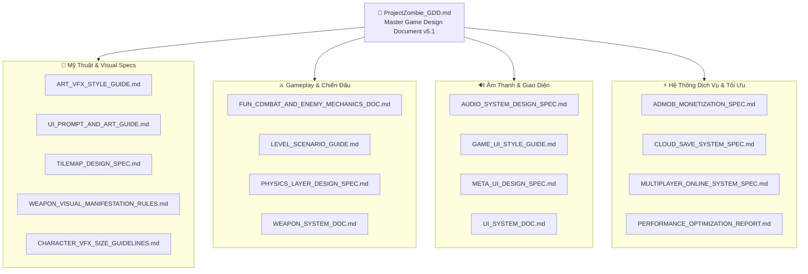

# 📜 Trung Tâm Tài Liệu Thiết Kế Trò Chơi (Game Design Documentation Hub)
## Dự Án: VONG XUYÊN (Project Zombie)

Chào mừng bạn đến với trung tâm tài liệu thiết kế và đặc tả kỹ thuật (Single Source of Truth) của dự án **VONG XUYÊN** — game **2D Top-down Action Roguelite** mang phong cách mỹ thuật **Cổ Phong Đông Sơn - Anime Dark Fantasy**, phát triển trên nền tảng **Unity 2022 LTS (URP) cho thiết bị di động Android**.

---

## 🗺️ Bản Đồ Hệ Thống Tài Liệu (Documentation Map)

---

## 📚 Danh Mục Tài Liệu Chi Tiết (Categorized Index)

### 1. 👑 Tài Liệu Thiết Kế Cốt Lõi (Master Design Document)
| Tài Liệu | Phiên Bản | Mô Tả Trọng Tâm | Đường Dẫn |
| :--- | :---: | :--- | :--- |
| **ProjectZombie GDD** | `v5.1` | **Single Source of Truth** toàn diện: 4 Tướng Thần Thoại, Hệ thống Ngũ Hành, Vòng lặp Core Gameplay, Cơ chế Gacha & Tiến hóa Pháp bảo. | [ProjectZombie_GDD.md](file:///c:/Users/thuon/Unity/Projectzombie/GameDesignDoc/ProjectZombie_GDD.md) |

---

### 2. 🎨 Mỹ Thuật, Đồ Họa & VFX (Art, Visual & VFX Specs)
| Tài Liệu | Phiên Bản | Mô Tả Trọng Tâm | Đường Dẫn |
| :--- | :---: | :--- | :--- |
| **Art & VFX Style Guide** | `v1.0` | Kim chỉ nam mỹ thuật Cổ Phong Đông Sơn, 2-Tone Cell Shading, Thick Outline, Palette màu Ngũ Hành và hiệu ứng Slash VFX. | [ART_VFX_STYLE_GUIDE.md](file:///c:/Users/thuon/Unity/Projectzombie/GameDesignDoc/ART_VFX_STYLE_GUIDE.md) |
| **UI Prompt & Art Guide** | `v1.0` | Sổ tay Prompt AI chuẩn hóa sinh Asset UI, Frame 9-Slice, Panel hoa văn trống đồng, Nút bấm & Biểu tượng đồng nhất. | [UI_PROMPT_AND_ART_GUIDE.md](file:///c:/Users/thuon/Unity/Projectzombie/GameDesignDoc/UI_PROMPT_AND_ART_GUIDE.md) |
| **Tilemap Design Spec** | `v1.0` | Quy chuẩn Tilemap 2.5D, Pixel Density PPU = 64, Auto-tiling Rule Tiles, Multi-layer Grid & Y-Sorting. | [TILEMAP_DESIGN_SPEC.md](file:///c:/Users/thuon/Unity/Projectzombie/GameDesignDoc/TILEMAP_DESIGN_SPEC.md) |
| **Weapon Visual Manifestation Rules** | `v1.0` | Quy chuẩn hiển thị tối đa 6 Pháp bảo đồng thời quanh nhân vật, phối hợp Orbital/Floating và Tối ưu Animation. | [WEAPON_VISUAL_MANIFESTATION_RULES.md](file:///c:/Users/thuon/Unity/Projectzombie/GameDesignDoc/WEAPON_VISUAL_MANIFESTATION_RULES.md) |
| **Character & VFX Metric Guidelines** | `v1.0` | Bảng quy chuẩn kích thước hình học Hero Chibi (1.05m), Quái thường/Elite/Boss và Hitbox Capsule chuẩn Metric. | [CHARACTER_VFX_SIZE_GUIDELINES.md](file:///c:/Users/thuon/Unity/Projectzombie/CHARACTER_VFX_SIZE_GUIDELINES.md) |

---

### 3. ⚔️ Cơ Chế Chiến Đấu, Màn Chơi & Vật Lý (Combat, Levels & Physics)
| Tài Liệu | Phiên Bản | Mô Tả Trọng Tâm | Đường Dẫn |
| :--- | :---: | :--- | :--- |
| **Fun Combat & Enemy Mechanics** | `v1.0` | Cơ chế chiến đấu Slapstick, hiệu ứng văng gãy, biến hình bựa vui nhộn của dàn Yêu Ma Cổ Phong. | [FUN_COMBAT_AND_ENEMY_MECHANICS_DOC.md](file:///c:/Users/thuon/Unity/Projectzombie/GameDesignDoc/FUN_COMBAT_AND_ENEMY_MECHANICS_DOC.md) |
| **Level Scenario & Spawning Guide** | `v1.0` | Diễn biến màn chơi 20 phút (Vong Xuyên Hà), tiến trình Wave, Sự kiện xuất hiện Tướng Ma, Boss Ngưu Đầu Mã Diện. | [LEVEL_SCENARIO_GUIDE.md](file:///c:/Users/thuon/Unity/Projectzombie/GameDesignDoc/LEVEL_SCENARIO_GUIDE.md) |
| **Physics 2D & Collision Matrix Spec** | `v1.0` | Bảng phân chia Layer 2D Physics, Ma trận va chạm tối ưu và quy tắc xử lý Raycast/Contact Filter không cấp phát bộ nhớ. | [PHYSICS_LAYER_DESIGN_SPEC.md](file:///c:/Users/thuon/Unity/Projectzombie/GameDesignDoc/PHYSICS_LAYER_DESIGN_SPEC.md) |
| **Weapons & Relic System Dev Doc** | `v6.5` | Kiến trúc C# hệ thống Pháp bảo (Hybrid Relic System): Melee, Projectile, AoE, Orbiting, Ranged & Tiến hóa Thần khí. | [WEAPON_SYSTEM_DOC.md](file:///c:/Users/thuon/Unity/Projectzombie/Assets/Features/Weapons/WEAPON_SYSTEM_DOC.md) |
| **Projectile System Spec** | `v1.0` | Thiết kế hệ thống Đạn, Quỹ đạo bay (Linear, Sine Wave, Homing, Boomerang), Object Pooling & Hitbox Detection. | [PROJECTILE_SYSTEM_DOC.md](file:///c:/Users/thuon/Unity/Projectzombie/Assets/Features/Projectiles/PROJECTILE_SYSTEM_DOC.md) |
| **Upgrades & Gacha System Doc** | `v2.0` | Cơ chế Reroll, Ban, Rarity Weighting và kiến trúc ScriptableObject cho hệ thống Thẻ nâng cấp trong trận đấu. | [UPGRADES_SYSTEM_DOC.md](file:///c:/Users/thuon/Unity/Projectzombie/Assets/Features/Upgrades/UPGRADES_SYSTEM_DOC.md) |

---

### 4. 🔊 Âm Thanh & Giao Diện Người Dùng (Audio & UI Specifications)
| Tài Liệu | Phiên Bản | Mô Tả Trọng Tâm | Đường Dẫn |
| :--- | :---: | :--- | :--- |
| **Audio System Design Spec** | `v2.5` | Thiết kế âm thanh Cổ Phong (Mõ gỗ, Khánh ngọc, Trống đồng), Event-Driven Audio Engine, AudioSource Pooling 0 Latency. | [AUDIO_SYSTEM_DESIGN_SPEC.md](file:///c:/Users/thuon/Unity/Projectzombie/GameDesignDoc/AUDIO_SYSTEM_DESIGN_SPEC.md) |
| **Game UI Style Guide** | `v2.0` | 7 Trụ cột UI/UX Di động: HUD In-game, Joystick ảo chuẩn công thái học, Bảng nâng cấp, Thang màu Ngũ Hành. | [GAME_UI_STYLE_GUIDE.md](file:///c:/Users/thuon/Unity/Projectzombie/GameDesignDoc/GAME_UI_STYLE_GUIDE.md) |
| **Meta UI Design Spec** | `v1.0` | Thiết kế giao diện Ngoài trận đấu (Sảnh Hoàng Tuyền, Kho Tướng, Meta Shop Nâng cấp vĩnh viễn, Tủ Pháp bảo). | [META_UI_DESIGN_SPEC.md](file:///c:/Users/thuon/Unity/Projectzombie/Assets/Features/UI/META_UI_DESIGN_SPEC.md) |
| **UI System Architecture Doc** | `v1.0` | Kiến trúc Model-View-Presenter (MVP), Tách biệt hoàn toàn UI View và Gameplay Core Logic. | [UI_SYSTEM_DOC.md](file:///c:/Users/thuon/Unity/Projectzombie/Assets/Features/UI/UI_SYSTEM_DOC.md) |

---

### 5. ⚡ Dịch Vụ Nền Tảng, Mạng & Tối Ưu (Services, Tech & Optimization)
| Tài Liệu | Phiên Bản | Mô Tả Trọng Tâm | Đường Dẫn |
| :--- | :---: | :--- | :--- |
| **AdMob Monetization Spec** | `v1.0` | Thiết kế tích hợp Quảng cáo Hybrid: Rewarded Video (Hồi sinh, Reroll thẻ), Interstitial tự nhiên, Collapsible Banner. | [ADMOB_MONETIZATION_SPEC.md](file:///c:/Users/thuon/Unity/Projectzombie/GameDesignDoc/ADMOB_MONETIZATION_SPEC.md) |
| **Cloud Save System Spec** | `v1.0` | Thiết kế Lưu trữ Đám mây (Cloud Save): Offline-first, Google Play Games Services (GPGS), Đồng bộ xung đột (Conflict Resolution). | [CLOUD_SAVE_SYSTEM_SPEC.md](file:///c:/Users/thuon/Unity/Projectzombie/GameDesignDoc/CLOUD_SAVE_SYSTEM_SPEC.md) |
| **Multiplayer Online Spec** | `v1.0` | Thiết kế Chơi mạng & Co-op (Dự thảo mở rộng tương lai): Đồng bộ Client-Server, Netcode for GameObjects. | [MULTIPLAYER_ONLINE_SYSTEM_SPEC.md](file:///c:/Users/thuon/Unity/Projectzombie/GameDesignDoc/MULTIPLAYER_ONLINE_SYSTEM_SPEC.md) |
| **Performance Optimization Report** | `v2.0` | Báo cáo chi tiết triệt tiêu giật lag (Zero Freeze Spikes), Profiling CPU/GPU, Sprite Atlas, Shader Culling, 60 FPS Mobile. | [PERFORMANCE_OPTIMIZATION_REPORT.md](file:///c:/Users/thuon/Unity/Projectzombie/GameDesignDoc/PERFORMANCE_OPTIMIZATION_REPORT.md) |
| **Android Build Troubleshooting** | `v1.0` | Sổ tay giải quyết triệt để các lỗi Build Android: Gradle, Keystore, ProGuard/R8, Target SDK 33+, IL2CPP ARM64. | [DOCS_ANDROID_BUILD_TROUBLESHOOTING.md](file:///c:/Users/thuon/Unity/Projectzombie/Assets/DOCS_ANDROID_BUILD_TROUBLESHOOTING.md) |

---

## 🔄 Quy Chuẩn Cập Nhật Tài Liệu (Maintenance Guidelines)
1. **Single Source of Truth:** Mọi thay đổi về chỉ số, cơ chế và danh sách nhân vật/vũ khí bắt buộc phải cập nhật trước tại `ProjectZombie_GDD.md`.
2. **Metadata Headers:** Tất cả tài liệu con phải duy trì Header chuẩn gồm: **Tên Dự Án**, **Phiên Bản**, **Ngày Cập Nhật**, **Trạng Thái (Proposed / Approved / Implemented)**.
3. **Cross-Linking:** Sử dụng Markdown Links chuẩn để liên kết chéo giữa các tài liệu đặc tả và mã nguồn C# liên quan.
