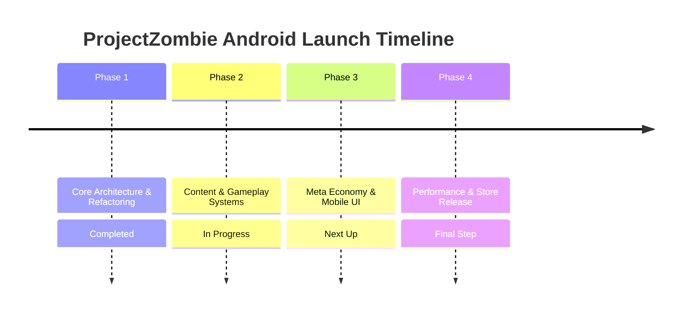

# Lộ Trình Phát Triển Dự Án — ProjectZombie (Android Release Roadmap)

**Dự án:** ProjectZombie (Top-down Survival Roguelite)  
**Nền tảng:** Android Mobile (Google Play Store — Target API 33+, IL2CPP ARM64)  
**Phiên bản mục tiêu:** MVP 1.0 (Store Release)

---

## 🎯 Tổng Quan Lộ Trình (Milestone Overview)

---

## 📌 Chi Tiết Các Giai Đoạn (Development Phases)

### 🚀 Giai Đoạn 1: Cấu Trúc Nền Tảng & Refactor (Completed)
- [x] **Chuyển hướng Nền tảng:** Đổi hoàn toàn target từ WebGL sang **Android Mobile**.
- [x] **Loại bỏ Web & TikTok Connectors:** Dọn dẹp sạch `SupabaseBridge`, `TikTokConnector`, `JS Bridge`.
- [x] **Hệ Thống Lưu Trữ Cục Bộ (Save System):** Hoàn thiện `SaveSystem.cs` mã hóa JSON ghi file tại `Application.persistentDataPath`.
- [x] **Chuẩn hóa Kiến trúc Code:** Áp dụng MVP cho UI, Event-driven, Object Pooling (0 GC Spikes), FSM cho Enemy AI.
- [x] **Cập nhật Tài liệu Kỹ thuật:** Hoàn thiện `ProjectZombie_GDD.md` và `SYSTEM_ARCHITECTURE.md`.

---

### ⚔️ Giai Đoạn 2: Xây Dựng Content & Gameplay MVP (In Progress)
- [/] **Tập Vũ Khí MVP (12 Weapons):**
  - [x] Pistol (`W001`), Knife Dual Slash (`W002`), Orbit Saw (`W003`).
  - [ ] Vampiric Bats (`W004`), Shotgun (`W005`), Grenade Launcher (`W006`).
  - [ ] Crossbow (`W007`), Flamethrower (`W008`), Lightning Orb (`W009`).
  - [ ] Poison Drone (`W010`), Holy Water (`W011`), Boomerang (`W012`).
  - [ ] Xây dựng 12 Thẻ Tiến Hóa (`EvolutionUpgrade E001` - `E012`).
- [/] **Tập Quái Vật & Spawn System (5 Enemies + 2 Bosses):**
  - [x] Walker Zombie, Runner Zombie, Zombie Tank, Spitter Zombie, Exploder Zombie.
  - [x] Hệ thống `SpawnManager`, `WavePhase`, `SpawnPillar` với animation hiệu ứng trụ.
  - [ ] Boss 1: **Abomination** (Phase 1 Bull Dash/Ground Slam, Phase 2 Swarm/Toxic Cloud, Evolution Chest Drop).
  - [ ] Boss 2: **Skeleton King** (Phase 1 Sword Wave/Bone Cage, Phase 2 Death Zone, Victory Chest Drop).
- [ ] **Bảng Tiến Trình Spawn (Spawn Timeline):** Cấu hình đợt quái tự động theo timeline từ 00:00 ➔ 20:00.

---

### 💰 Giai Đoạn 3: Meta Economy & Mobile UI/UX (Planned)
- [ ] **Cây Nâng Cấp Vĩnh Viễn (Meta Progression Tree UI):**
  - Giao diện Shop nâng cấp vĩnh viễn chia 3 nhánh: Offense (Damage/AtkSpeed/Crit), Defense (HP/Armor), Utility (Speed/Magnet/Luck).
- [ ] **Hệ Thống Mở Khóa Nhân Vật:** UI Shop chọn nhân vật, mở khóa Gunslinger (1,500 Coin), Shadow Tank (3,500 Coin).
- [ ] **Mobile Touch Input & Joystick UI:**
  - Tích hợp Dynamic Virtual Joystick điều khiển 360 độ góc dưới màn hình cảm ứng Android.
- [ ] **Màn Hình Kết Quả & Thống Kê (Run Summary UI):**
  - Thống kê thời gian sống, số lượng tiêu diệt, tổng sát thương, Coin Sinh Tồn nhận được.

---

### 🛡️ Giai Đoạn 4: Tối Ưu Hiệu Năng & Đóng Gói Android Store (Planned)
- [ ] **Tối Ưu Hóa Bộ Nhớ & VRAM (Mobile Performance):**
  - Nén Texture Sprite Sheet định dạng **ASTC**.
  - Kiểm tra Sprite Atlas & Tilemap Batching để duy trì Draw Calls < 30.
  - Test stress test 200 enemies + 100 projectiles giữ vững 60 FPS trên máy di động tầm trung.
- [ ] **Đóng Gói Android App Bundle (.aab):**
  - Cấu hình IL2CPP ARM64-v8a backend, Target SDK Android 13+ (API Level 33+).
  - Đóng gói file `.aab` hoàn chỉnh tích hợp Google Play App Signing & Keystore sẵn sàng publish.
