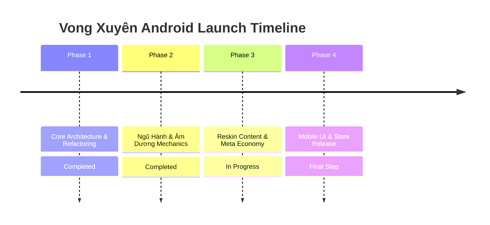

# Lộ Trình Phát Triển Dự Án — VONG XUYÊN (Android Release Roadmap)

**Dự án:** Vong Xuyên (Top-down Survival Roguelite — GDD v4.0)  
**Nền tảng:** Android Mobile (Google Play Store — Target API 33+, IL2CPP ARM64)  
**Phiên bản mục tiêu:** MVP 1.0 (Store Release)

---

## 🎯 Tổng Quan Lộ Trình (Milestone Overview)

---

## 📌 Chi Tiết Các Giai Đoạn (Development Phases)

### 🚀 Giai Đoạn 1: Cấu Trúc Nền Tảng & Refactor (Completed)
- [x] **Chuyển hướng Nền tảng:** Đổi hoàn toàn target từ WebGL sang **Android Mobile**.
- [x] **Loại bỏ Web & TikTok Connectors:** Dọn dẹp sạch `SupabaseBridge`, `TikTokConnector`, `JS Bridge`.
- [x] **Hệ Thống Lưu Trữ Cục Bộ (Save System):** Hoàn thiện `SaveSystem.cs` mã hóa JSON ghi file tại `Application.persistentDataPath`.
- [x] **Chuẩn hóa Kiến trúc Code:** Áp dụng MVP cho UI, Event-driven, Object Pooling (0 GC Spikes), FSM cho Enemy AI.
- [x] **Cập nhật Tài liệu Kỹ thuật:** Hoàn thiện `ProjectZombie_GDD.md` (v4.0 Single Source of Truth) và `LEVEL_SCENARIO_GUIDE.md`.

---

### ☯️ Giai Đoạn 2: Lõi Cơ Chế Ngũ Hành & Âm Dương (Completed)
- [x] **Tính Toán Sát Thương Ngũ Hành (Elemental Counter):**
  - Tích hợp `ElementType` enum (`Kim`, `Moc`, `Thuy`, `Hoa`, `Tho`) vào `DamageData.cs` và `DamageUtility.cs`.
  - Tra cứu vòng Tương Khắc Ngũ Hành nhân **+30% Sát thương**.
- [x] **Combo Tương Sinh Ngũ Hành (Elemental Combo Tracker):**
  - Tích hợp vòng đệm theo dõi 3s trong `WeaponManager.cs` giúp giảm **20% Cooldown** khi đánh đúng chuỗi Tương Sinh.
- [x] **Cán Cân Âm Dương (Yin-Yang Balance):**
  - Xây dựng `YinYangManager.cs` theo dõi trạng thái Âm Dương (0–100) phát event `OnYinYangStateChanged`.
- [x] **Dynamic Upgrade Gacha Filtering:**
  - Tích hợp bộ lọc thẻ nâng cấp ngẫu nhiên trong `UpgradeManager.cs` dựa trên trạng thái `YinYangState` của người chơi.
- [x] **Dynamic Element Boss AI:**
  - Xây dựng `BossElementController.cs` cho phép Boss (Ngưu Đầu Mã Diện & Diêm Vương) luân phiên đổi hệ Ngũ Hành theo thời gian thực (10s/lần).

---

### 📜 Giai Đoạn 3: Reskin Content & Kinh Tế Cổ Tiền (In Progress)
- [/] **Tập 12 Pháp Bảo MVP & Thẻ Tiến Hóa (GDD v4.0):**
  - [x] Nỏ Thần (`W001` - Kim), Bút Phán Quan (`W002` - Kim), Bùa Trấn Yêu (`W003` - Mộc).
  - [x] Cửu Vĩ Hồ Trảo (`W004` - Hỏa), Trống Đồng Đông Sơn (`W005` - Thổ), Lựu Đạn Thần Sa (`W006` - Hỏa).
  - [x] Cung Thạch Sanh (`W007` - Kim), Đao Cửu Vĩ (`W008` - Hỏa), Trượng Long Vương (`W009` - Thủy).
  - [x] Linh Phù Ma Da (`W010` - Thủy), Nước Thánh Chùa Hương (`W011` - Thổ), Phi Tiêu Bát Quái (`W012` - Mộc).
  - [x] Xây dựng bộ 12 Thẻ Tiến Hóa Tối Thượng (`E001` - `E012`).
- [/] **Tập Yêu Ma & Spawn System (5 Yêu Ma + 2 Bosses):**
  - [x] Ma Giáp (Kim), Ma Trơi (Hỏa), Quỷ Nhập Tràng (Thổ), Ma Da (Thủy), Hồ Ly Tinh Nhỏ (Hỏa).
  - [x] Boss 1: **Ngưu Đầu Mã Diện** (Phase 1 Bull Dash/Ground Slam, Phase 2 Swarm/Hắc Khí, đổi hệ Thổ/Hỏa, Rương U Minh Drop).
  - [x] Boss 2: **Diêm Vương** (Phase 1 Bút Phán Quan/Lưới Nghiệp Báo, Phase 2 Vực Vong Xuyên/Quỷ Sứ, luân phiên 5 hệ, Rương Đầu Thai Drop).
- [x] **Chuyển Đổi Kinh Tế Cổ Tiền (Meta Currency):**
  - Chuyển đổi tên gọi đơn vị tiền vĩnh viễn thành **Cổ Tiền** (tiền xu cổ Việt Nam) trong `MetaCurrencyManager.cs` và `MetaProgressionSaveData.cs`.

---

### 🛡️ Giai Đoạn 4: Mobile UI MVP & Đóng Gói Android Store (Planned)
- [/] **Cập Nhật Mobile HUD Canvas (MVP Architecture):**
  - [x] Bổ sung Slider Cán cân Âm Dương & Text Thuộc tính Boss vào `RunHUDView.cs` và `RunHUDPresenter.cs`.
  - [ ] Thêm Badge màu hiển thị thuộc tính Ngũ Hành trên thẻ Gacha Nâng cấp (`UpgradeCardView.cs`).
- [ ] **Cây Nâng Cấp Vĩnh Viễn & Shop Cổ Tiền:**
  - Giao diện Shop nâng cấp vĩnh viễn dùng Cổ Tiền chia 3 nhánh: Offense (Damage/AtkSpeed/Crit), Defense (HP/Armor), Utility (Speed/Magnet/Luck).
- [ ] **Hệ Thống Mở Khóa Nhân Vật:**
  - UI Chọn Nhân vật theo hệ khởi điểm: Thư Sinh (Kim), Đạo Sĩ (Mộc), Võ Tăng (Thổ).
- [ ] **Tối Ưu Hiệu Năng & Đóng Gói Android App Bundle (.aab):**
  - Texture Compression **ASTC 6x6**, Sprite Atlas Batching (Draw Calls < 30).
  - Stress Test 200 Yêu ma + 100 Projectiles kiểm tra FPS (Target 60 FPS).
  - Xuất file `.aab` IL2CPP ARM64-v8a API 33+ đóng gói Google Play Store Release.
