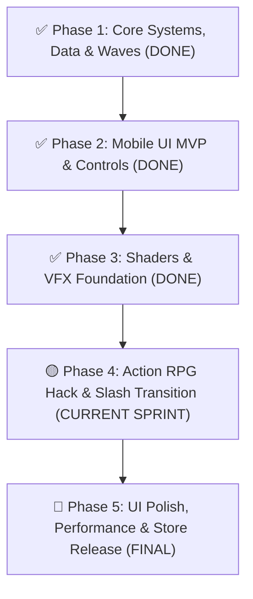

# Danh Sách Nhiệm Vụ & Task Tracker — VONG XUYÊN

Tài liệu quản lý danh sách công việc (Kanban Board Task Tracker) phân chia theo các hạng mục của dự án **Vong Xuyên (Android Release - GDD v5.0 Action RPG Roguelite)**.  
*Tài liệu tham chiếu chi tiết:* 🎮 **[ProjectZombie_GDD.md](file:///c:/Users/thuon/Unity/Projectzombie/GameDesignDoc/ProjectZombie_GDD.md)** | 🎨 **[UI_ART_DIRECTION_GUIDE.md](file:///c:/Users/thuon/Unity/Projectzombie/.agents/references/UI_ART_DIRECTION_GUIDE.md)** | 📐 **[SYSTEM_ARCHITECTURE.md](file:///c:/Users/thuon/Unity/Projectzombie/.agents/references/SYSTEM_ARCHITECTURE.md)**

---

## 📋 Kanban Board Summary

| 🔴 Backlog (Sắp Tới / Xử Lý Sau) | 🟡 In Progress (Đang Triển Khai - ARPG Focus) | 🟢 Done (Đã Hoàn Thành) |
|---|---|---|
| 📱 **[TASK-314] Mobile UI Responsive & Safe Area** | ⚔️ **[TASK-ARPG-01] Tái Cấu Trúc Lõi Vũ Khí & 3-Hit Combo** | ☯️ **[Hạng Mục 1] Lõi Ngũ Hành, Âm Dương & 0-Alloc Combat** |
| 🪓 **[TASK-316] Hệ Thống UI Trực Quan Ngũ Hành (Bát Quái / Glow)** | 🏃 **[TASK-ARPG-02] Trạng Thái Nhân Vật & Combat Controls** | 📦 **[Hạng Mục 2] Database 12 Pháp Bảo, 12 Tiến Hóa & Cổ Tiền** |
| 💥 **[TASK-GP-03] Treasure Chest Gacha Popup (1-3-5 Items)** | 🎴 **[TASK-ARPG-03] Hệ Thống Nâng Cấp Trong Trận & Đột Phá** | 🧟 **[Hạng Mục 3] AI 5 Yêu Ma, 2 Boss & 20-Min Wave Timeline** |
| 🗜️ **[TASK-401] Texture Compression ASTC & Sprite Atlas** | 🧟 **[TASK-ARPG-04] Cân Bằng Enemy Wave (30-50 Mob) & Telegraph** | 📱 **[TASK-300] Mobile Controls (Joystick, Dash, Skill Buttons)** |
| 🧪 **[TASK-402] Mobile Stress Test (60 FPS ARPG)** | 🏛️ **[TASK-ARPG-05] UI Sảnh Chờ Chọn Loadout Vũ Khí & Relic** | 📊 **[TASK-312 & 313] In-Game HUD Visuals & Upgrade Cards UI** |
| 🚀 **[TASK-403] Android AAB Build & Signing Release** | ✨ **[TASK-VFX-05] Hit Sparks, Hit Stop 0.04s & Shake Polish** | 💎 **[TASK-EXP-01] Hệ Thống Hạt EXP Zero-Alloc & Magnet** |
| | 🎵 **[TASK-GP-05] Audio Feedback Layers (Hit/Death/Chime)** | 🎨 **[TASK-VFX-01 -> 04] Bộ VFX Vệt Chém, Orbit & Shockwave** |

---

## 🏃 Pipeline Thực Thi Chi Tiết (Execution Pipeline)

---

### 🟡 Phase 4: Chuyển Đổi Sang Action RPG Roguelite (CURRENT SPRINT — GDD v5.0)

Mục tiêu: Chuyển đổi cơ chế chiến đấu từ Tự Động Đánh (Survivor) sang **Chặt Chém Chủ Động (Hack & Slash Action RPG)** lấy **Vũ Khí Chính (3-Hit Combo)** và **Kỹ Năng Nhân Vật** làm gốc, biến đổi các vũ khí phụ thành **Pháp Bảo Hộ Thân (Relics)**.

---

#### ⚔️ [TASK-ARPG-01] Tái Cấu Trúc Lõi Vũ Khí & Chuỗi 3-Hit Combo (Primary vs Relics)
*Mục tiêu:* Phân tách rõ ràng giữa 1 Vũ khí chính đánh tay và tối đa 3 Pháp bảo hộ thân.
* **Dependencies:** `DamageUtility.cs`, `TargetingUtility.cs`, `ElementCycleManager.cs`.

- [x] **[TASK-ARPG-01.1] Nâng Cấp `WeaponBase.cs` Hỗ Trợ Chuỗi Combo:**
  - Thêm thuộc tính `CurrentComboStep` ($1 \rightarrow 2 \rightarrow 3$), `MaxComboSteps = 3`, `ComboResetTime = 1.0s`.
  - Bổ sung hàm `TriggerActiveComboAttack(int step)` và cơ chế reset combo về nhát 1 nếu quá thời gian chờ.
  - Cung cấp event `public event Action<DamageData, Collider2D> OnHitEnemy` để các Pháp bảo và kỹ năng lắng nghe kích hoạt hiệu ứng On-Hit.
- [x] **[TASK-ARPG-01.2] Đa Hình Hóa Hitbox & Sát Thương Trong `Weapon_MeleeBase.cs`:**
  - Mỗi bước Combo có thông số riêng:
    - *Nhát 1:* Hitbox hẹp phía trước, Damage hệ số $1.0\times$.
    - *Nhát 2:* Hitbox quét quạt ngang rộng, Damage hệ số $1.2\times$.
    - *Nhát 3:* Hitbox mở rộng / đâm sâu, Damage hệ số $1.8\times$, Knockback force mạnh $+50\%$ và kích hoạt Camera Shake.
  - Cập nhật [Weapon_DualSlash.cs](file:///c:/Users/thuon/Unity/Projectzombie/Assets/Features/Weapons/Weapon_DualSlash.cs) / `Weapon_MeleeBase` tuân thủ chuỗi 3 nhát này.
- [x] **[TASK-ARPG-01.3] Tái Cấu Trúc `WeaponManager.cs` Theo Mô Hình Loadout:**
  - Định nghĩa rõ: `public WeaponBase PrimaryWeapon { get; }` (Chỉ duy nhất 1 vũ khí slot chính).
  - Định nghĩa danh sách: `public IReadOnlyList<WeaponBase> RelicWeapons { get; }` (Tối đa 3 Pháp bảo mang theo).
  - Sửa đổi hàm `TriggerPrimaryAttack()`: Kích hoạt `PrimaryWeapon.TriggerActiveComboAttack()` mượt mà.
  - Vòng lặp `Tick()`: Chỉ chạy cho các `RelicWeapons` (nếu là dạng Aura hộ thân) hoặc đăng ký On-Hit event của `PrimaryWeapon`.
- [ ] **[TASK-ARPG-01.4] Chuyển Đổi Các Pháp Bảo Phụ Sang Cơ Chế Relic:**
  - *Bùa Trấn Yêu (`Weapon_Orbit.cs`):* Giữ nguyên vòng xoay bảo vệ nhưng chuyển trọng tâm sang Đẩy lùi (Knockback) bảo vệ sau lưng.
  - *Cửu Vĩ Hồ Trảo:* Lắng nghe `PrimaryWeapon.OnHitEnemy` $\rightarrow$ Đính kèm đòn cào lửa và hút máu On-Hit.
  - *Lựu Đạn Thần Sa:* Lắng nghe đòn Combo thứ 3 của Primary Weapon $\rightarrow$ Phóng lựu đạn phát nổ.

---

#### 🏃 [TASK-ARPG-02] Trạng Thái Nhân Vật, Kỹ Năng Lướt & Combat Controls
*Mục tiêu:* Đem lại cảm giác điều khiển mượt mà, đầm tay, hỗ trợ né đòn phản xạ và tự động ngắm mục tiêu.
* **Dependencies:** `PlayerController.cs`, `AttackButtonPresenter.cs`, `MobileControlsSetupTool.cs`.

- [x] **[TASK-ARPG-02.1] Trạng Thái Vung Kiếm (Action State & Movement Slowdown):**
  - Trong `PlayerController.cs`: Khi đang vung đòn chém ($0.1s$ windup), giảm tốc độ chạy còn $40\%$ để tạo lực đầm cho nhát chém, khôi phục tốc độ ngay sau khi kết thúc đòn.
- [x] **[TASK-ARPG-02.2] Cơ Chế Dash Cancel (Hủy Hoạt Ảnh Bằng Nút Lướt):**
  - Khi người chơi bấm nút **Dash** trong lúc đang chém $\rightarrow$ Lập tức hủy trạng thái vung đòn, kích hoạt Lướt né đòn khẩn cấp với $0.15s$ I-frame bất tử.
- [x] **[TASK-ARPG-02.3] Tự Động Ngắm Thông Minh (Smart Soft-Lock):**
  - Khi bấm nút Attack: Nếu người chơi thả Joystick $\rightarrow$ `PlayerController` tự động xoay mặt về phía kẻ địch gần nhất trong hình nón $90^\circ$ và bán kính $5m$ phía trước.
- [ ] **[TASK-ARPG-02.4] Nâng Cấp `PlayerAnimator.cs`:**
  - Bổ sung các Trigger gọi Animation: `Attack_1`, `Attack_2`, `Attack_3`, `Dash` đồng bộ theo nhịp bấm.
- [x] **[TASK-ARPG-02.5] Nâng Cấp `AttackButtonPresenter.cs` & `AttackButtonView.cs`:**
  - Bổ sung **Tap Buffer**: Nhận diện nhịp bấm liên tục của người chơi mà không bị nuốt lệnh khi vũ khí vừa kết thúc nhát chém trước.

---

#### 🎴 [TASK-ARPG-03] Hệ Thống Nâng Cấp Trong Trận (In-Run Upgrades & Breakthrough)
*Mục tiêu:* Cải biến giao diện Lên Cấp, tập trung biến hóa chuỗi đòn chém và thức tỉnh Pháp bảo đã chọn.
* **Dependencies:** `UpgradeData.cs`, `UpgradeManager.cs`, `UpgradeUIPresenter.cs`.

- [ ] **[TASK-ARPG-03.1] Mở Rộng Schema Dữ Liệu `UpgradeData.cs`:**
  - Thêm `UpgradeCategory`: `ComboAugment` (Biến hóa đòn chém), `RelicAwakening` (Thức tỉnh Pháp bảo), `DashTrait` (Cường hóa lướt), `ConditionalPassive` (Nội tại tình huống), `BreakthroughUltimate` (Bí tịch tuyệt kỹ).
- [ ] **[TASK-ARPG-03.2] Nâng Cấp Bộ Lọc Gacha `UpgradeManager.cs`:**
  - Chỉ cho phép xuất hiện thẻ thuộc về: (1) Vũ Khí Chính đang cầm, (2) Các Pháp bảo đã trang bị trong Loadout, (3) Thẻ Lướt & Chỉ số.
  - Triệt tiêu hoàn toàn việc roll ra các vũ khí lạ chưa được trang bị ngoài sảnh.
- [ ] **[TASK-ARPG-03.3] Cơ Chế Đột Phá Tuyệt Kỹ (Breakthrough System):**
  - Tại các mốc Level 5 và Level 10 (hoặc sau khi hạ Boss 1): Ép hiển thị 3 thẻ **Bí Tịch Tuyệt Kỹ** làm thay đổi hoàn toàn hình thái chiến đấu (VD: *Bát Quái Kiếm Trận, Hóa Thần Nhập Ma, Thái Cực Hộ Mệnh*).
- [ ] **[TASK-ARPG-03.4] Tạo Bộ Thẻ ScriptableObjects Mẫu Cho 4 Nhóm:**
  - Tạo các thẻ: Kiếm Khí Trảm, Trảm Phong Liên Hoàn, Tàn Ảnh Kiếm, Lướt Phản Đòn, Trảm Hậu (+100% Crit sau lưng), Cuồng Nộ.

---

#### 🧟 [TASK-ARPG-04] Cân Bằng Enemy Waves (30-50 Mob) & Chỉ Báo Báo Đòn (Telegraphing)
*Mục tiêu:* Giảm mật độ quái để có không gian lướt và chém combo, tăng chất lượng thử thách của quái vật.
* **Dependencies:** `WavePhase.cs`, `SpawnManager.cs`, `Enemy.cs`.

- [ ] **[TASK-ARPG-04.1] Điều Chỉnh Mật Độ Spawn:**
  - Trong `WavePhase.cs` & `SpawnManager.cs`: Giảm `maxEnemies` đồng thời từ 150–200 xuống **30 – 50 quái/wave**.
- [ ] **[TASK-ARPG-04.2] Tăng HP & Độ Bền Của Quái Vật:**
  - Tăng HP cơ bản của toàn bộ 5 Yêu ma lên $2.5\times$ trong ScriptableObject Data để người chơi hoàn thành trọn vẹn chuỗi 3-Hit Combo lên từng nhóm quái.
- [ ] **[TASK-ARPG-04.3] Hệ Thống Chỉ Báo Báo Đòn (Telegraph Warning System):**
  - Tạo component `EnemyAttackTelegraph.cs`: Hiển thị vệt đỏ (Red Arc/Cone) cảnh báo trước khi quái Tinh Anh và Boss ra đòn ($0.3s - 0.5s$) giúp người chơi kịp bấm Dash né đòn.

---

#### 🏛️ [TASK-ARPG-05] UI Sảnh Chờ Chọn Loadout (Meta Hub Integration)
*Mục tiêu:* Cho phép người chơi chuẩn bị Nhân vật + Vũ khí chính + Pháp bảo trước khi bắt đầu trận đấu.
* **Dependencies:** `CharacterSelectionPresenter.cs`, `MainHubPresenter.cs`, `MetaUIManager.cs`.

- [ ] **[TASK-ARPG-05.1] Mở Rộng Dữ Liệu Loadout Trận Đấu (`RunLoadoutState.cs`):**
  - Lưu thông tin: `SelectedCharacter`, `SelectedPrimaryWeapon`, `List<WeaponData> SelectedRelics (tối đa 3)`.
- [ ] **[TASK-ARPG-05.2] Nâng Cấp UI Sảnh Chờ `CharacterSelectionView.cs`:**
  - Bổ sung Panel chọn 1 Vũ Khí Chính và chọn 2-3 Pháp Bảo Hộ Thân với icon trực quan trước khi nhấn "Xuất Trận".
- [ ] **[TASK-ARPG-05.3] Khởi Tạo Gameplay Từ Loadout:**
  - Khi Scene Gameplay load: `WeaponManager` đọc `RunLoadoutState` để spawn chính xác Vũ Khí Chính và các Pháp bảo vào nhân vật.

---

#### ✨ [TASK-VFX-05] Tích Hợp Game Feel & Hit Impact Polish Cho Đòn Chém
- [ ] **Hit-Stop Toàn Diện:** Tích hợp `GameJuiceEvents.RequestHitStop(0.04f)` cho mọi đòn chém trúng quái (Chí mạng dừng `0.08f`).
- [ ] **Camera Shake Theo Nhịp Combo:** Nhát chém 1-2 rung nhẹ ($0.03$), nhát chém thứ 3 rung mạnh ($0.1s$, biên độ $0.15$).
- [ ] **VFX Vệt Chém Theo Chiều Vung Kiếm:** Tích hợp vệt chém uốn lượn uốn cong theo hướng chém của nhân vật.

---

### 🔴 Phase 5: UI Polish, Performance & Đóng Gói Phát Hành (FINAL PHASE - XỬ LÝ SAU)

- [ ] 🚨 **[TASK-314] Tối Ưu Hóa Toàn Diện Mobile UI Responsive, Safe Area & Multi-Resolution Adaptation**
- [ ] 🚨 **[TASK-316] Hệ Thống UI Trực Quan Ngũ Hành Cho Người Chơi Mới (MVP)**
- [ ] **[TASK-401] Texture Compression ASTC & Sprite Atlas (ASTC 6x6)**
- [ ] **[TASK-402] Mobile Stress Test (60 FPS ARPG)**
- [ ] **[TASK-403] Android AAB Build & Signing (Google Play Release)**
