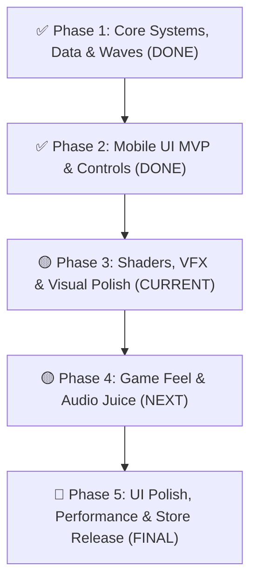

# Danh Sách Nhiệm Vụ & Task Tracker — VONG XUYÊN

Tài liệu quản lý danh sách công việc (Kanban Board Task Tracker) phân chia theo các hạng mục của dự án **Vong Xuyên (Android Release - GDD v4.0)**.
*Tài liệu tham chiếu chi tiết:* 🎨 **[UI_ART_DIRECTION_GUIDE.md](file:///c:/Users/thuon/Unity/Projectzombie/.agents/references/UI_ART_DIRECTION_GUIDE.md)** | 📖 **[GAMEPLAY_PRODUCTION_GUIDE.md](file:///c:/Users/thuon/Unity/Projectzombie/.agents/references/GAMEPLAY_PRODUCTION_GUIDE.md)** | 📐 **[SYSTEM_ARCHITECTURE.md](file:///c:/Users/thuon/Unity/Projectzombie/.agents/references/SYSTEM_ARCHITECTURE.md)**

---

## 📋 Kanban Board Summary

| 🔴 Backlog (Sắp Tới / Xử Lý Sau) | 🟡 In Progress (Đang Triển Khai - Gameplay Focus) | 🟢 Done (Đã Hoàn Thành) |
|---|---|---|
| 📱 **[TASK-314] Mobile UI Responsive & Safe Area** | 🎨 **[TASK-VFX-Core] Bộ 4 Shader Graph URP Cho 2D Mobile** | ☯️ **[Hạng Mục 1] Lõi Ngũ Hành, Âm Dương & 0-Alloc Combat** |
| 🪓 **[TASK-316] Hệ Thống UI Trực Quan Ngũ Hành (Bát Quái / Glow)** | ⚔️ **[TASK-VFX-01] Vệt Chém Bút Phán Quan & Luồng Lửa Đao Cửu Vĩ** | 📦 **[Hạng Mục 2] Database 12 Pháp Bảo, 12 Tiến Hóa & Cổ Tiền** |
| 💥 **[TASK-GP-03] Treasure Chest Gacha Popup (1-3-5 Items)** | 🌀 **[TASK-VFX-02] Orbit Trail Bùa Trấn Yêu & Phi Tiêu Bát Quái** | 🧟 **[Hạng Mục 3] AI 5 Yêu Ma, 2 Boss & 20-Min Wave Timeline** |
| 🌊 **[TASK-GP-04] Circle Swarm Spawner Events (Phút 3, 7, 12)** | 🔔 **[TASK-VFX-03] Sóng Âm Trống Đồng & Địa Chấn Lựu Đạn** | 📱 **[TASK-300] Mobile Controls (Joystick, Dash, Skill Buttons)** |
| 🗜️ **[TASK-401] Texture Compression ASTC & Sprite Atlas** | ⚡ **[TASK-VFX-04] Đạn Bay Nỏ Thần, Sét Long Vương & Khói Ma Da** | 📊 **[TASK-312 & 313] In-Game HUD Visuals & Upgrade Cards UI** |
| 🧪 **[TASK-402] Mobile Stress Test (200 Mobs 60 FPS)** | ✨ **[TASK-VFX-05] Hit Sparks, Hit Stop & Sorting Layer Polish** | 💎 **[TASK-EXP-01] Hệ Thống Hạt EXP Zero-Alloc, Magnet & Audio Pitch** |
| 🚀 **[TASK-403] Android AAB Build & Signing Release** | ⚡ **[TASK-GP-01] Hit Flash URP Shader & Knockback Feedback** | 🇻🇳 **[TASK-315] Vietnamese TMP Dynamic Fallback Font** |
| | 📳 **[TASK-GP-02] Screen Shake & Damage Popup Scale Polish** | 🏛️ **[TASK-303, 304, 305] Meta Shop, Hero Select & Run Summary** |
| | 🎵 **[TASK-GP-05] Audio Feedback Layers (Hit/Death/Chime)** | |

---

## 🏃 Pipeline Thực Thi Chi Tiết (Execution Pipeline)

---

### ✅ Phase 1: Hệ Thống Cốt Lõi, Database & AI Wave (Completed)

#### ☯️ Hạng Mục 1.1: Lõi Cơ Chế Ngũ Hành & Âm Dương
- [x] **[TASK-101]** Refactor `DamageUtility.cs` và `DamageData.cs` hỗ trợ tra cứu Tương Khắc Ngũ Hành (+30% Sát thương).
- [x] **[TASK-102]** Tích hợp Element Combo Tracker vào `WeaponManager.cs` (-20% Cooldown khi kích hoạt Tương Sinh trong 3s).
- [x] **[TASK-103]** Xây dựng `YinYangManager.cs` theo dõi trạng thái Âm Dương (0-100) và phát sự kiện `OnYinYangStateChanged`.
- [x] **[TASK-104]** Tích hợp lọc pool thẻ Gacha nâng cấp ngẫu nhiên trong `UpgradeManager.cs` theo `YinYangState`.
- [x] **[TASK-105]** Tạo `BossElementController.cs` cho phép Boss (Ngưu Đầu Mã Diện & Diêm Vương) luân phiên xoay vòng thuộc tính Ngũ Hành theo chu kỳ 10s.
- [x] **[TASK-106] Tích Hợp Toàn Diện Sát Thương Ngũ Hành & Vòng Tương Sinh (Clean Architecture & SOLID):**
  - [x] **[TASK-106.1] Chuẩn Hóa IDamageDealer & WeaponBase (Attacker Element Pipeline):**
    - Cập nhật `WeaponBase` cung cấp `AttackElement = this.element` và `CreateDamageData()`.
    - Refactor các lớp vũ khí con (`Weapon_Crossbow`, `Weapon_Boomerang`, `Weapon_DualSlash`, `Weapon_Flamethrower`, `Weapon_MeleeBase`, `PetController`,...) truyền đúng `this.element` khi tạo `DamageData` / spawn Projectile.
  - [x] **[TASK-106.2] Chuẩn Hóa IDamageable & Hit Resolution (Defender Element & Counter Multiplier):**
    - Cung cấp `CurrentElement` trên `Enemy` và `BossElementController`.
    - Tại điểm va chạm (`ProjectileCollision.cs` & `Weapon_MeleeBase.DealDamageInArea`), áp dụng tính toán tương khắc 1 chiều qua `DamageUtility.CalculateHitDamage(attackerElement, defenderElement)` (nhân `×1.3` nếu khắc hệ).
    - Đánh dấu cờ `IsCounter` trong `DamageData` và `DamageReport` để phục vụ visual feedback.
  - [x] **[TASK-106.3] Tích Hợp Single Source of Truth Vòng Tương Sinh (`ElementCycleManager`):**
    - Dọn dẹp logic combo thủ công trong `WeaponManager.cs`, quy tụ về `ElementCycleManager`.
    - Gọi `ElementCycleManager.Instance.RegisterHit(attackerElement, sourceWeapon)` khi đòn đánh trúng kẻ địch.
    - Đảm bảo cơ chế cooldown refund 20% trừ trực tiếp trên `WeaponBase.ReduceCurrentCooldown()` mượt mà, zero-allocation và tôn trọng giới hạn 1 proc / 3s.
    - Bổ sung sự kiện `OnElementSynergyTriggered` kích hoạt -20% Cooldown cho vũ khí trúng đòn và phát tín hiệu cho UI/VFX/Audio.
  - [x] **[TASK-106.4] Visual & Audio Feedback Tương Khắc / Tương Sinh (Game Feel):**
    - Kích hoạt màu Vàng Kim rực rỡ (`#FFD700`) + ký hiệu `✦` trên Floating Damage Text khi đòn đánh đạt điều kiện Tương Khắc trong `DamageTextManager` và `DamageTextStyleConfig`.
    - Phát âm thanh *Ting!* + hiệu ứng khi proc Tương Sinh theo đúng GDD v4.0.
  - [x] **[TASK-OPT-01] Tối Ưu Hóa Toàn Diện Physics & Combat Hot-path (Zero-Alloc & LayerMask Filtering):**
    - Xây dựng `TargetingUtility.cs` với cache `EnemyLayerMask` (Bitwise O(1)) và Reservoir Sampling 0-Alloc.
    - Refactor 8 vũ khí tầm xa, `Weapon_MeleeBase`, `ExplosionBehavior`, `HomingBehavior`, `VampiricBehavior`, `PetController`, `SuicideExplodeBehavior`, `BatQuaiTranZone`, `VoTangSignatureSkill`.
    - Triệt tiêu 100% việc gọi `Physics2D.OverlapCircleAll` tạo mảng rác trên Heap và bỏ qua `CompareTag` dư thừa khi đã lọc LayerMask.

#### 🗡️ Hạng Mục 1.2: Reskin Content, Database & Kinh Tế Cổ Tiền
- [x] **[TASK-201]** Thêm trường `elementType` vào ScriptableObject `WeaponData.cs` và `EnemyConfig.cs`.
- [x] **[TASK-202]** Tạo `WeaponDataGenerator.cs` tự động sinh/cập nhật dữ liệu `.asset` cho 12 Pháp Bảo MVP và 12 Evolution theo GDD 4.0.
- [x] **[TASK-203]** Tạo `EnemyDataGenerator.cs` tự động sinh/cập nhật dữ liệu `.asset` cho 5 Yêu Ma MVP (Ma Giáp, Ma Trơi, Quỷ Nhập Tràng, Ma Da, Hồ Ly Tinh Nhỏ).
- [x] **[TASK-204]** Chuyển đổi tên gọi đơn vị tiền Meta thành **Cổ Tiền** (tiền xu cổ Việt Nam) trong `MetaCurrencyManager.cs` và `MetaProgressionSaveData.cs`.
- [x] **[TASK-205]** Tạo `WeaponEvolutionManager.cs` kiểm tra điều kiện ghép 12 Vũ Khí Tiến Hóa theo ma trận GDD v4.0.
- [x] **[TASK-206]** Tạo `ProjectilePrefabGenerator.cs` & `ProjectileBehaviorDataGenerator.cs` sinh 12 Prefabs đạn và gán Behaviors SOs.
- [x] **[TASK-207]** Tạo `WaveDataGenerator.cs` tự động sinh 15 Wave Config ScriptableObjects bám sát Timeline 15 Phút GDD v4.0.

#### 🧟 Hạng Mục 1.3: AI Yêu Ma, Boss Mechanics & 20-Min Wave Timeline
- [x] **[TASK-306]** Tích hợp cơ chế **Cản Đạn (`Heavy Armor Bullet Sponge` - GDD 5.1)** cho Quỷ Nhập Tràng (`E_QUYNHAPTRANG`) trong `PierceBehavior.cs`.
- [x] **[TASK-307]** Viết `SuicideExplodeBehavior.cs` cho Hồ Ly Tinh Nhỏ (`E_HOALYTINH`) áp sát nổ AoE 50 Damage.
- [x] **[TASK-308]** Xây dựng `BossStateMachine.cs`, `BullDashSkill.cs` (Ngưu Xung Thiên), `GroundSlamSkill.cs` (Địa Chấn Âm Ty) cho Boss 1 Ngưu Đầu Mã Diện.
- [x] **[TASK-309]** Tích hợp **Anti-Cornering Guard (GDD 7.0)** cho `EnemySpawner.cs` dồn 70% quái hướng về trung tâm khi Player sát tường $<5\text{m}$.
- [x] **[TASK-310]** Tái cấu trúc Spawner System quy về mô hình Master-Worker chuẩn Data-Driven (`SpawnManager` & `EnemySpawner`).
- [x] **[TASK-311]** Tách biệt 100% AI Boss bằng `BossMovementStrategy.cs` và `BossMeleeAttackStrategy.cs` độc lập với quái thường.
- [x] **[TASK-E01] -> [TASK-E14]** Hoàn thiện 5 Yêu ma, 2 Boss Prefabs/SOs, 2 Rương báu và toàn bộ 20 Waves cho trận đấu 20 phút.

---

### ✅ Phase 2: Mobile UI MVP Architecture & Core Controls (Completed)

- [x] 🚨 **[TASK-300] Setup Mobile Controls Canvas**:
  - Dựng `DynamicVirtualJoystick.cs` (OnScreenControl), `SignatureSkillButtonView` + `SignatureSkillPresenter` (Nút bấm Skill chủ động) & `DashButtonView` + `DashButtonPresenter` chuẩn New Input System & MVP.
  - Xây dựng Editor Tool `MobileControlsSetupTool.cs` tự động dựng và wire toàn bộ Mobile Controls vào Scene.
- [x] 🚨 **[TASK-312] Refactor & Refine In-Game HUD Visuals (`RunHUDView.cs` & `RunHUDPresenter.cs`)**:
  - [x] Visual & Contrast cho Health Bar (`#D13838`), EXP Bar (`#4DEEEA`) & Level Text (`#FFD700`).
  - [x] Redesign Slider Cán Cân Âm Dương (`CharacterGaugeWidgetView.cs` & `TaoistYinYangTracker.cs`) với 3 trạng thái Âm Thịnh / Cân Bằng / Dương Thịnh.
  - [x] Overhead Boss Element Indicator: Hiển thị Badge ngũ hành trực tiếp trên đầu Boss.
  - [x] Tinh gọn Top HUD, phân định rõ rệt giữa HUD chính và Panel Âm Dương.
- [x] 🚨 **[TASK-313] Refine Upgrade Cards Gacha UI (Stat Diff & Badges)**:
  - [x] Xây dựng bộ format chỉ số `IUpgradeStatFormatter` & `UpgradeStatFormatter` (Rich Text).
  - [x] Chuẩn hóa Badge Ngũ Hành qua `ElementVisualHelper.cs`.
  - [x] View thụ động `UpgradeCardView.cs` hỗ trợ `_statDiffText` và `UnscaledTime`.
  - [x] Dynamic Card Container & Object Pooling trong `UpgradeUIView.cs` (Zero-Alloc, tái sử dụng thẻ linh hoạt 1-3-5 cards).
- [x] 🚨 **[TASK-UPG-02] Hệ Thống Nâng Cấp Vũ Khí 48 Thẻ & Bộ Lọc Thông Minh (Smart Filter Pipeline)**:
  - [x] Sinh trọn bộ 48 Thẻ Nâng Cấp Level 2 $\rightarrow$ 5 (`W001_Lv2` đến `W012_Lv5`) qua `UpgradeDatabaseStandardizer.cs`.
  - [x] Cầu nối chỉ số đạn (`BonusPierce`, `SpeedMultiplier`, `ScaleMultiplier`) vào `ProjectileRuntimeState` và `ProjectileSpawner`.
  - [x] Thuật toán trọng số động `CalculateEffectiveWeight`: Ưu tiên vũ khí sở hữu ($2.5\times$), Passive ($2.0\times$), Tiến hóa ($4.0\times$), Tương sinh Ngũ Hành ($+35\%$).
  - [x] Giới hạn tối đa 1 thẻ Mở Khóa Mới / 1 lần Roll và giới hạn cứng 6 Vũ khí / 6 Bị động (`MAX_WEAPONS = 6`, `MAX_PASSIVES = 6`).
  - [x] Hệ thống Thẻ Dự Phòng Vĩnh Cửu `FallbackRewardUpgradeData.cs` (+150 Vàng / Hồi 40% Máu) chống treo game khi cạn pool.
  - [x] Nút Bỏ Qua (Skip) hồi phục 20% Máu tối đa.
- [x] 🚨 **[TASK-W011-01] Nâng Cấp Nước Thánh Chùa Hương (W011 - Holy Water AoE Zone)**:
  - [x] Khắc phục 100% lỗi mất sát thương DoT qua `PeriodicHitBehavior.cs` (0 GC Allocation `Physics2D.OverlapCircleNonAlloc`).
  - [x] Tích hợp hiệu ứng Làm Chậm $30\%$ tốc độ di chuyển quái vật trong $1.0\text{s}$.
  - [x] Sinh texture và Prefab riêng `Proj_W011_NuocThanhChuaHuong.prefab` màu Lam Ngọc Sáng & Ánh Kim Phật Giáo.
  - [x] Cân bằng cơ chế rơi ngẫu nhiên vùng tròn quanh người chơi ($1.2\text{m} - 5.5\text{m}$), phục vụ lối chơi lùa quái (Kite).

---

### 🟡 Phase 3: Shaders, Modular VFX & Vũ Khí Polish (CURRENT FOCUS - GAMEPLAY)
*Tài liệu tham chiếu chi tiết:* 🎨 **[UI_ART_DIRECTION_GUIDE.md](file:///c:/Users/thuon/Unity/Projectzombie/.agents/references/UI_ART_DIRECTION_GUIDE.md)** | 🥞 **[SORTING_LAYERS_GUIDE.md](file:///c:/Users/thuon/Unity/Projectzombie/.agents/references/SORTING_LAYERS_GUIDE.md)** | 💥 **[weapon_dual_slash_vfx_suggestions.md](file:///c:/Users/thuon/Unity/Projectzombie/.agents/references/weapon_dual_slash_vfx_suggestions.md)**

- [x] 🚨 **[TASK-VFX-Core] Xây Dựng Bộ Shader HLSL URP Chuẩn Cho VFX 2D Mobile**:
  - [x] **[TASK-VFX-Core.1] Shader Vệt Chém / Kiếm Khí (`URP_VFX_Slash_Additive.shader`):** Polar UV Scrolling + Dissolve Noise + Dual HDR Core/Edge Tint.
  - [x] **[TASK-VFX-Core.2] Shader Sóng Xung Kích / Biến Dạng (`URP_VFX_Distortion_Shockwave.shader`):** Opaque Scene Color + Normal Wave + Fallback Bloom Ring cho đòn nổ/AoE.
  - [x] **[TASK-VFX-Core.3] Shader Vết Nứt Đất (`URP_VFX_GroundDecal_Dissolve.shader`):** Dissolve Burn Edge trên nền đất layer `VFX_Bottom`.
  - [x] **[TASK-VFX-Core.4] Shader Hit Flash Siêu Nhẹ Cho Quái Vật (`URP_Sprite_HitFlash.shader`):** Nháy trắng/vàng kim 0.05s trực tiếp trên Sprite Shader qua `MaterialPropertyBlock` & GPU Instancing Buffer (0 GC).

- [x] 🚨 **[TASK-VFX-01] [W002 & W008] Vệt Chém Đa Hướng & Luồng Lửa (`Bút Phán Quan` & `Đao Cửu Vĩ`)**:
  - [x] **Dynamic Slash Placement:** Spawn Crescent Slash VFX tại `hitCenter` xoay góc Z theo hướng đánh thực tế.
  - [x] **Multi-layer Slash Effect:** Tạo Prefab 3 lớp (`Core_White`, `Slash_Arc_Glow`, `Ink_Splash_Sparks` qua `WeaponVFXBuilder.cs`).
  - [x] **Visual Progression:** Nâng cấp visual theo Level 1 -> 4 -> Tiến Hóa `E002` (Vòng xoáy Âm Dương) trong `Weapon_DualSlash.cs`.
  - [x] **Đao Cửu Vĩ (W008):** Luồng rồng lửa phun liên tục dạng nón xoắn ốc kèm tàn lửa than hồng (`VFX_W008_FoxFlameStream`).

- [x] 🚨 **[TASK-VFX-02] [W003 & W012] Vệt Linh Khí Orbit & Phi Tiêu Bát Quái (`Bùa Trấn Yêu` & `Phi Tiêu Bát Quái`)**:
  - [x] Tangent Rotation: Xoay tiếp tuyến lá bùa theo chiều quay.
  - [x] Trail & Glow Ribbon: Gắn Trail Renderer Shader phát sáng mềm mại theo sau lá bùa (`VFX_W003_TalismanTrail`) và luồng gió xoáy phi tiêu (`VFX_W012_WindVortex`).
  - [x] Impact Pulse: Sóng đẩy lùi tí hon (Micro Repulsion Pulse) tại điểm va chạm quái.

- [x] 🚨 **[TASK-VFX-03] [W005, W006, W011] Sóng Âm Trấn Quốc & Địa Chấn (`Trống Đồng`, `Lựu Đạn`, `Nước Thánh`)**:
  - [x] **Trống Đồng Đông Sơn (W005):** Sóng âm hoa văn Trống Đồng dập xuống mặt đất + Vết nứt đất `GroundDecal` (`VFX_W005_DongSonShockwave`).
  - [x] **Lựu Đạn Thần Sa (W006):** Cột bão lửa cuộn xoáy 3 tầng bốc lên + Tàn than hồng bay phân tán (`VFX_W006_CinnabarExplosion`).
  - [x] **Nước Thánh Chùa Hương (W011):** Bình vỡ tóe nước thánh + Bãi sương mù gợn sóng dưới mặt đất + Bọt khí bay lên (`VFX_W011_HolyWaterAoE`).

- [x] 🚨 **[TASK-VFX-04] [W001, W004, W007, W009, W010, W013] Đạn Bay, Sét Dây & Triệu Hồi Linh Thú**:
  - [x] **Nỏ Thần (W001) & Cung Thạch Sanh (W007):** Mũi tên ánh sáng vệt đuôi dài + Vòng xé gió `Wind_Pierce_Ring` (`VFX_W001_GoldenArrow`).
  - [x] **Cửu Vĩ Hồ Trảo (W004):** Móng vuốt cáo lửa cào xé + Vệt sinh khí xanh ngọc bay ngược về Player (`VFX_W004_FoxClaws`).
  - [x] **Trượng Long Vương (W009):** Chuỗi sét nước `LineRenderer` giật nối 6 mục tiêu kèm tóe nước điện tích (`VFX_W009_LightningChain`).
  - [x] **Linh Phù Ma Da (W010) & Cờ Âm Binh (W013):** Hiệu ứng khói sương đầm lầy và làn sương đen âm ty triệu hồi (`VFX_W010_PoisonSwamp`).

- [ ] 🚨 **[TASK-VFX-05] Tích Hợp Game Feel & Hit Impact Polish Cho Toàn Bộ Vũ Khí**:
  - [ ] **Hit Sparks Pool:** Pool Particle Prefab tóe tia sáng/mảnh vụn theo 5 nguyên tố.
  - [ ] **Hit Stop (Frame Freeze):** Dừng `Time.timeScale = 0.05f` trong `0.04s` khi Crit / Proc Evolution.
  - [ ] **Chuẩn Hóa 3 Tầng Sorting Layer:** `VFX_Bottom` (Decal), `VFX_Middle` (Đạn/Slash/Orbit), `VFX_Top` (Hit Sparks/Nổ).

---

### 🟡 Phase 4: Gameplay Production Feel & Dynamic Audio (GAMEPLAY FOCUS)
*Tài liệu tham chiếu chi tiết:* 📖 **[GAMEPLAY_PRODUCTION_GUIDE.md](file:///c:/Users/thuon/Unity/Projectzombie/.agents/references/GAMEPLAY_PRODUCTION_GUIDE.md)** | 🔊 **[AUDIO_SYSTEM_GUIDE.md](file:///c:/Users/thuon/Unity/Projectzombie/.agents/references/AUDIO_SYSTEM_GUIDE.md)**

- [x] 🚨 **[TASK-GP-01] Hit Flash URP Shader & Knockback Feedback**:
  - [x] Nháy trắng (`Flash White 0.05s`) và Nháy Vàng Kim (`#FFD700`) tương khắc trên Sprite quái vật qua `HitFlashFeedback.cs` (0 GC).
  - [x] Lực đẩy lùi vật lý `Knockback` tích hợp vào đạn bay (`ProjectileCollision`), vụ nổ AoE (`ExplosionBehavior`) và chém cận chiến (`Weapon_MeleeBase`).
- [ ] 🚨 **[TASK-GP-02] Screen Shake & Damage Popup Feedback**:
  - Tích hợp Camera Shake (`0.08s`, biên độ `0.15`) khi đòn đánh Chí Mạng hoặc Nổ AoE.
  - Nâng cấp Damage Popup: Phân biệt rõ Sát thương Thường (Trắng), Tương Khắc (Vàng Kim `#FFD700` + `✦`), Chí Mạng (Đỏ Cam Scale Punch).
- [ ] 🚨 **[TASK-GP-03] Treasure Chest Gacha Popup (1-3-5 Items) & Evolution Ceremony**:
  - Popup mở rương báu rơi từ Elite/Boss (Rương Gỗ: 1 món, Rương Bạc: 3 món, Rương U Minh: 5 món + Instant Evolution).
  - Hiệu ứng Cleanse Blast (quét sạch quái cận chiến) khi hoàn thành ghép Pháp Bảo Tối Thượng.
- [ ] 🚨 **[TASK-GP-04] Circle Swarm Spawner Events (Tăng nhịp độ căng thẳng)**:
  - Bổ sung Event quái bao vây 360 độ siết chặt tại: Phút 03:00 (Ma Trơi), Phút 07:00 (Ma Da), Phút 12:00 (Quỷ Nhập Tràng).
  - Buộc người chơi dùng cơ chế `Dash` (i-frame 0.2s) để đục thủng vòng vây.
- [ ] 🚨 **[TASK-GP-05] Polish Audio Feedback Layers**:
  - Tích hợp âm thanh phản hồi va chạm (Hit SFX), âm thanh quái tan biến (Death Pop) và chuỗi chuông hút ngọc EXP.

---

### 🔴 Phase 5: UI Polish, Performance & Đóng Gói Phát Hành (FINAL PHASE - XỬ LÝ SAU)

- [ ] 🚨 **[TASK-314] Tối Ưu Hóa Toàn Diện Mobile UI Responsive, Safe Area & Multi-Resolution Adaptation**:
  - [ ] **[TASK-314.1] Safe Area Fitter Zero-Alloc (`SafeAreaFitter.cs`):** Tự động bắt `Screen.safeArea` áp dụng vào `anchorMin`/`anchorMax` (tránh Notch camera, Dynamic Island, Home Bar).
  - [ ] **[TASK-314.2] Adaptive Canvas Scaler (`AdaptiveCanvasScaler.cs`):** Match Height 1.0 cho màn dài (20:9) và Match Width 0.0 cho màn vuông (4:3).
  - [ ] **[TASK-314.3] Mobile Controls Left Touch Zone:** Cải tiến `DynamicVirtualJoystick.cs` hỗ trợ chạm nửa trái màn hình và căn lề cụm nút Dash/Skill.
  - [ ] **[TASK-314.4] Adaptive Card Container Auto-Scaler (`UpgradeUIView.cs`):** Tự động co giãn scale khi mở 3 hoặc 5 thẻ Gacha.
  - [ ] **[TASK-314.5] Editor Tool Chuẩn Hóa 1-Click (`MobileResponsiveOptimizer.cs`):** Tự động quét và chuẩn hóa toàn bộ Scene/Prefabs.
- [ ] 🚨 **[TASK-316] Hệ Thống UI Trực Quan Ngũ Hành Cho Người Chơi Mới (MVP)**:
  - [ ] **[TASK-316.1] Gợi Ý Tương Sinh (Synergy Glow & Hint) Trên Thẻ Gacha:** Viền sáng xanh ngọc + tooltip gợi ý khi xuất hiện thẻ tương sinh.
  - [ ] **[TASK-316.2] HUD Quick Reference Wheel (Vòng Bát Quái Tra Cứu Nhanh):** Hold touch 1s để soi sơ đồ tương sinh tương khắc.
  - [ ] **[TASK-316.3] Progressive Onboarding Banner Tutorial:** Toast hướng dẫn 3s khi lần đầu kích hoạt tương khắc / tương sinh trong Run 1.
  - [ ] **[TASK-316.4] Tab Sơ Đồ Ngũ Hành Trong Pause Menu & Codex.**
- [ ] **[TASK-401] Texture Compression ASTC & Sprite Atlas**:
  - Gom toàn bộ UI/Sprites vào Sprite Atlas 2048x2048, nén **ASTC 6x6** cho Android (Draw Calls < 30).
- [ ] **[TASK-402] Mobile Stress Test (200 Mobs 60 FPS)**:
  - Thử nghiệm 200 Yêu ma + 100 Projectiles kiểm tra FPS và GC Spikes (Target 60 FPS).
- [ ] **[TASK-403] Android AAB Build & Signing (Google Play Release)**:
  - Cấu hình Build Profile IL2CPP ARM64, Target API 33+, xuất file `.aab` có ký số phát hành Google Play Store.
