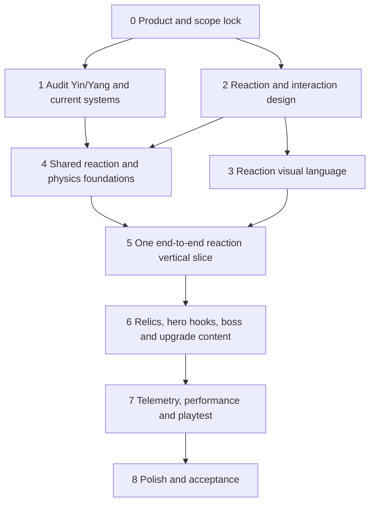

# Vong Xuyên — Vertical Slice Execution Plan

**Purpose:** Turn the product direction in the leadership brief into small, assignable tasks with dependencies and evidence-based acceptance criteria.
**Product north star:** *Vietnamese mythology action roguelite where folk relics and Five Element reactions create chaotic, funny, satisfying combat stories.*
**Status:** Proposed execution plan; task owners are team roles until named owners are assigned.

## 1. Product guardrails

- Freeze expansion of large systems until the vertical slice passes player validation.
- Vertical slice: Bến Đò Vong Xuyên, 1–2 heroes, 5 enemies, Ngưu Đầu boss, 5 relics, 5–8 elemental reactions, about 30 meaningful upgrades, 8–12 minutes per run.
- Three pillars: Five Elements provide strategy; slapstick physics provides memorable fun; Vietnamese culture provides a distinct identity.
- Do not add heroes, maps, PvP, multiplayer expansion, currencies, gacha, crafting, guilds, battle pass, progression systems, or dozens of relics during this slice.
- Preserve existing player saves when removing Yin/Yang. Do not delete or migrate serialized data without a documented compatibility path.
- Any reaction chain must be bounded and use pooled, allocation-conscious gameplay/VFX paths.

## 2. Workstream overview and dependencies

Parallel work is allowed only where outputs are independent: Yin/Yang audit can run alongside design lock; Art can develop reaction concepts after the first reaction set is selected; Dev can inspect current physics and pooling while design finishes the matrix. Do not build the full framework against unapproved mechanics.

## 3. Task backlog

### Phase 0 — Product and scope lock

#### PROD-01 — Ratify vertical-slice scope
**Owner:** Product / Game Director  
**Tasks:** Confirmed: map Bến Đò Vong Xuyên; heroes Thư Sinh (combo/mark) and Ẩn Sĩ (talisman setup); 5 enemies; Ngưu Đầu encounter; 5 relics; 5–8 reactions; ~30 upgrades; 8–12 minute run. Primary performance acceptance profile: low-end Android with 4 GB RAM, 60 Hz display, entry-level GPU (e.g. Mali-G52 class; Redmi 13C 4 GB is a concrete reference). Secondary compatibility/memory check: Android Go with 2 GB RAM when a device is available; do not assume a 60 FPS target for this secondary profile. Record explicit out-of-scope items.  
**Depends on:** None.  
**Acceptance:** A one-page scope sheet is approved; every candidate feature is marked in-scope or deferred; no team is asked to build content outside it.

#### PROD-02 — Set slice success measures
**Owner:** Product + Game Design  
**Tasks:** Define first-run questions and an observation sheet around element purpose, player-created combo, remembered relic/reaction, funny moment, and desire to try a different build.  
**Depends on:** PROD-01.  
**Acceptance:** The 10-player test has a consistent script, note template, and pass/fail thresholds agreed before testing.

### Phase 1 — Audit and design lock

#### DEV-01 — Inventory Yin/Yang dependencies
**Owner:** Dev  
**Tasks:** Search code, namespaces, ScriptableObjects, UI, tutorial, filters, combat modifiers, events, saves, Addressables, character and upgrade data. Record references, serialized IDs, and runtime entry points.  
**Depends on:** PROD-01.  
**Acceptance:** Inventory lists each dependency, owning asset/file, player-facing effect, save impact, and proposed disposition (remove, replace, compatibility-only). No production asset is deleted in this task.

#### GD-01 — Remove Yin/Yang from target design
**Owner:** Game Design  
**Tasks:** Update design vocabulary and target rules for identity, upgrade pool, combat modifiers, UI, tutorial, progression, and GDD. Identify valuable mechanics to re-home as Five Element, hero passive, or relic interaction.  
**Depends on:** PROD-01.  
**Acceptance:** Reviewed design docs contain no active Yin/Yang mechanic or terminology in the slice; disposition is recorded for each mechanic removed.

#### GD-02 — Choose the first reaction set
**Owner:** Game Design  
**Tasks:** Approved initial Five Reaction set for the vertical slice: Thủy → Hỏa — Bốc Hơi (steam burst leaves a slippery wet patch; enemies crossing it may slip, spin, or collide); Mộc → Hỏa — Hỏa Hoạn (burn spreads to nearby enemies); Thổ → Kim — Toái Giáp (armor break + fragments); Thủy → Mộc — Sinh Trưởng (root/entangle); Thổ → Thủy — Sa Lầy (slow + pull into a muddy area). Define exact application order, effect values/durations, counterplay/readability, propagation behavior, and player story. Keep direct damage modifiers secondary.  
**Depends on:** PROD-01.  
**Acceptance:** The five approved reactions are documented with concise rules and examples; exact element application order/precedence is explicit; values are marked provisional or locked.

#### GD-03 — Build the interaction matrix
**Owner:** Game Design  
**Tasks:** Map supported combinations across Element × Status × Physics × Environment. Mark unsupported combinations intentionally empty; prioritize interactions that create readable comedy or tactical choices.  
**Depends on:** GD-02.  
**Acceptance:** Matrix identifies supported combinations, required setup, outcome, and owning task; no mechanic exists only as an undocumented weapon-specific exception.

#### ART-01 — Define the Vietnamese visual language
**Owner:** Art  
**Tasks:** Create an art sheet using Vietnamese folk references (Hàng Trống/Đông Hồ stylization, giấy dó, sắc phong, trống đồng motifs, local ritual objects and architecture). Define prohibited generic fantasy cues and readability rules.  
**Depends on:** PROD-01.  
**Acceptance:** Art review approves a reference sheet usable by character, environment, UI, and VFX work; include a screenshot test checklist.

### Phase 2 — Dev foundations

#### DEV-02 — Plan save-compatible Yin/Yang removal
**Owner:** Dev  
**Tasks:** Based on DEV-01, choose migration, fallback, or compatibility-read strategy for existing saves and serialized assets. Add version/default rules where needed.  
**Depends on:** DEV-01, GD-01.  
**Acceptance:** Migration note covers old save versions, missing/unknown fields, and rollback expectations; representative legacy saves retain valid progression and load without exceptions.

#### DEV-03 — Implement Yin/Yang retirement by slice boundary
**Owner:** Dev  
**Tasks:** Remove active runtime/UI hooks from the slice, replace approved mechanics with Five Element/passive/relic equivalents, keep compatibility code only where required.  
**Depends on:** DEV-02.  
**Acceptance:** Fresh and representative legacy saves load; no active Yin/Yang UI, modifier, event or upgrade appears during a slice run; serialized references are accounted for.

#### DEV-04 — Specify ElementApplication contract
**Owner:** Dev  
**Tasks:** Define how sources apply an element/status to a target, including source identity, element, duration/intensity, refresh/stack rule, and pooled target-side state.  
**Depends on:** GD-02, GD-03.  
**Acceptance:** Contract is documented and demonstrated by two distinct sources applying state to one target without weapon-specific reaction logic.

#### DEV-05 — Implement data-driven ReactionDefinition and resolver
**Owner:** Dev  
**Tasks:** Create configurable definitions for required/prior and incoming element, effect values, status, damage, AoE, knockback, VFX/SFX, duration, propagation, and internal cooldown. Resolve priority deterministically.  
**Depends on:** DEV-04, GD-02.  
**Acceptance:** Designers can tune a reaction through data; resolver selects the expected reaction for approved test pairs; invalid/conflicting definitions are reported clearly.

#### DEV-06 — Add chain-reaction safety limits
**Owner:** Dev  
**Tasks:** Add maximum propagation depth, per-target reaction cooldown, per-frame work budget, pooled effects/VFX, NonAlloc target detection, and maximum simultaneous reactions. Define deterministic behavior when limits are reached.  
**Depends on:** DEV-05.  
**Acceptance:** Stress scenario cannot recurse indefinitely; counters show all limits; excess work follows documented policy; no unbounded allocations occur in the reaction hot path.

#### DEV-07 — Define shared Physics Combat API
**Owner:** Dev  
**Tasks:** Define shared contracts for Launch, Knockback, Pull, WallHit, EnemyCollision, EnemyProjectile, and RagdollFlight. Route weapon/status/boss callers through shared entry points incrementally.  
**Depends on:** GD-03.  
**Acceptance:** At least one relic, one status interaction, and Ngưu Đầu use shared physics contracts; collision ownership, team filtering, immunity, and pooling are documented.

#### DEV-08 — Establish Upgrade Modifier pipeline
**Owner:** Dev  
**Tasks:** Implement composable, data-driven modifiers for projectile operations (split, bounce, pierce, orbit, return, explode, inherit status, apply element) without per-upgrade subclass proliferation.  
**Depends on:** PROD-01, GD-02.  
**Acceptance:** Two different modifiers compose on a weapon through data; ordering and incompatible combinations have deterministic rules.

### Phase 3 — First playable proof

#### GD-04 — Fully specify the pilot reaction
**Owner:** Game Design  
**Tasks:** Use the approved pilot reaction Thủy → Hỏa, Bốc Hơi; specify setup, cues, result, duration, chaining, and tuning range.  
**Depends on:** GD-02, GD-03.  
**Acceptance:** A new tester can predict how to trigger it and describe its outcome after a short explanation-free play session.

#### ART-02 — Create pilot reaction visual package
**Owner:** Art  
**Tasks:** Design distinct silhouette, timing, palette, impact frame and sound cue. For Bốc Hơi, communicate a steam burst that leaves a readable slippery wet patch and causes enemy slip/spin/collision, rather than merely mixing blue/red particles.  
**Depends on:** ART-01, GD-04.  
**Acceptance:** Reaction is identifiable in gameplay footage with UI hidden; effect does not obscure target, direction, or knockback; assets meet import/pooling constraints.

#### DEV-09 — Ship one end-to-end reaction
**Owner:** Dev  
**Tasks:** Connect application → target state → resolver → configured effect → physics → pooled VFX/SFX. Use the pilot reaction; preserve existing damage/hitbox responsibilities.  
**Depends on:** DEV-05, DEV-06, DEV-07, GD-04, ART-02.  
**Acceptance:** Pilot works on hit/miss cases as designed, is tunable from data, obeys chain limits, and has no reaction logic embedded in an individual weapon.

#### VFX-01 — Rework basic melee slash as combat presentation
**Owner:** Dev + Art  
**Tasks:** Audit assigned slash prefabs; separate visual center from hitbox center; add pooled reveal/peak/dissolve animation; reset modified transforms and render state; align peak with actual damage frame; keep hit sparks separate; apply modest combo 1–2–3 scaling.  
**Depends on:** ART-01 and confirmed attack timing; integrate with DEV-09 conventions.  
**Acceptance:** Slash remains visible on a miss; hit sparks occur only on hit; slash peak and hit query align; pooled reuse starts clean; effect reads at target resolution without masking combat.

### Phase 4 — Slice content

#### GD-05 — Define hero identities on shared combat language
**Owner:** Game Design  
**Tasks:** Implement Thư Sinh as combo/mark and Ẩn Sĩ as talisman setup using the shared Five Element/reaction rules, without adding hero-specific subsystems.  
**Depends on:** GD-02, GD-03, PROD-01.  
**Acceptance:** Thư Sinh places Five Element marks through attack combos; Ẩn Sĩ prepares elements on enemies or terrain with talismans. Both use the same reaction rules, with distinct setup choices demonstrated in gameplay.

#### GD-06 — Design five relics as interaction starters
**Owner:** Game Design  
**Tasks:** Define slice versions of Dép Tổ Ong, Nồi Cơm, Điếu Cày, Chổi Lông Gà, and Bùa Trấn Yêu. Make each create or exploit a reaction/status/physics interaction.  
**Depends on:** GD-03, DEV-07, GD-05.  
**Acceptance:** Every relic has a gameplay loop, at least one matrix interaction, a recognizable moment, and no flat-stat increase as its primary identity.

#### GD-07 — Author ~30 meaningful upgrades
**Owner:** Game Design  
**Tasks:** Tag upgrades as Mutation, Reaction, or Chaos; use flat-stat upgrades as limited filler. Ensure choices support selected hero/relic/reaction pool.  
**Depends on:** GD-02, DEV-08, GD-05, GD-06.  
**Acceptance:** Pool contains about 30 slice-ready upgrades; every 3–5 levels a tester can identify changed build behavior; each entry has implementation data and balance bounds.

#### GD-08 — Design five enemies and Ngưu Đầu encounter
**Owner:** Game Design  
**Tasks:** Select five enemy behaviors and design Ngưu Đầu to test core systems (charge bait → wall collision → armor break); define phase rules, arena cues, reaction opportunities, and counterplay.  
**Depends on:** GD-03, DEV-07.  
**Acceptance:** Boss is a mechanic test rather than an HP/damage check; tells and counterplay are described; encounter produces a planned clip-worthy moment.

#### ART-03 — Produce reaction, status and slapstick readability assets
**Owner:** Art  
**Tasks:** Build shared visual rules/assets for each selected element/reaction plus squash/stretch, spin, trajectory, impact frames, status icons, wall splat, dust and debris.  
**Depends on:** ART-01, GD-02, GD-03.  
**Acceptance:** Each supported reaction has a distinct visual signature; element identity reads without UI; slapstick outcomes remain legible at normal gameplay zoom.

#### DEV-10 — Integrate slice content through shared systems
**Owner:** Dev  
**Tasks:** Implement selected heroes, five enemies, five relics, boss interactions and upgrade data using reaction, physics and modifier contracts. Do not add content outside PROD-01.  
**Depends on:** DEV-03, DEV-06, DEV-07, DEV-08, GD-05–GD-08, ART-03.  
**Acceptance:** Complete 8–12 minute run exercises planned reaction/slapstick loops; content is reachable through normal run flow; no duplicate weapon-specific reaction/physics system is introduced.

#### ART-04 — Prepare store-first gameplay shots
**Owner:** Art + Design  
**Tasks:** Stage and capture Dép hit, Nồi suction → enemy enters → pot bulge → launch, wall impact, chain reaction, boss moment, and one strongly Vietnamese frame.  
**Depends on:** Slice content implemented; ART-02, ART-03.  
**Acceptance:** Six clean captures/short clips exist; no shot depends on particle clutter to explain mechanics; a screenshot without logo is recognized as Vong Xuyên by the review group.

### Phase 5 — Measurement, performance and validation

#### DEV-11 — Add minimum gameplay telemetry
**Owner:** Dev  
**Tasks:** Record run start/end/duration, selected hero/relics, upgrade choices, death cause, boss reached/killed, reaction usage/kills, and most-used relic. Respect existing privacy and analytics configuration.  
**Depends on:** PROD-01, DEV-10.  
**Acceptance:** A test run produces queryable/exportable records for required events; missing optional context does not break a run; event names/payloads are documented.

#### DEV-12 — Profile Android combat stress case
**Owner:** Dev  
**Tasks:** Define and run a repeatable dense enemy/projectile/reaction scenario on the primary low-end Android 4 GB RAM / 60 Hz profile; measure frame time, GC allocation, active effects, and reaction caps. Run a secondary Android Go 2 GB RAM compatibility/memory check if a device is available.  
**Depends on:** DEV-06, DEV-10.  
**Acceptance:** Profile evidence is attached for the 4 GB primary profile; agree and report a frame-time/FPS target for that device class before the run; no significant combat-path GC spike; safety caps work under load. Any 2 GB Android Go result is reported separately as compatibility/memory evidence, not as the primary 60 FPS acceptance result.

#### QA-01 — Run first-time-player validation with 10 people
**Owner:** Product + QA + Game Design  
**Tasks:** Observe ten players who have not played before. Do not teach reaction rules before first run; collect agreed measures and behavioral evidence.  
**Depends on:** PROD-02, DEV-10, ART-03.  
**Acceptance:** Results show whether players explain element purpose and a created combo; remember a relic and reaction; recount a funny moment; and want another build. Each missed threshold creates a prioritized follow-up task.

#### QA-02 — Final vertical-slice acceptance review
**Owner:** Product / Game Director with all leads  
**Tasks:** Review design, art, dev, telemetry, Android performance, save compatibility, and playtest evidence.  
**Depends on:** PROD-02, DEV-03, ART-04, DEV-11, DEV-12, QA-01.  
**Acceptance:** Each pillar is Pass/Fail with linked evidence; failures have owners and dates; slice is accepted only when product, design, art, and dev criteria pass.

## 4. Cross-team acceptance checklist

### Game Design
- A first-time player can answer “What are the Five Elements for?” after a few minutes.
- A first-time player can identify a combo they created.
- Supported Element × Status × Physics × Environment interactions are explicit; unsupported combinations are intentionally blank.
- Every 3–5 levels, build behavior changes visibly or mechanically; stat-only progression is not the main reward.

### Art
- Reactions are distinguishable without tooltip/UI and are not represented only by mixed particle colors.
- A screenshot without logo is recognized as Vong Xuyên by the review group.
- Slapstick mechanics show cause and effect (anticipation, motion, impact, aftermath) without particle effects obscuring action.
- Required store-first moments can be captured from the playable build.

### Dev
- Yin/Yang is absent from active slice design/runtime/UI while old saves load safely.
- Reactions are data-driven, deterministic and bounded; pooling/NonAlloc paths are used in hot loops.
- Physics interactions go through shared contracts.
- Dense reaction combat meets the agreed Android frame-time target without significant combat-path GC spikes.
- Telemetry captures listed run/build/reaction/boss events.

### Product
- Ten new players complete the test protocol; report measured recall, comprehension, funny-moment and replay-intent outcomes.
- A task marked done is not accepted without a playable build, visual capture, profile, data sample, or other stated evidence.
- KPI direction: gameplay should create a plausible memorable/clip-worthy moment every 30–60 seconds; validate through observed sessions, not team assertion.

## 5. Immediate next actions

1. Product assigns named owners and ratifies PROD-01/PROD-02.
2. Game Design begins GD-01–GD-03; Dev begins DEV-01; Art begins ART-01.
3. Dev reports save compatibility and current-system constraints before Yin/Yang implementation removal.
4. After reaction selection, all teams complete one pilot reaction end-to-end before expanding the reaction set.
5. Slash VFX work proceeds as VFX-01 within that presentation pipeline; it does not become a separate scope-expansion track.

## 6. Out of scope until slice acceptance

New heroes or maps, PvP, multiplayer expansion, new currencies, gacha expansion, crafting, guilds, battle pass, new progression systems, and large relic expansions.

## 7. Approved reaction rules — first design pass

This section turns the approved five-reaction list into implementation-ready *provisional* rules. Durations and radii are tuning starting points for playtests, not final balance values.

### 7.1 Shared application and ordering rules

1. **Target state is per enemy.** An application records the element, source, and expiry time on the affected target. It is not a global player combo queue.
2. **Old state + incoming element resolves.** A reaction is checked when a new element is applied to a target that already has an unexpired element state. The listed arrow is the required order: e.g. apply Thủy first, then apply Hỏa to the same target to trigger Bốc Hơi. Reverse order does not trigger that reaction.
3. **One application, at most one reaction per target.** The incoming element is consumed by the reaction. The target's prior element is also consumed, then the target has no primed element until another application. This prevents ambiguous multi-match resolution in the first slice.
4. **Refresh policy.** Reapplying the same element refreshes its 4-second primed window; it does not stack. A different element replaces the primed element unless that ordered pair is one of the five approved reactions.
5. **Reaction effects do not recursively apply elements.** Propagation can copy only the reaction's explicitly allowed status/effect, never re-trigger the same reaction automatically. Initial propagation depth is 1; each target has a 1.0-second reaction cooldown; cap each source reaction at 3 additional targets and 4 total targets including the primary. These are provisional safety values and must be enforced by DEV-06.
6. **Boss/resistance handling.** Bốc Hơi enemy response is fixed for the slice: light enemies slide farther and spin; standard enemies slide a short distance and stumble; heavy/armored enemies only stagger in place; flying enemies do not slip on the ground and only wobble briefly in the steam; bosses do not slip and receive only reaction VFX/SFX. For other reactions, bosses and immune/heavy targets receive reduced control effects per encounter data.
7. **Keep systems distinct.** Existing `ElementCycleManager` tracks recent weapon hits for Tương Sinh/cooldown synergy. These new reactions are target-state interactions. Do not silently merge the two queues or let one proc substitute for the other.

### 7.2 Reaction cards

| Ordered application | Reaction | Provisional result | Duration / limits | Readability cue |
|---|---|---|---|---|
| Thủy → Hỏa | **Bốc Hơi** | Steam burst creates a wet patch; enemies crossing it respond by class: light slide farther/spin; standard slide briefly/stumble; heavy stagger in place; flying wobble in steam but do not ground-slip; bosses are unaffected by control. | Patch radius 0.8 m; affects at most 2 secondary enemies beyond the primary target; patch lasts 2.0 s; light enemy slide/spin up to 0.8 s; standard enemy stumble up to 0.35 s; heavy enemy stagger up to 0.2 s; flying enemy wobble up to 0.25 s; boss control duration 0 s. Each enemy can slip at most once per patch; up to 2 secondary enemies affected and at most 2 collision impacts per patch; collisions only stagger/interrupt and deal no damage; no element propagation. | Water mark flashes, steam burst briefly reveals a puddle with a clear wet-ground silhouette; crossing enemies squash, slide/spin, then produce a readable impact frame and splash sound. |
| Mộc → Hỏa | **Hỏa Hoạn** | Ignite the target; on its first burn tick, fire jumps to up to 2 nearby unburned enemies. | Burn 3 s, tick every 1 s; spread radius 1.25 m; spread once per original ignition. | Vine/leaf mark chars at edges, then a recognizable flame runs along a short brushstroke path to each secondary target. |
| Thổ → Kim | **Toái Giáp** | Break armor on the target and emit a small directional debris burst; fragments can hit nearby enemies once. | Armor break 3 s; up to 2 secondary targets within 1 m; fragments do not apply elements. | Stone plate cracks with a metallic split, followed by 2–3 angular debris shapes; armor indicator visibly changes. |
| Thủy → Mộc | **Sinh Trưởng** | Roots hold the target in place; target can still attack if its design permits. | Root 1.25 s; boss control reduced to a 0.25 s stumble; no spread. | Water pools under the target, then paper-cut roots wrap feet/legs; clear snap/release cue at expiry. |
| Thổ → Thủy | **Sa Lầy** | Create a small muddy patch that slows and pulls light enemies toward its center. | Patch 2.0 s, radius 1.4 m; 35% slow; pull capped at 1.2 m/s; boss receives slow only. | Ground darkens/cracks into a mud ring; targets lean/slide toward center with dust and water ripple cues. |

### 7.3 Design acceptance for this pass

- Every reaction card specifies ordered inputs, target/effect, duration, propagation cap, and a distinctive non-color-only cue.
- A same-element refresh, reverse-order pair, expired state, repeated propagation, and boss-resistance case have explicit expected outcomes.
- Game Design reviews the provisional tuning after the first playable Bốc Hơi build; no balance value becomes locked before observation.
- Art confirms each reaction can be understood with UI hidden and without particle clutter; Dev demonstrates that reaction feedback does not depend on the existing global Tương Sinh queue.

## 8. Interaction Matrix — first slice pass

Legend: **Approved** = explicitly selected for the slice; **Provisional** = a design proposal requiring review; blank = no special interaction is planned in the first slice.

| Element setup / status | Physics interaction | Environment interaction | Result | State |
|---|---|---|---|---|
| Thủy → Hỏa: Bốc Hơi | Enemy loses traction; may slide/spin into another enemy | Creates a small 0.8 m wet patch lasting 2.0 s | Slapstick slip and collision chain; each patch affects at most 2 secondary enemies and has a bounded number of impacts | **Approved concept; values provisional** |
| Mộc → Hỏa: Hỏa Hoạn | Burning enemy can spread fire on first burn tick | Nearby enemies in spread radius catch fire | Burn jumps once to up to two targets | Provisional |
| Thổ → Kim: Toái Giáp | Armor break makes target more vulnerable to physical impact | Fragments can hit nearby enemies | Armor cracks; fragment burst | Provisional |
| Thủy → Mộc: Sinh Trưởng | Root stops movement; does not automatically stop attacks | Roots appear under target | Brief entangle; boss control reduced | Provisional |
| Thổ → Thủy: Sa Lầy | Slow target and pull light enemies toward center | Temporary muddy ground patch | Enemies slide inward and bunch together | Provisional |

### Matrix decisions for the next design pass

- For **Bốc Hơi**, wet patch scope is set to 2.0 s / 0.8 m / max 2 secondary enemies. **Decision: collisions deal no damage; they only stagger/interrupt.** Keep collision chains capped and never allow one collision to trigger more elemental reactions by itself. **Decision: use the five enemy-class responses and durations specified in the shared rules.**
- Confirm how an enemy that is already burning interacts with the wet patch (initial rule proposal: wet patch removes/pauses Burning on contact, but this is not yet approved).
- For the four provisional reactions, Game Design must approve or revise their status/physics/environment interactions before Dev treats them as implementation requirements.

### 8.1 Bốc Hơi — small wet-patch art and feedback brief

- **Footprint:** keep the gameplay patch within the approved 0.8 m radius. The visible puddle may use a thin broken outline and a few brush marks, but must not visually imply a larger hazard area.
- **Reveal:** steam puff at reaction point for about 0.12 s, then expose the puddle silhouette; do not keep opaque steam over enemies.
- **Active read:** wet surface is a low-contrast paper/ink sheen with 2–3 short ripple/brush accents. Use shape, ground contact and motion cues so it remains readable without relying on a blue color alone.
- **Slip cue:** on entering the patch, show a short foot skid/splash; light enemies spin, standard enemies stumble, heavy enemies only flinch, flying enemies wobble in steam, and bosses show no control response. Collision uses a brief squash/impact beat and recovery pose; it deals no damage.
- **Limits in feedback:** affect at most 2 secondary enemies beyond the primary target and at most 2 collision impacts per patch. Avoid debris bursts or full-screen flashes.
- **End:** fade/ripple out during the final 0.2 s of the 2.0 s lifetime. Reused pooled instances must reset scale, alpha, animation phase and particles.
- **Audio:** one compact steam hiss on reaction and a soft splash/skid cue on slip; collision gets a muted thump. Avoid repeated loud sounds when multiple enemies enter together.

**Art acceptance:** at gameplay camera zoom, a player can identify the puddle boundary, which enemies slipped, and that the collision caused no damage. The visual stays inside the 0.8 m gameplay footprint and does not obscure the player or hit feedback.

## 9. Dev implementation plan — Steam Slip pilot (Bốc Hơi)

### 9.1 Current-system audit (verified in source)

- **Element payload exists:** `DamageData` carries `ElementType` and source weapon. `WeaponBase.CreateDamageData()` sets the weapon element; `Weapon_MeleeBase` registers successful elemental hits with `ElementCycleManager`.
- **Existing elemental system has a different purpose:** `ElementCycleManager` keeps a short global hit queue and procs Tương Sinh/cooldown synergy. It is not per-target priming and must remain separate from this reaction pilot.
- **Enemy state foundation exists:** `Enemy` exposes `CurrentElement`, status APIs, boss/heavy flags, and a pooled lifecycle. `EnemyStatusController` already stores active statuses, handles durations/immunity/tenacity, emits status events and clears state on enable/disable/spawn.
- **Status extensibility is partial:** `StatusEffectType` includes Slow, Stun, Burn and slapstick states. `EnemyStatusController` has per-type flags plus a static handler registry; adding special wet/slip logic directly there risks mixing target state, surface lifetime, and collision coordination.
- **Physics foundation exists:** `EnemyKinematicPhysics` supports knockback and ragdoll flight. Ragdoll impact currently damages nearby enemies, which conflicts with the approved no-damage slip collision. Bốc Hơi must not reuse that damage-producing ragdoll path.
- **Physics detection/pooling patterns exist:** project code uses fixed `OverlapCircleNonAlloc` buffers. VFX managers pool visuals, but there is no verified pooled gameplay-surface abstraction for a wet patch.
- **Enemy classification is incomplete for this rule:** `Enemy` exposes boss, elite tenacity and heavy armor. A shared light/standard/heavy/flying reaction class is not evident. Do not infer it from prefab names; add explicit config or capability data.
- **Workspace note:** the previous commit is `65a3b9c`; plan file has later uncommitted edits. Existing unrelated workspace changes were included in that commit, so review Git history before any future commit.

### 9.2 Design decisions this implementation must preserve

- Trigger only when the **same target** has Thủy primed and then receives Hỏa before the 4-second prime expires. Reverse order does not trigger Bốc Hơi.
- Reaction consumes both applications; same-element reapplication refreshes the prime; a different non-reaction element replaces it.
- Bốc Hơi creates a **0.8 m radius wet patch**, lasting **2.0 s**, affecting at most **2 secondary enemies** beyond the primary reaction target.
- Each eligible enemy can slip at most once per patch. At most 2 collision impacts per patch; collision only interrupts/staggers, deals no damage, applies no element and cannot trigger another reaction.
- Per-class response: light slide/spin up to 0.8 s; standard short stumble up to 0.35 s; heavy/armored stagger in place up to 0.2 s; flying wobble in steam up to 0.25 s but no ground slip; boss gets VFX/SFX only, no control.
- All values remain tunable/provisional until playtest.

### 9.3 Dependency-ordered tasks

#### DEV-SLIP-01 — Confirm element-hit entry points and actor classification
**Owner:** Dev  
**Tasks:** Trace all slice hit paths (Thư Sinh basic/combo, Ẩn Sĩ talisman, relic/projectiles) and document where damage is actually applied. Add an explicit enemy reaction class/capability (`Light`, `Standard`, `Heavy`, `Flying`, `Boss`) to enemy config/runtime with safe defaults for existing assets.  
**Depends on:** Existing approved hero/reaction scope.  
**Acceptance:** Every slice enemy has an explicit class; all selected Thủy/Hỏa sources are listed with their actual hit callback; unknown class defaults safely to Standard; no classification relies on string/name checks.

#### DEV-SLIP-02 — Define target-local ElementApplication state
**Owner:** Dev  
**Tasks:** Add a small per-enemy primed-element state with source, timestamp/expiry and pool reset. Define same-element refresh, different-element replacement, expiry, death/disable reset, and test visibility/debugging. Do not modify `ElementCycleManager` semantics.  
**Depends on:** DEV-SLIP-01.  
**Acceptance:** Two independent application sources can prime the same target; another target remains unaffected; order/expiry/refresh behavior matches Section 7; disable/reuse cannot carry a primed element across pooled lives.

#### DEV-SLIP-03 — Add pilot resolver and Bốc Hơi definition
**Owner:** Dev  
**Tasks:** Resolve ordered Thủy → Hỏa on the same target and execute one configured reaction. Keep pilot implementation data-driven where existing architecture allows; avoid a generic framework that is not needed to ship this proof. Add per-target cooldown and explicit no-recursion behavior.  
**Depends on:** DEV-SLIP-02.  
**Acceptance:** Correct ordered pair triggers once; reverse order, expired prime, unrelated target, duplicate same-frame hit and cooldown cases do not double-trigger; resolver is independent from weapon-specific code and from Tương Sinh.

#### DEV-SLIP-04 — Implement a pooled small wet patch
**Owner:** Dev  
**Tasks:** Create/activate a gameplay patch with 0.8 m radius and 2.0 s lifetime; use a reusable fixed overlap buffer or equivalent bounded tracking; cap affected secondary enemies at 2. Track per-patch affected enemies without per-frame allocations. Do not add an unpooled collider object per reaction.  
**Depends on:** DEV-SLIP-03.  
**Acceptance:** Patch expires and returns/reset cleanly; affected-target count never exceeds cap; repeated overlap cannot retrigger the same enemy; frame profiling shows no recurring managed allocation from patch tracking.

#### DEV-SLIP-05 — Implement non-damaging class-specific slip response
**Owner:** Dev  
**Tasks:** Add a dedicated slippery-surface movement response using explicit enemy class. Preserve enemy AI recovery. For enemy-to-enemy contact, use a bounded collision/stagger signal; explicitly bypass ragdoll impact damage and damage APIs. Boss receives no movement control.  
**Depends on:** DEV-SLIP-01, DEV-SLIP-04.  
**Acceptance:** All five class responses and durations match Section 7; slip collisions produce zero health change on both enemies, no damage event, no elemental application and no recursively spawned slip chain; boss motion/control remains unaffected.

#### DEV-SLIP-06 — Integrate actual hero/relic element sources
**Owner:** Dev  
**Tasks:** Wire the selected Thủy and Hỏa attacks into the target-local application API. Prefer already-approved slice attacks; if a required element source does not exist, report that gap and add the smallest data/config change rather than silently assigning a new element to an unrelated relic.  
**Depends on:** DEV-SLIP-03 and confirmed attack ownership from DEV-SLIP-01.  
**Acceptance:** In a playable build, the intended Thủy setup followed by Hỏa on the same enemy triggers Bốc Hơi; reversing order or switching targets does not; both Thư Sinh and Ẩn Sĩ have a documented role in available application paths.

#### DEV-SLIP-07 — Add temporary diagnostics and counters
**Owner:** Dev  
**Tasks:** Under a development-only toggle, show/log prime element/expiry, reaction trigger, patch lifetime, affected count, collision count and rejection reason. Avoid logs/allocations in release hot paths.  
**Depends on:** DEV-SLIP-02 through DEV-SLIP-05.  
**Acceptance:** Designers can reproduce and diagnose all trigger/cap cases in Editor/development build; diagnostics are disabled or stripped in release configuration.

#### DEV-SLIP-08 — Integrate AI-authored art and audio hooks
**Owner:** Dev + Art  
**Tasks:** Expose sprite/material/animation/audio references through prefab/config; support temporary placeholder and later asset swap; ensure pooling resets alpha, transform, timer, renderer and particles.  
**Depends on:** DEV-SLIP-04 and AI art brief.  
**Acceptance:** Placeholder and final AI art use the same prefab/config; repeated pooled reuse shows no stale visuals/audio; visual patch stays inside gameplay footprint and never masks hit feedback.

#### DEV-SLIP-09 — Playtest and tune on target profiles
**Owner:** Dev + Design + QA  
**Tasks:** Validate ordering, class responses, radius/lifetime, cap behavior, readability and performance. Primary profile: low-end Android 4 GB/60 Hz; optional Android Go 2 GB is compatibility/memory-only evidence.  
**Depends on:** DEV-SLIP-05 through DEV-SLIP-08.  
**Acceptance:** Attach gameplay capture and profiler evidence; confirm exact behavior against approved rules; record tuning changes and retest; no damage on slip collisions; no significant GC spike in the hot path.

### 9.4 Implementation boundaries and risks

- Do not add “Wet” to the generic status enum until it is clear that it needs status UI/handler lifecycle; the wet patch can initially be an owned gameplay surface with bounded lifetime.
- Do not implement generalized reaction authoring for all five reactions as part of this pilot. First prove one end-to-end reaction; generalize only after the pilot identifies reusable contracts.
- Do not reuse `RagdollFlight` or its impact routine: that routine intentionally damages nearby enemies.
- Preserve pooling reset behavior for both enemy priming and patch state.
- Save migration/Yin-Yang retirement are separate tasks; this pilot must not opportunistically delete Yin/Yang data.
