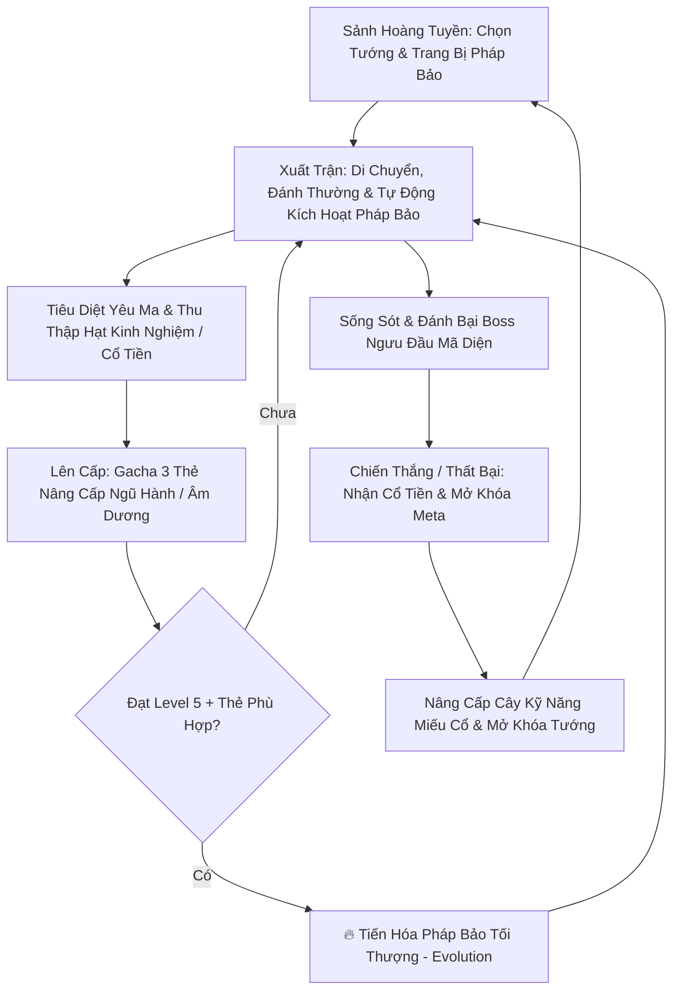

# 🌊 VONG XUYÊN — Survival Roguelite Mobile Game

[](https://unity.com/)
[](https://play.google.com/)
[](https://unity.com/srp/universal-render-pipeline)
[](#-kiến-trúc--kỹ-thuật)
[-teal.svg)](#-hệ-thống-âm-thanh-chuẩn-cổ-phong)
[](#-tối-ưu-hiệu-năng-di-động-mobile-performance--optimization)

> **Vong Xuyên** là dự án game hành động sinh tồn di động (**Top-down Survival Roguelite / Survivor-like**) lấy cảm hứng từ bối cảnh thần thoại, văn hóa dân gian Việt Nam và triết lý Đông Phương (**Ngũ Hành & Cán Cân Âm Dương**). Game được thiết kế chuyên biệt cho hệ máy Android với hiệu năng tối ưu cao (60 FPS mượt mà, Zero GC Allocation trong combat loop, Offline-First).

---

## 📌 Mục Lục
1. [🌟 Điểm Nổi Bật (Unique Selling Points)](#-điểm-nổi-bật-unique-selling-points)
2. [🎮 Vòng Lặp Trò Chơi (Core Gameplay Loop)](#-vòng-lặp-trò-chơi-core-gameplay-loop)
3. [☯️ Hệ Thống Cơ Chế Cốt Lõi (Core Mechanics)](#️-hệ-thống-cơ-chế-cốt-lõi-core-mechanics)
4. [🔊 Hệ Thống Âm Thanh Chuẩn Cổ Phong (Audio Master DNA)](#-hệ-thống-âm-thanh-chuẩn-cổ-phong-audio-master-dna)
5. [🛡️ Kiến Trúc Đóng Băng & Kiểm Soát Trận Đấu (Pause Guard Architecture)](#️-kiến-trúc-đóng-băng--kiểm-soát-trận-đấu-pause-guard-architecture)
6. [📐 Kiến Trúc Kỹ Thuật (Architecture & Engineering)](#-kiến-trúc-kỹ-thuật-architecture--engineering)
7. [📁 Cấu Trúc Thư Mục Dự Án (Folder Structure)](#-cấu-trúc-thư-mục-dự-án-folder-structure)
8. [⚡ Tối Ưu Hiệu Năng Di Động (Mobile Performance & Optimization)](#-tối-ưu-hiệu-năng-di-động-mobile-performance--optimization)
9. [🛠️ Yêu Cầu Môi Trường & Thiết Lập (Getting Started)](#️-yêu-cầu-môi-trường--thiết-lập-getting-started)
10. [📚 Tài Liệu Tham Chiếu Chi Tiết (Documentation)](#-tài-liệu-tham-chiếu-chi-tiết-documentation)

---

## 🌟 Điểm Nổi Bật (Unique Selling Points)

- 📜 **Chủ Đề & Cốt Truyện Dân Gian Việt Nam:** Hành trình vượt qua cửa ải Bến Đò Vong Xuyên cõi Âm Ty để tìm đường về nhân gian, thức tỉnh thần lực của **Tứ Tướng Thần Thoại** (Thư Sinh, Thanh Đồng, Đạo Sĩ, Võ Tăng) nhằm diệt trừ Ma Vương.
- ☯️ **Cơ Chế Ngũ Hành Tương Sinh - Tương Khắc:** 
  - **Tương Khắc:** Tăng **+30% Sát thương** khi dùng vũ khí khắc hệ kẻ địch (`Kim khắc Mộc`, `Mộc khắc Thổ`, `Thổ khắc Thủy`, `Thủy khắc Hỏa`, `Hỏa khắc Kim`).
  - **Tương Sinh:** Giảm **-20% Cooldown** cho vũ khí khi kích hoạt chuỗi hệ sinh nhau (`Kim sinh Thủy`, `Thủy sinh Mộc`, `Mộc sinh Hỏa`, `Hỏa sinh Thổ`, `Thổ sinh Kim`).
- ⚖️ **Cán Cân Âm Dương (Yin-Yang Balance - Độc Quyền Nhân Vật Thanh Đồng):** Trục nội tại riêng biệt luân chuyển thế đánh (Âm Thịnh / Dương Thịnh / Thái Cực), quyết định kho thẻ Gacha Nâng cấp đặc thù và mở khóa nhánh Tiến Hóa (Evolution) tối thượng.
- 🗡️ **Kho Pháp Bảo & Yêu Ma Đậm Chất Thần Thoại:** Nỏ Thần, Bút Phán Quan, Bùa Trấn Yêu, Trống Đồng, Điếu Cày Cửu U, Dép Tổ Ong, Đao Cửu Vĩ đối đầu Ma Giáp, Quỷ Nhập Tràng, Ma Da, Ma Trơi, Ngưu Đầu Mã Diện.
- ⚡ **Zero Garbage Collection (0 GC) & Object Pooling:** Triệt tiêu hoàn toàn hiện tượng sụt FPS/giật lag trên Android khi spawn hàng trăm quái vật và đạn cùng lúc.
- 🎵 **Hệ Thống Âm Thanh Cổ Phong Thuần Khiết (0ms Latency):** Thiết kế tỉ mỉ từng tiếng gõ Mõ Gỗ, Khánh Ngọc, tiếng vung kiếm, nổ bộc phá và khúc Đàn Tranh Sáo Trúc ngoài Sảnh.

---

## 🎮 Vòng Lặp Trò Chơi (Core Gameplay Loop)



---

## ☯️ Hệ Thống Cơ Chế Cốt Lõi (Core Mechanics)

### 1. Vòng Tròn Ngũ Hành (Five Elements)

| Hệ | Màu Sắc / Ký Hiệu | Hệ Khắc (+30% DMG) | Hệ Sinh (-20% CDR) | Pháp Bảo Tiêu Biểu |
|:---:|:---:|:---:|:---:|:---|
| 🔷 **Kim** | Vàng Kim (`#E8C468`) | 🌿 Mộc | 🌊 Thủy | Nỏ Thần Cơ, Dép Tổ Ong Thần Sa |
| 🌿 **Mộc** | Lục Bảo (`#4C7A3D`) | 🪨 Thổ | 🔥 Hỏa | Trượng Mây, Chiếu Trải Hoàng Tuyền |
| 🌊 **Thủy** | Lam Ngọc (`#2E6E9E`) | 🔥 Hỏa | 🌿 Mộc | Nước Thánh Hồ Gươm, Chuông Chiêu Hồn |
| 🔥 **Hỏa** | Hỏa Long (`#B8442C`) | 🔷 Kim | 🪨 Thổ | Đao Cửu Vĩ, Điếu Cày Cửu U |
| 🪨 **Thổ** | Nâu Đất (`#9C7A48`) | 🌊 Thủy | 🔷 Kim | Trống Đồng Đông Sơn, Bùa Trấn Yêu |

### 2. Cán Cân Âm Dương (Độc Quyền Nhân Vật Thanh Đồng)
- Điểm Âm Dương dao động từ **0 (Cực Âm) đến 100 (Cực Dương)**, khởi đầu ở mức cân bằng **50 (Thái Cực)**.
- Đòn đánh từ các pháp bảo Âm (hút máu, làm chậm, debuff) làm lệch về phía Âm; pháp bảo Dương (sát thương diện rộng, bộc phá, ánh sáng) kéo về phía Dương.
- Trạng thái Cán cân (Âm Thịnh / Dương Thịnh / Thái Cực) lọc trực tiếp danh sách thẻ Gacha trong `UpgradeManager` thông qua `IUpgradeFilter` và mở khóa dạng Tiến Hóa riêng biệt.

---

## 🔊 Hệ Thống Âm Thanh Chuẩn Cổ Phong (Audio Master DNA)

Hệ thống âm thanh được xây dựng theo chuẩn **44.1kHz 16-bit PCM Mono, 0ms Delay**, tối ưu hóa qua `AudioSourcePool` và tự động điều khiển âm lượng độc lập qua `PlayerPrefs`:

| Phân Hệ | Tên File Audio | Đặc Tính Âm Học & Trải Nghiệm |
| :--- | :--- | :--- |
| **Giao Diện UI** | `SFX_UI_Click_Crisp.wav`<br>`SFX_UI_Confirm.wav`<br>`SFX_UI_Weapon_Equip.wav`<br>`SFX_UI_Error.wav`<br>`SFX_Coin_Tick.wav` | Tiếng gõ Mõ Gỗ Mun giòn tan, Khánh Ngọc xác nhận thanh thoát, tiếng tra kiếm vào vỏ êm dịu khi chọn vũ khí, tiếng mộc đục khi thao tác lỗi và tiếng cổ tiền leng keng. |
| **Chiến Đấu & Đánh Thường** | `SFX_Sword_Slash_Light.wav`<br>`SFX_Sword_Slash_Crit.wav`<br>`SFX_Player_Dash.wav`<br>`SFX_Player_Hurt.wav`<br>`SFX_Enemy_Dissolve_Death.wav` | Tiếng vung kiếm chém xé gió sắc bén, trảm kích bạo liệt rung chấn màn hình, thân pháp Phi Vân lướt gió, trúng đòn va chạm giáp mộc và quái vật tan biến thành tro bụi. |
| **Pháp Bảo & Đạn Đạo** | `SFX_Projectile_Shoot.wav`<br>`SFX_Projectile_Explode.wav`<br>`SFX_Magic_Orbit_Loop.wav` | Tiếng vút phóng Đạo Phù / Nỏ Cổ, nổ bộc phá đầm chắc của Hỏa Lô / Bình Rượu và tiếng xoay vòng ma mị của Hồ Lô / Bát Quái hộ thân. |
| **Tuyệt Kỹ & Ngũ Hành** | `SFX_Skill_Ultimate_Cast.wav`<br>`SFX_Elemental_Reaction.wav`<br>`SFX_Status_Freeze.wav`<br>`SFX_Status_Burn.wav` | Âm thanh kích hoạt Tuyệt Kỹ bùng nổ uy nghiêm, tiếng khánh ngọc ngân vang khi kích hoạt Vòng Tương Sinh, tiếng tinh thể băng vỡ giòn tan và ngọn lửa thiêu đốt yêu ma. |
| **Boss & Nhạc Nền (BGM)** | `SFX_Boss_Roar_Warning.wav`<br>`SFX_Boss_Smash.wav`<br>`BGM_MainHub_VongXuyen.wav` | Tiếng tù và chiến trận / Boss gầm báo hiệu xuất hiện, đòn dậm đất chấn động địa chấn của Boss Ngưu Đầu và khúc Đàn Tranh Sáo Trúc thanh tịnh tại Sảnh Chờ. |

---

## 🛡️ Kiến Trúc Đóng Băng & Kiểm Soát Trận Đấu (Pause Guard Architecture)

Nhằm giải quyết triệt để lỗi quái vật/boss vẫn tấn công khi `Time.timeScale = 0` và lỗi xung đột giao diện:

1. **Single Source of Truth Toàn Cục:**
   - [`GameStateManager.cs`](file:///c:/Users/thuon/Unity/Projectzombie/Assets/Features/Shared/GameStateManager.cs): Cung cấp thuộc tính `public static bool IsPlaying => (Instance != null && Instance.CurrentState == GameState.Playing) && Time.timeScale > 0f;`.
2. **Root Guard Tại Mọi Cửa Ngõ Điều Phối:**
   - Đặt `if (!GameStateManager.IsPlaying) return;` tại đầu `Update()` và `FixedUpdate()` của các Base Class: `Enemy`, `BossStateMachine`, `PlayerController`, `CharacterCombat`, `WeaponManager`, `EnemyStatusController`, `EnemyKinematicPhysics`.
   - Đảm bảo 100% quái vật, boss, debuff và vũ khí lập tức bất động hoàn toàn khi tạm dừng game.
3. **Blocking Modal Guard Cho Bảng Chọn Nâng Cấp:**
   - Khi thăng cấp (`GameState.LevelUpSelection`), nút Pause trên HUD tự động khóa tương tác (`interactable = false`) và chặn phím tắt Tab / Esc, ngăn chặn triệt để lỗi bấm nhầm làm mất bảng chọn thẻ hoặc mất lượt nâng cấp của người chơi.

---

## 📐 Kiến Trúc Kỹ Thuật (Architecture & Engineering)

Dự án áp dụng các nguyên tắc kỹ thuật chuẩn mực cho game Unity quy mô lớn:

- **SOLID & Clean Architecture:** Tách biệt module độc lập, giao tiếp thông qua Interfaces (`IDamageable`, `IDamageDealer`, `IUpgradeFilter`, `ICharacterStats`, `ISignatureSkill`).
- **Mô Hình MVP (Model-View-Presenter) Cho UI:**
  - **Model:** Quản lý dữ liệu logic, phát Event (`PlayerStats`, `RunStatsTracker`, `PlayerExperience`).
  - **View:** Thụ động (`Passive View`), chỉ nhận render dữ liệu thô, không can thiệp logic.
  - **Presenter:** Lắng nghe Model, định dạng dữ liệu và cập nhật View.
- **Event-Driven Decoupling:** Giao tiếp lỏng lẻo thông qua `GameEventBus` và C# Actions, triệt tiêu hoàn toàn phụ thuộc vòng.
- **Data-Driven Design:** Lưu trữ toàn bộ chỉ số nhân vật, quái vật, vũ khí, đạn đạo và thẻ nâng cấp trong `ScriptableObject` (`WeaponData`, `EnemyConfig`, `ProjectileData`, `UpgradeData`).
- **Enemy AI State Machine & Strategy Pattern:** Kết hợp FSM (Idle, Chase, Attack, Dead) với Strategy Pattern (`MeleeAttackStrategy`, `RangedAttackStrategy`, `CombatMovementStrategy`).

---

## 📁 Cấu Trúc Thư Mục Dự Án (Folder Structure)

```text
Assets/
├── Core/                      # Hạ tầng & Logic nền tảng chạy xuyên suốt
│   ├── Audio/                 # AudioManager, AudioConfigSO, AudioSourcePool, Sound Emitters
│   ├── Camera/                # Cinemachine Virtual Cameras & Screen Shake Controller
│   ├── Juice/                 # Game Feel, Hit Flash, Damage Text Manager
│   ├── Pooling/               # Generic Object Pooling (Zero GC Allocation)
│   ├── Save/                  # SaveSystem (Offline-first Local JSON Persistence)
│   └── Services/              # Service Locators & Bootstrapper
│
├── Features/                  # Triển khai tính năng (Feature-based Modular)
│   ├── Boss/                  # Boss State Machine, Skills (Ground Slam, Bull Dash) & Elements
│   ├── Collectibles/          # Hạt EXP (ExpGem Homing), Nam Châm (Magnet), Rương Kho Báu, Cổ Tiền
│   ├── Enemies/               # Quái vật AI FSM, Status Controller, Movement & Attack Strategies
│   ├── MetaProgression/       # Cây kỹ năng vĩnh viễn Miếu Cổ, Talent Tree, Shop
│   ├── Player/                # Player Movement, Character Combat, Health, Signature Skills
│   ├── Projectiles/           # Đạn bay Data-Driven, Pool Spawner, Collision & Behaviors
│   ├── Spawners/              # Master-Worker Wave Spawner, Swarm Events
│   ├── UI/                    # MVP UI Panels (HUD, LevelUp, Pause, GameOver, Loadout, Joystick)
│   ├── Upgrades/              # Hệ thống thẻ Gacha, Filter Âm Dương & Tiến Hóa Pháp Bảo
│   ├── Weapons/               # 15+ Pháp bảo, Melee/Ranged Base Classes & Relics
│   └── YinYang/               # Quản lý Cán cân Âm Dương & Vòng Tương Sinh (ElementCycleManager)
│
├── _Data/                     # ScriptableObjects cấu hình Game
│   ├── Audios/                # Audio Clips & AudioConfigSO Assets
│   ├── Enemies/               # Chỉ số yêu ma, HP, MoveSpeed, Element
│   ├── Weapons/               # Dữ liệu pháp bảo, Damage, Cooldown, Evolution
│   └── Upgrades/              # Danh mục thẻ nâng cấp
│
├── _Prefabs/                  # Prefabs nhân vật, quái vật, UI, VFX
├── Art/ & _ART/               # Sprites 2D Pixel Art Cổ Phong, Animation Clips, Controllers
├── Shader/ & VFX/             # Shader Graph URP, Particle Systems, Slash & Trail VFX
└── Scenes/                    # MainMenu, GamePlay_BendoVongXuyen, Bootstrapper
```

---

## ⚡ Tối Ưu Hiệu Năng Di Động (Mobile Performance & Optimization)

Nhằm đảm bảo trải nghiệm **60 FPS ổn định** trên thiết bị Android từ tầm trung:
1. **Generic Object Pooling:** Áp dụng cho toàn bộ đạn bay, quái vật, hạt EXP, VFX và Floating Damage Text. Không gọi `Instantiate()`/`Destroy()` trong combat loop.
2. **Zero GC Physics Hot-Path:**
   - Thay thế `OverlapCircleAll` / `OverlapBoxAll` bằng `NonAlloc` cùng buffer tĩnh `Collider2D[]`.
   - Lọc va chạm thông qua Bitwise `LayerMask` ở tầng C++ Physics.
3. **TryGetComponent & Caching:** Loại bỏ triệt để `GetComponent` trong `Update()` và chu kỳ va chạm vật lý.
4. **Sprite Batching & Sorting Layers:** Chuẩn hóa 10 Sorting Layers và Y-Sorting (`Transparency Sort Axis (0, 1, 0)`) cho góc nhìn Frontal Top-Down 2.5D.
5. **TextMeshProUGUI:** Bắt buộc sử dụng TMPro tương thích bộ font thuần Việt (`BeVietnamPro-Regular SDF`) để tối ưu Draw Call và độ sắc nét.

---

## 🛠️ Yêu Cầu Môi Trường & Thiết Lập (Getting Started)

### Yêu Cầu Kỹ Thuật
- **Unity Version:** `2022.3 LTS` (Khuyên dùng `2022.3.x`).
- **Render Pipeline:** Universal Render Pipeline (URP 2D).
- **Input System:** New Input System (`com.unity.inputsystem`).
- **Target OS:** Android 8.0 (API 26) trở lên, Target SDK API 33+ (Android 13/14).
- **Scripting Backend:** IL2CPP (ARM64-v8a).

### Cài Đặt & Chạy Game Trong Unity Editor
1. Clone repository về máy:
   ```bash
   git clone <repository_url>
   ```
2. Mở Unity Hub và thêm dự án bằng phiên bản **Unity 2022.3 LTS**.
3. Mở scene khởi động tại: `Assets/Scenes/GamePlay_BendoVongXuyen.unity` (hoặc Scene Bootstrapper).
4. Nhấn **Play** để trải nghiệm với Dynamic Virtual Joystick hoặc bàn phím (WASD / Phím điều hướng).

---

## 📚 Tài Liệu Tham Chiếu Chi Tiết (Documentation)

- 📖 [Game Design Document (GDD v4.0)](file:///c:/Users/thuon/Unity/Projectzombie/GameDesignDoc/ProjectZombie_GDD.md) — Chi tiết thiết kế toàn bộ hệ thống trò chơi.
- 📐 [Sơ Đồ Kiến Trúc Hệ Thống (SYSTEM_ARCHITECTURE.md)](file:///c:/Users/thuon/Unity/Projectzombie/.agents/references/SYSTEM_ARCHITECTURE.md) — Kiến trúc 6 tầng và Data Flow.
- 📊 [Sơ Đồ Luồng Hoạt Động Trực Quan (SYSTEM_FLOWCHART.md)](file:///c:/Users/thuon/Unity/Projectzombie/.agents/references/SYSTEM_FLOWCHART.md) — Sơ đồ khối trực quan hóa chi tiết các luồng (Combat, Spawner, Upgrade, MVP).
- 🎨 [Hướng Dẫn Art Direction UI (UI_ART_DIRECTION_GUIDE.md)](file:///c:/Users/thuon/Unity/Projectzombie/.agents/references/UI_ART_DIRECTION_GUIDE.md) — Bảng màu Ngũ Hành, UI Panels & Buttons.
- ⚔️ [Hướng Dẫn Tối Ưu Gameplay & Game Feel](file:///c:/Users/thuon/Unity/Projectzombie/.agents/references/GAMEPLAY_PRODUCTION_GUIDE.md) — Hit Flash, Screen Shake, Knockback.
- 🥞 [Chuẩn Hóa Sorting Layers & Y-Sorting](file:///c:/Users/thuon/Unity/Projectzombie/.agents/references/SORTING_LAYERS_GUIDE.md) — Thiết lập Rendering 2D.
- 📋 [Bảng Nhiệm Vụ & Tiến Độ (TASKS.md)](file:///c:/Users/thuon/Unity/Projectzombie/ProjectManagement/TASKS.md) — Sprint Task Tracker.

---

*© 2026 Dự án Vong Xuyên (Project Zombie) — Phát triển cho nền tảng Android Mobile.*
