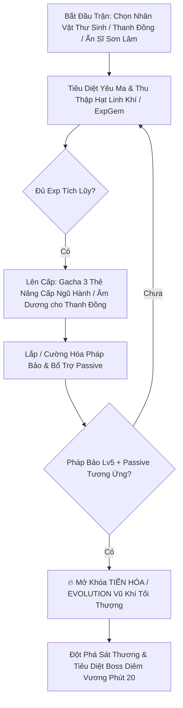
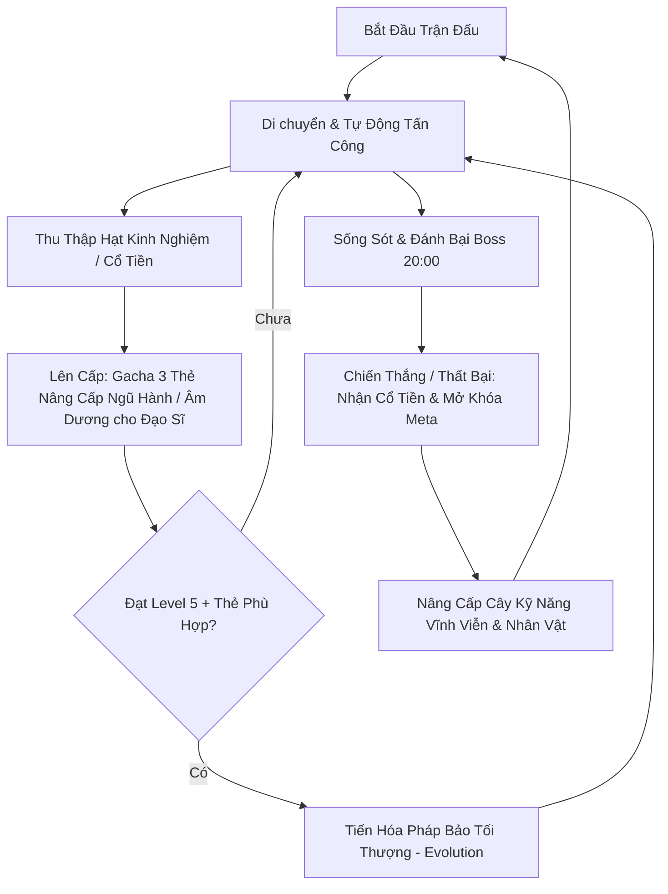

# 🌊 VONG XUYÊN — Survival Roguelite Mobile Game

[](https://unity.com/)
[](https://play.google.com/)
[](https://unity.com/srp/universal-render-pipeline)
[](#-kiến-trúc--kỹ-thuật)
[](#)

> **Vong Xuyên** là dự án game hành động sinh tồn di động (**Top-down Survival Roguelite / Survivor-like**) lấy cảm hứng từ bối cảnh thần thoại, văn hóa dân gian Việt Nam và triết lý Đông Phương (**Ngũ Hành & Cán Cân Âm Dương**). Game được thiết kế chuyên biệt cho hệ máy Android với hiệu năng tối ưu cao (60 FPS, Zero GC Alloc, Offline-First).

---

## 📌 Mục Lục
1. [🌟 Điểm Nổi Bật (Unique Selling Points)](#-điểm-nổi-bật-unique-selling-points)
2. [🎮 Vòng Lặp Trò Chơi (Core Gameplay Loop)](#-vòng-lặp-trò-chơi-core-gameplay-loop)
3. [☯️ Hệ Thống Cơ Chế Cốt Lõi (Core Mechanics)](#️-hệ-thống-cơ-chế-cốt-lõi-core-mechanics)
4. [📐 Kiến Trúc Kỹ Thuật (Architecture & Engineering)](#-kiến-trúc-kỹ-thuật-architecture--engineering)
5. [📁 Cấu Trúc Thư Mục Dự Án (Folder Structure)](#-cấu-trúc-thư-mục-dự-án-folder-structure)
6. [⚡ Tối Ưu Hiệu Năng Di Động (Mobile Performance & Optimization)](#-tối-ưu-hiệu-năng-di-động-mobile-performance--optimization)
7. [🛠️ Yêu Cầu Môi Trường & Thiết Lập (Getting Started)](#️-yêu-cầu-môi-trường--thiết-lập-getting-started)
8. [📚 Tài Liệu Tham Chiếu Chi Tiết (Documentation)](#-tài-liệu-tham-chiếu-chi-tiết-documentation)

---

## 🌟 Điểm Nổi Bật (Unique Selling Points)

- 📜 **Chủ Đề & Cốt Truyện Dân Gian Việt Nam:** Hành trình vượt qua cửa ải Bến Đò Vong Xuyên cõi Âm Ty để tìm đường về nhân gian, thức tỉnh thần lực của **Tứ Bất Tử** (Tản Viên Sơn Thánh, Chử Đồng Tử, Phù Đổng Thiên Vương, Thánh Mẫu Liễu Hạnh) nhằm diệt trừ Ma Vương.
- ☯️ **Cơ Chế Ngũ Hành Tương Sinh - Tương Khắc:** 
  - **Tương Khắc:** Tăng **+30% Sát thương** khi dùng vũ khí khắc hệ kẻ địch (`Kim khắc Mộc`, `Mộc khắc Thổ`, `Thổ khắc Thủy`, `Thủy khắc Hỏa`, `Hỏa khắc Kim`).
  - **Tương Sinh:** Giảm **-20% Cooldown** cho vũ khí khi kích hoạt chuỗi hệ sinh nhau (`Kim sinh Thủy`, `Thủy sinh Mộc`, `Mộc sinh Hỏa`, `Hỏa sinh Thổ`, `Thổ sinh Kim`).
- ⚖️ **Cán Cân Âm Dương (Yin-Yang Balance - Độc Quyền Nhân Vật Thanh Đồng):** Trục nội tại riêng biệt cho nhân vật Thanh Đồng luân chuyển thế đánh (Âm Thịnh / Dương Thịnh / Thái Cực), quyết định kho thẻ Gacha Nâng cấp đặc thù và mở khóa nhánh Tiến Hóa (Evolution) tối thượng.
- 🗡️ **Kho Pháp Bảo & Yêu Ma Đậm Chất Thần Thoại:** Nỏ Thần, Bút Phán Quan, Bùa Trấn Yêu, Trống Đồng, Đao Cửu Vĩ đối đầu Ma Giáp, Quỷ Nhập Tràng, Ma Da, Ma Trơi, Ngưu Đầu Mã Diện, Diêm Vương.
- 🚀 **Zero Garbage Collection (0 GC) & Object Pooling:** Triệt tiêu hoàn toàn hiện tượng sụt FPS/giật lag trên Android khi spawn hàng trăm quái vật và đạn cùng lúc.

---

## 🎮 Cơ Chế Gameplay Nổi Bật

### 1. Luồng Trận Đấu & Tiến Trình Nâng Cấp


### 2. Cán Cân Âm Dương (Cơ chế Độc Quyền — Nhân vật Thanh Đồng)
- **Thiết kế chuyên biệt:** Chỉ kích hoạt và hiển thị trên HUD khi người chơi chọn **Thanh Đồng**.
- 🚀 **Hiệu Năng Cực Hạn Cho Android:** Tải mượt mà **200+ Yêu ma và 100+ Đạn bay/VFX** đồng thời mà không bị drop khung hình (Zero GC Heap Allocation trong combat loop).

---

## 🎮 Vòng Lặp Trò Chơi (Core Gameplay Loop)



---

## ☯️ Hệ Thống Cơ Chế Cốt Lõi (Core Mechanics)

### 1. Vòng Tròn Ngũ Hành (Five Elements - Cơ chế chung)

| Hệ | Màu Sắc / Ký Hiệu | Hệ Khắc (+30% DMG) | Hệ Sinh (-20% CDR) | Pháp Bảo Tiêu Biểu |
|:---:|:---:|:---:|:---:|:---|
| 🔷 **Kim** | Vàng Kim (`#E8C468`) | 🌿 Mộc | 🌊 Thủy | Nỏ Thần Cơ, Phi Tiêu Bạc |
| 🌿 **Mộc** | Lục Bảo (`#4C7A3D`) | 🪨 Thổ | 🔥 Hỏa | Trượng Mây, Gai Độc Rừng Thiêng |
| 🌊 **Thủy** | Lam Ngọc (`#2E6E9E`) | 🔥 Hỏa | 🌿 Mộc | Nước Thánh Hồ Gươm, Chuông Chiêu Hồn |
| 🔥 **Hỏa** | Hỏa Long (`#B8442C`) | 🔷 Kim | 🪨 Thổ | Đao Cửu Vĩ, Bình Lửa Tam Muội |
| 🪨 **Thổ** | Nâu Đất (`#9C7A48`) | 🌊 Thủy | 🔷 Kim | Trống Đồng Đông Sơn, Bùa Trấn Yêu |

### 2. Cán Cân Âm Dương (Cơ chế Độc Quyền — Nhân vật Đạo Sĩ / Thanh Đồng)
- **Thiết kế chuyên biệt:** Chỉ kích hoạt và hiển thị trên HUD khi người chơi chọn **Đạo Sĩ**.
- Điểm Âm Dương dao động từ **0 (Cực Âm) đến 100 (Cực Dương)**, khởi đầu ở mức cân bằng **50 (Thái Cực)**.
- Đòn đánh từ các pháp bảo Âm (hút máu, làm chậm, debuff) làm lệch về phía Âm; pháp bảo Dương (sát thương diện rộng, bộc phá, ánh sáng) kéo về phía Dương.
- Trạng thái Cán cân (Âm Thịnh / Dương Thịnh / Thái Cực) lọc trực tiếp danh sách thẻ Gacha trong `UpgradeManager` thông qua `IUpgradeFilter` và mở khóa dạng Tiến Hóa riêng biệt.

---

## 📐 Kiến Trúc Kỹ Thuật (Architecture & Engineering)

Dự án áp dụng các nguyên tắc kỹ thuật chuẩn mực cho game Unity quy mô lớn:

- **SOLID & Clean Architecture:** Tách biệt module độc lập, giao tiếp thông qua Interfaces (`IDamageable`, `IDamageDealer`, `IUpgradeFilter`, `ICharacterStats`).
- **Mô Hình MVP (Model-View-Presenter) Cho UI:**
  - **Model:** Chứa dữ liệu logic, phát Event (ví dụ: `PlayerStats`, `RunStatsTracker`).
  - **View:** Thụ động (`Passive View`), chỉ cập nhật TextMeshPro/Slider thông qua hàm định dạng.
  - **Presenter:** Lắng nghe Model, chuyển đổi dữ liệu thành text/format và truyền tới View.
- **Event-Driven Decoupling:** Sử dụng `System.Action` và C# Events để phát tín hiệu giữa các hệ thống, triệt tiêu phụ thuộc vòng.
- **Data-Driven Design:** Lưu trữ chỉ số nhân vật, quái vật, vũ khí và thẻ nâng cấp trong `ScriptableObject` (`WeaponData`, `EnemyConfig`, `UpgradeData`).
- **Enemy AI State Machine & Strategy Pattern:** Kết hợp FSM (Idle, Chase, Attack, Dead) với Strategy Pattern (`MeleeAttackStrategy`, `RangedAttackStrategy`, `CombatMovementStrategy`).

---

## 📁 Cấu Trúc Thư Mục Dự Án (Folder Structure)

```text
Assets/
├── Core/                      # Hạ tầng & Logic nền tảng chạy xuyên suốt
│   ├── Audio/                 # Audio Manager, Sound Emitters, Presets SO
│   ├── Camera/                # Cinemachine Virtual Cameras & Screen Shake Controller
│   ├── Juice/                 # Game feel, Hit Flash, Damage Text Manager
│   ├── Pooling/               # Generic Object Pooling (0 GC Allocation)
│   ├── Save/                  # SaveSystem (Offline-first Local JSON Persistence)
│   └── Services/              # Service Locators & Bootstrapper
│
├── Features/                  # Triển khai tính năng (Feature-based Modular)
│   ├── Boss/                  # Boss State Machine & Dynamic Element Controller
│   ├── Collectibles/          # Hạt EXP, Nam Châm (Magnet), Rương Kho Báu, Cổ Tiền
│   ├── Enemies/               # Quái vật AI FSM, Movement & Attack Strategies
│   ├── MetaProgression/       # Cây kỹ năng vĩnh viễn, Talent Tree, Shop
│   ├── Player/                # Player Movement, Character Controller, Leveling
│   ├── Projectiles/           # Đạn bay, va chạm & hiệu ứng vật lý
│   ├── Spawners/              # Master-Worker Wave Spawner, Swarm Events
│   ├── UI/                    # MVP UI Panels (HUD, LevelUp, Pause, GameOver, Joystick)
│   ├── Upgrades/              # Hệ thống thẻ Gacha, Filter Âm Dương & Tiến Hóa
│   ├── Weapons/               # 12+ Pháp bảo, Melee/Ranged Base Classes
│   └── YinYang/               # Quản lý Cán cân Âm Dương & State Machine
│
├── _Data/                     # ScriptableObjects cấu hình Game
│   ├── Enemies/               # Chỉ số yêu ma, HP, MoveSpeed, Element
│   ├── Weapons/               # Dữ liệu pháp bảo, Damage, Cooldown, Evolution
│   └── Upgrades/              # Danh mục thẻ nâng cấp
│
├── _Prefabs/                  # Prefabs nhân vật, quái vật, UI, VFX
├── Art/ & _ART/               # Sprites 2D Pixel Art, Animation Clips, Controllers
├── Shader/ & VFX/             # Shader Graph URP, Particle Systems, Slash & Trail VFX
└── Scenes/                    # MainMenu, GamePlay_BendoVongXuyen, Bootstrapper
```

---

## ⚡ Tối Ưu Hiệu Năng Di Động (Mobile Performance & Optimization)

Nhằm đảm bảo trải nghiệm 60 FPS ổn định trên thiết bị Android từ tầm trung:
1. **Generic Object Pooling:** Áp dụng cho toàn bộ đạn bay, quái vật, hạt EXP, VFX và Floating Damage Text. Không gọi `Instantiate()`/`Destroy()` trong runtime.
2. **Zero GC Physics Hot-Path:**
   - Thay thế `OverlapCircleAll` bằng `Physics2D.OverlapCircleNonAlloc` cùng buffer tĩnh `Collider2D[]`.
   - Lọc va chạm thông qua Bitwise `LayerMask` thay vì so sánh `CompareTag` lặp lại.
3. **TryGetComponent & Caching:** Loại bỏ triệt để `GetComponent` trong `Update()` và chu kỳ va chạm vật lý.
4. **Sprite Batching & Sorting Layers:** Chuẩn hóa 10 Sorting Layers và Y-Sorting (`Transparency Sort Axis (0, 1, 0)`) cho góc nhìn Frontal Top-Down 2.5D.
5. **TextMeshProUGUI:** Bắt buộc sử dụng TMPro cho 100% UI Text để tối ưu Draw Call và độ sắc nét.

---

## 🛠️ Yêu Cầu Môi Trường & Thiết Lập (Getting Started)

### Yêu Cầu Kỹ Thuật
- **Unity Version:** `2022.3 LTS` (Khuyên dùng `2022.3.x`).
- **Render Pipeline:** Universal Render Pipeline (URP 2D).
- **Input System:** New Input System (`com.unity.inputsystem`).
- **Target OS:** Android 8.0 (API 26) trở lên, Target SDK API 33+ (Android 13/14).
- **Scripting Backend:** IL2CPP (ARM64-v8a).

### Cài Đặt & Chạy Game Trong Unity Editor
1. Clone repository về máy:
   ```bash
   git clone <repository_url>
   ```
2. Mở Unity Hub và thêm dự án bằng phiên bản **Unity 2022.3 LTS**.
3. Mở scene khởi động tại: `Assets/Scenes/GamePlay_BendoVongXuyen.unity` (hoặc Scene Bootstrapper).
4. Nhấn **Play** để trải nghiệm với Dynamic Virtual Joystick hoặc bàn phím (WASD / Phím điều hướng).

---

## 📚 Tài Liệu Tham Chiếu Chi Tiết (Documentation)

Các tài liệu kỹ thuật, thiết kế và hướng dẫn sản xuất nằm trong thư mục dự án:
- 📖 [Game Design Document (GDD v4.0)](file:///c:/Users/thuon/Unity/Projectzombie/GameDesignDoc/ProjectZombie_GDD.md) — Chi tiết thiết kế toàn bộ hệ thống trò chơi.
- 📐 [Sơ Đồ Kiến Trúc Hệ Thống (SYSTEM_ARCHITECTURE.md)](file:///c:/Users/thuon/Unity/Projectzombie/.agents/references/SYSTEM_ARCHITECTURE.md) — Kiến trúc 6 tầng và Data Flow.
- 📊 [Sơ Đồ Luồng Hoạt Động Trực Quan (SYSTEM_FLOWCHART.md)](file:///c:/Users/thuon/Unity/Projectzombie/.agents/references/SYSTEM_FLOWCHART.md) — Sơ đồ khối ASCII trực quan hóa chi tiết các luồng (Combat, Spawner, Upgrade, MVP).
- 🎨 [Hướng Dẫn Art Direction UI (UI_ART_DIRECTION_GUIDE.md)](file:///c:/Users/thuon/Unity/Projectzombie/.agents/references/UI_ART_DIRECTION_GUIDE.md) — Bảng màu Ngũ Hành, UI Panels & Buttons.
- ⚔️ [Hướng Dẫn Tối Ưu Gameplay & Game Feel](file:///c:/Users/thuon/Unity/Projectzombie/.agents/references/GAMEPLAY_PRODUCTION_GUIDE.md) — Hit Flash, Screen Shake, Knockback.
- 🥞 [Chuẩn Hóa Sorting Layers & Y-Sorting](file:///c:/Users/thuon/Unity/Projectzombie/.agents/references/SORTING_LAYERS_GUIDE.md) — Thiết lập Rendering 2D.
- 📋 [Bảng Nhiệm Vụ & Tiến Độ (TASKS.md)](file:///c:/Users/thuon/Unity/Projectzombie/ProjectManagement/TASKS.md) — Sprint Task Tracker.

---

*© 2026 Dự án Vong Xuyên (Project Zombie) — Phát triển cho nền tảng Android Mobile.*
